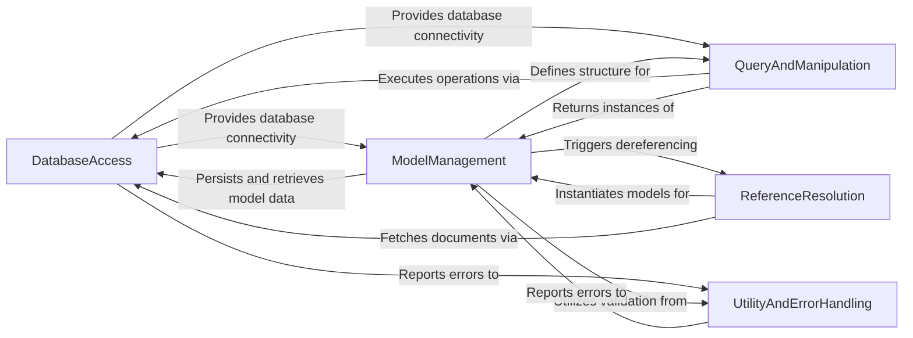

## Component Details

The PyMODM architecture is designed around an Object-Document Mapper (ODM) pattern for MongoDB. The core data flow begins with the `DatabaseAccess` component establishing and managing connections to the MongoDB database. `ModelManagement` defines the schema and behavior of Python objects that map to MongoDB documents, utilizing `UtilityAndErrorHandling` for data validation and error reporting. `QueryAndManipulation` provides the primary interface for users to interact with the database, executing queries and operations on `ModelManagement` instances through `DatabaseAccess`. For complex relationships, `ReferenceResolution` handles the automatic fetching and instantiation of linked documents, also relying on `DatabaseAccess` for data retrieval and `ModelManagement` for object creation. `UtilityAndErrorHandling` serves as a cross-cutting concern, providing essential services like validation and error management to all other components.

### DatabaseAccess
Manages connections to MongoDB and handles low-level data storage and retrieval operations, including GridFS for file management.

**Related Classes/Methods**:

- <a href="https://github.com/mongodb/pymodm/blob/master/pymodm/connection.py#L44-L81" target="_blank" rel="noopener noreferrer">`pymodm.connection:connect` (44:81)</a>
- <a href="https://github.com/mongodb/pymodm/blob/master/pymodm/connection.py#L84-L92" target="_blank" rel="noopener noreferrer">`pymodm.connection:_get_connection` (84:92)</a>
- <a href="https://github.com/mongodb/pymodm/blob/master/pymodm/connection.py#L95-L97" target="_blank" rel="noopener noreferrer">`pymodm.connection:_get_db` (95:97)</a>
- <a href="https://github.com/mongodb/pymodm/blob/master/pymodm/files.py#L67-L141" target="_blank" rel="noopener noreferrer">`pymodm.files.GridFSStorage` (67:141)</a>
- <a href="https://github.com/mongodb/pymodm/blob/master/pymodm/files.py#L312-L351" target="_blank" rel="noopener noreferrer">`pymodm.files.GridFSFile` (312:351)</a>
- <a href="https://github.com/mongodb/pymodm/blob/master/pymodm/files.py#L207-L275" target="_blank" rel="noopener noreferrer">`pymodm.files.FieldFile` (207:275)</a>

### ModelManagement
Defines the structure and behavior of PyMODM models, including field definitions, data serialization/deserialization, validation, and persistence.

**Related Classes/Methods**:

- <a href="https://github.com/mongodb/pymodm/blob/master/pymodm/base/models.py#L34-L141" target="_blank" rel="noopener noreferrer">`pymodm.base.models.MongoModelMetaclass` (34:141)</a>
- <a href="https://github.com/mongodb/pymodm/blob/master/pymodm/base/models.py#L144-L183" target="_blank" rel="noopener noreferrer">`pymodm.base.models.TopLevelMongoModelMetaclass` (144:183)</a>
- <a href="https://github.com/mongodb/pymodm/blob/master/pymodm/base/models.py#L186-L399" target="_blank" rel="noopener noreferrer">`pymodm.base.models.MongoModelBase` (186:399)</a>
- <a href="https://github.com/mongodb/pymodm/blob/master/pymodm/base/models.py#L402-L528" target="_blank" rel="noopener noreferrer">`pymodm.base.models.TopLevelMongoModel` (402:528)</a>
- <a href="https://github.com/mongodb/pymodm/blob/master/pymodm/base/models.py#L531-L600" target="_blank" rel="noopener noreferrer">`pymodm.base.models.MongoModel` (531:600)</a>
- <a href="https://github.com/mongodb/pymodm/blob/master/pymodm/base/models.py#L603-L605" target="_blank" rel="noopener noreferrer">`pymodm.base.models.EmbeddedMongoModel` (603:605)</a>
- <a href="https://github.com/mongodb/pymodm/blob/master/pymodm/base/models.py#L380-L419" target="_blank" rel="noopener noreferrer">`pymodm.base.models.MongoModelBase:save` (380:419)</a>
- <a href="https://github.com/mongodb/pymodm/blob/master/pymodm/base/models.py#L371-L384" target="_blank" rel="noopener noreferrer">`pymodm.base.models.MongoModelBase:full_clean` (371:384)</a>
- <a href="https://github.com/mongodb/pymodm/blob/master/pymodm/base/models.py#L292-L314" target="_blank" rel="noopener noreferrer">`pymodm.base.models.MongoModelBase:to_son` (292:314)</a>
- <a href="https://github.com/mongodb/pymodm/blob/master/pymodm/base/models.py#L268-L290" target="_blank" rel="noopener noreferrer">`pymodm.base.models.MongoModelBase:from_document` (268:290)</a>
- <a href="https://github.com/mongodb/pymodm/blob/master/pymodm/base/fields.py#L25-L220" target="_blank" rel="noopener noreferrer">`pymodm.base.fields.MongoBaseField` (25:220)</a>
- <a href="https://github.com/mongodb/pymodm/blob/master/pymodm/fields.py#L100-L103" target="_blank" rel="noopener noreferrer">`pymodm.fields.CharField` (100:103)</a>
- <a href="https://github.com/mongodb/pymodm/blob/master/pymodm/fields.py#L110-L113" target="_blank" rel="noopener noreferrer">`pymodm.fields.ObjectIdField` (110:113)</a>
- <a href="https://github.com/mongodb/pymodm/blob/master/pymodm/fields.py#L116-L119" target="_blank" rel="noopener noreferrer">`pymodm.fields.DateTimeField` (116:119)</a>
- <a href="https://github.com/mongodb/pymodm/blob/master/pymodm/fields.py#L200-L203" target="_blank" rel="noopener noreferrer">`pymodm.fields.FileField` (200:203)</a>
- <a href="https://github.com/mongodb/pymodm/blob/master/pymodm/fields.py#L206-L290" target="_blank" rel="noopener noreferrer">`pymodm.fields.ReferenceField` (206:290)</a>
- <a href="https://github.com/mongodb/pymodm/blob/master/pymodm/fields.py#L293-L300" target="_blank" rel="noopener noreferrer">`pymodm.fields.EmbeddedModelField` (293:300)</a>
- <a href="https://github.com/mongodb/pymodm/blob/master/pymodm/fields.py#L303-L310" target="_blank" rel="noopener noreferrer">`pymodm.fields.ListField` (303:310)</a>
- <a href="https://github.com/mongodb/pymodm/blob/master/pymodm/fields.py#L313-L320" target="_blank" rel="noopener noreferrer">`pymodm.fields.DictField` (313:320)</a>

### QueryAndManipulation
Provides the API for building and executing database queries, enabling filtering, ordering, and bulk data operations on models.

**Related Classes/Methods**:

- <a href="https://github.com/mongodb/pymodm/blob/master/pymodm/queryset.py#L26-L564" target="_blank" rel="noopener noreferrer">`pymodm.queryset.QuerySet` (26:564)</a>
- <a href="https://github.com/mongodb/pymodm/blob/master/pymodm/queryset.py#L75-L117" target="_blank" rel="noopener noreferrer">`pymodm.queryset.QuerySet:get` (75:117)</a>
- <a href="https://github.com/mongodb/pymodm/blob/master/pymodm/queryset.py#L185-L187" target="_blank" rel="noopener noreferrer">`pymodm.queryset.QuerySet:all` (185:187)</a>
- <a href="https://github.com/mongodb/pymodm/blob/master/pymodm/queryset.py#L201-L218" target="_blank" rel="noopener noreferrer">`pymodm.queryset.QuerySet:raw` (201:218)</a>
- <a href="https://github.com/mongodb/pymodm/blob/master/pymodm/queryset.py#L220-L231" target="_blank" rel="noopener noreferrer">`pymodm.queryset.QuerySet:order_by` (220:231)</a>
- <a href="https://github.com/mongodb/pymodm/blob/master/pymodm/queryset.py#L393-L434" target="_blank" rel="noopener noreferrer">`pymodm.queryset.QuerySet:bulk_create` (393:434)</a>
- <a href="https://github.com/mongodb/pymodm/blob/master/pymodm/queryset.py#L436-L490" target="_blank" rel="noopener noreferrer">`pymodm.queryset.QuerySet:delete` (436:490)</a>
- <a href="https://github.com/mongodb/pymodm/blob/master/pymodm/manager.py#L23-L108" target="_blank" rel="noopener noreferrer">`pymodm.manager.BaseManager` (23:108)</a>
- <a href="https://github.com/mongodb/pymodm/blob/master/pymodm/manager.py#L111-L166" target="_blank" rel="noopener noreferrer">`pymodm.manager.Manager` (111:166)</a>

### ReferenceResolution
Handles the automatic resolution and attachment of referenced MongoDB documents (DBRefs) to their corresponding model instances.

**Related Classes/Methods**:

- <a href="https://github.com/mongodb/pymodm/blob/master/pymodm/dereference.py#L167-L198" target="_blank" rel="noopener noreferrer">`pymodm.dereference.dereference` (167:198)</a>
- <a href="https://github.com/mongodb/pymodm/blob/master/pymodm/dereference.py#L69-L87" target="_blank" rel="noopener noreferrer">`pymodm.dereference._find_references` (69:87)</a>
- <a href="https://github.com/mongodb/pymodm/blob/master/pymodm/dereference.py#L144-L164" target="_blank" rel="noopener noreferrer">`pymodm.dereference._attach_objects` (144:164)</a>

### UtilityAndErrorHandling
Provides common utility functions, general-purpose data validation, and defines a structured system for reporting various operational and validation errors across the library.

**Related Classes/Methods**:

- <a href="https://github.com/mongodb/pymodm/blob/master/pymodm/errors.py#L41-L79" target="_blank" rel="noopener noreferrer">`pymodm.errors.ValidationError` (41:79)</a>
- <a href="https://github.com/mongodb/pymodm/blob/master/pymodm/errors.py#L86-L87" target="_blank" rel="noopener noreferrer">`pymodm.errors.ConfigurationError` (86:87)</a>
- <a href="https://github.com/mongodb/pymodm/blob/master/pymodm/errors.py#L82-L83" target="_blank" rel="noopener noreferrer">`pymodm.errors.OperationError` (82:83)</a>
- <a href="https://github.com/mongodb/pymodm/blob/master/pymodm/errors.py#L31-L33" target="_blank" rel="noopener noreferrer">`pymodm.errors.ModelDoesNotExist` (31:33)</a>
- <a href="https://github.com/mongodb/pymodm/blob/master/pymodm/errors.py#L36-L38" target="_blank" rel="noopener noreferrer">`pymodm.errors.InvalidModel` (36:38)</a>
- <a href="https://github.com/mongodb/pymodm/blob/master/pymodm/common.py#L60-L72" target="_blank" rel="noopener noreferrer">`pymodm.common.get_document` (60:72)</a>
- <a href="https://github.com/mongodb/pymodm/blob/master/pymodm/common.py#L86-L89" target="_blank" rel="noopener noreferrer">`pymodm.common.validate_string_or_none` (86:89)</a>
- <a href="https://github.com/mongodb/pymodm/blob/master/pymodm/common.py#L92-L108" target="_blank" rel="noopener noreferrer">`pymodm.common.validate_mongo_field_name` (92:108)</a>
- <a href="https://github.com/mongodb/pymodm/blob/master/pymodm/common.py#L111-L119" target="_blank" rel="noopener noreferrer">`pymodm.common.validate_mongo_keys` (111:119)</a>
- <a href="https://github.com/mongodb/pymodm/blob/master/pymodm/common.py#L169-L180" target="_blank" rel="noopener noreferrer">`pymodm.common.validate_ordering` (169:180)</a>
- <a href="https://github.com/mongodb/pymodm/blob/master/pymodm/validators.py#L26-L33" target="_blank" rel="noopener noreferrer">`pymodm.validators.validator_for_func` (26:33)</a>
- <a href="https://github.com/mongodb/pymodm/blob/master/pymodm/validators.py#L36-L48" target="_blank" rel="noopener noreferrer">`pymodm.validators.validator_for_type` (36:48)</a>

### [FAQ](https://github.com/CodeBoarding/GeneratedOnBoardings/tree/main?tab=readme-ov-file#faq)