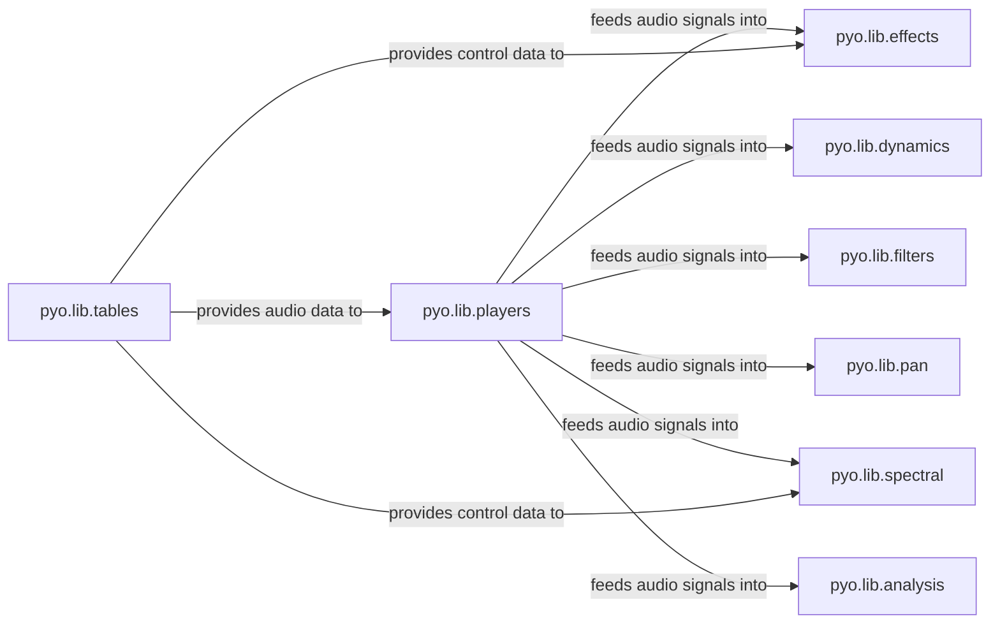

## Details

The `Audio Processing & Analysis` subsystem in `pyo` is a core set of modules dedicated to transforming, manipulating, and extracting information from audio signals. It embodies the project's signal-flow architectural bias, where audio and control data move through various processing stages.

### pyo.lib.players
Acts as an audio source, playing back audio from files or internal tables, initiating the audio signal flow within the subsystem.

**Related Classes/Methods**:

- <a href="https://github.com/belangeo/pyo/blob/master/pyo/lib/players.py" target="_blank" rel="noopener noreferrer">`pyo.lib.players`</a>

### pyo.lib.effects
Applies various general audio effects (e.g., distortion, delay, reverb) to incoming signals, altering their sonic characteristics.

**Related Classes/Methods**:

- <a href="https://github.com/belangeo/pyo/blob/master/pyo/lib/effects.py" target="_blank" rel="noopener noreferrer">`pyo.lib.effects`</a>

### pyo.lib.dynamics
Controls signal dynamics, including compression, limiting, and expansion, to manage the loudness and dynamic range of audio.

**Related Classes/Methods**:

- <a href="https://github.com/belangeo/pyo/blob/master/pyo/lib/dynamics.py" target="_blank" rel="noopener noreferrer">`pyo.lib.dynamics`</a>

### pyo.lib.filters
Implements various audio filters (e.g., low-pass, high-pass, band-pass) to shape the frequency content of audio signals.

**Related Classes/Methods**:

- <a href="https://github.com/belangeo/pyo/blob/master/pyo/lib/filters.py" target="_blank" rel="noopener noreferrer">`pyo.lib.filters`</a>

### pyo.lib.pan
Handles stereo and multi-channel panning, including HRTF-based spatialization, to position sounds in a virtual space.

**Related Classes/Methods**:

- <a href="https://github.com/belangeo/pyo/blob/master/pyo/lib/pan.py" target="_blank" rel="noopener noreferrer">`pyo.lib.pan`</a>
- <a href="https://github.com/belangeo/pyo/blob/master/pyo/lib/hrtf.py" target="_blank" rel="noopener noreferrer">`pyo.lib.hrtf`</a>

### pyo.lib.spectral
Manages Fast Fourier Transform (FFT) and Inverse FFT (IFFT) operations for spectral manipulation, and implements advanced spectral processing techniques like time-stretching and pitch-shifting.

**Related Classes/Methods**:

- <a href="https://github.com/belangeo/pyo/blob/master/pyo/lib/fourier.py" target="_blank" rel="noopener noreferrer">`pyo.lib.fourier`</a>
- <a href="https://github.com/belangeo/pyo/blob/master/pyo/lib/phasevoc.py" target="_blank" rel="noopener noreferrer">`pyo.lib.phasevoc`</a>

### pyo.lib.analysis
Performs real-time signal analysis (e.g., pitch tracking, amplitude following, onset detection) to extract meaningful data from audio.

**Related Classes/Methods**:

- <a href="https://github.com/belangeo/pyo/blob/master/pyo/lib/analysis.py" target="_blank" rel="noopener noreferrer">`pyo.lib.analysis`</a>

### pyo.lib.tables
Manages various audio data tables (e.g., waveforms, envelopes, breakpoints) and performs granular synthesis and other table-based processing operations.

**Related Classes/Methods**:

- <a href="https://github.com/belangeo/pyo/blob/master/pyo/lib/tables.py" target="_blank" rel="noopener noreferrer">`pyo.lib.tables`</a>
- <a href="https://github.com/belangeo/pyo/blob/master/pyo/lib/tableprocess.py" target="_blank" rel="noopener noreferrer">`pyo.lib.tableprocess`</a>

### [FAQ](https://github.com/CodeBoarding/GeneratedOnBoardings/tree/main?tab=readme-ov-file#faq)