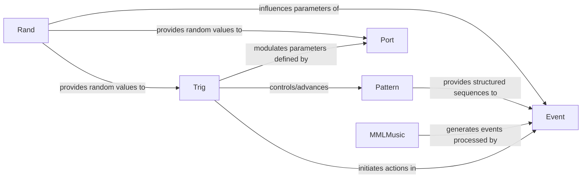

## Details

The pyo subsystem for event-driven music generation is centered around the Events component, which orchestrates the creation, transformation, and playback of musical events. It integrates with Pattern for structured sequencing, Trig for dynamic event initiation, Rand for introducing variability, and MMLMusic for high-level textual composition. Port components are utilized to ensure smooth transitions and shaping of audio parameters. This architecture facilitates a flexible and powerful environment for both algorithmic and structured music composition, with clear pathways for control flow and data modulation between components.

### Event
The core component for event-based sequencing and generative music. It manages the creation, transformation, and playback of musical events over time, including filtering, scaling, and generative processes. It is central to pyo's Event-Driven Architecture.

**Related Classes/Methods**:

- <a href="https://github.com/belangeo/pyo/blob/master/pyo/lib/events.py#L1985-L1993" target="_blank" rel="noopener noreferrer">`pyo.lib.events.Events`:1985-1993</a>

### Trig
Generates discrete trigger signals based on various conditions, sequences, or random distributions. These triggers are fundamental for initiating events or controlling parameters dynamically within the audio engine.

**Related Classes/Methods**:

- <a href="https://github.com/belangeo/pyo/blob/master/pyo/lib/triggers.py#L36-L79" target="_blank" rel="noopener noreferrer">`pyo.lib.triggers.Trig`:36-79</a>

### Pattern
Defines and manages musical patterns, providing structured rhythmic and melodic sequencing capabilities. It acts as a configurable source for repetitive or evolving musical structures, crucial for structured composition.

**Related Classes/Methods**:

- <a href="https://github.com/belangeo/pyo/blob/master/pyo/lib/pattern.py#L30-L176" target="_blank" rel="noopener noreferrer">`pyo.lib.pattern.Pattern`:30-176</a>

### Rand
Offers various random number generators to introduce variability and unpredictability into musical parameters. This component is essential for generative music and dynamic sound design, allowing for non-deterministic control.

**Related Classes/Methods**:

- <a href="https://github.com/belangeo/pyo/blob/master/pyo/lib/randoms.py" target="_blank" rel="noopener noreferrer">`pyo.lib.randoms.Rand`</a>

### Port
Manages smooth control signal changes and envelope generation. These components are essential for shaping the temporal evolution of audio parameters (e.g., amplitude, frequency) over time, preventing abrupt transitions.

**Related Classes/Methods**:

- <a href="https://github.com/belangeo/pyo/blob/master/pyo/lib/controls.py" target="_blank" rel="noopener noreferrer">`pyo.lib.controls.Port`</a>

### MMLMusic
Parses and interprets Music Macro Language (MML) strings to generate musical sequences. It provides a high-level, text-based interface for composing and translating musical ideas into playable events, abstracting low-level event creation.

**Related Classes/Methods**:

- <a href="https://github.com/belangeo/pyo/blob/master/pyo/lib/mmlmusic.py" target="_blank" rel="noopener noreferrer">`pyo.lib.mmlmusic.MMLMusic`</a>

### [FAQ](https://github.com/CodeBoarding/GeneratedOnBoardings/tree/main?tab=readme-ov-file#faq)