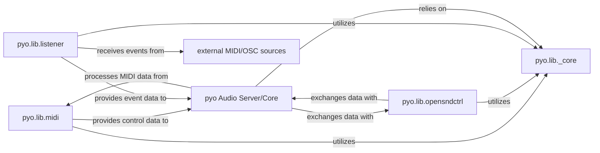

## Details

The `pyo` audio synthesis library's core functionality revolves around the `pyo Audio Server/Core`, which acts as the central processing unit for all audio streams and interactions with external hardware. This server leverages foundational utilities provided by `pyo.lib._core`, which defines base classes and common helper functions. For external communication, `pyo` employs dedicated components: `pyo.lib.midi` handles the input and output of MIDI data, enabling interaction with MIDI devices, while `pyo.lib.opensndctrl` facilitates bidirectional communication using the Open Sound Control (OSC) protocol. Additionally, the `pyo.lib.listener` component provides independent, thread-based listening for both MIDI and OSC events, allowing for flexible integration with external control sources even when the main audio server is not actively processing. These components collectively form a robust system for real-time audio synthesis and external control.

### pyo.lib.midi
Manages the configuration, processing, and transmission/reception of MIDI data, serving as a gateway for `pyo` to interact with external MIDI devices.

**Related Classes/Methods**:

- <a href="https://github.com/belangeo/pyo/blob/master/pyo/lib/midi.py" target="_blank" rel="noopener noreferrer">`pyo.lib.midi`</a>

### pyo.lib.opensndctrl
Manages the sending and receiving of Open Sound Control (OSC) messages, enabling `pyo` to communicate bidirectionally with other OSC-enabled applications and devices.

**Related Classes/Methods**:

- <a href="https://github.com/belangeo/pyo/blob/master/pyo/lib/opensndctrl.py" target="_blank" rel="noopener noreferrer">`pyo.lib.opensndctrl`</a>

### pyo.lib.listener
Provides the underlying mechanisms for listening to and receiving MIDI and OSC messages from external sources, acting as a low-level network and device listener.

**Related Classes/Methods**:

- <a href="https://github.com/belangeo/pyo/blob/master/pyo/lib/listener.py" target="_blank" rel="noopener noreferrer">`pyo.lib.listener`</a>

### pyo Audio Server/Core
Central component of `pyo` responsible for audio processing, interacting with external audio and MIDI interfaces, and managing the audio graph.

**Related Classes/Methods**:

- <a href="https://github.com/belangeo/pyo/blob/master/pyo/lib/server.py" target="_blank" rel="noopener noreferrer">`pyo.lib.server`</a>

### pyo.lib._core
Provides common utility functions and the foundational `PyoObject` base class utilized by other `pyo` components.

**Related Classes/Methods**:

- <a href="https://github.com/belangeo/pyo/blob/master/pyo/lib/_core.py" target="_blank" rel="noopener noreferrer">`pyo.lib._core`</a>

### external MIDI/OSC sources
External entities that provide MIDI and OSC events.

**Related Classes/Methods**: _None_

### [FAQ](https://github.com/CodeBoarding/GeneratedOnBoardings/tree/main?tab=readme-ov-file#faq)