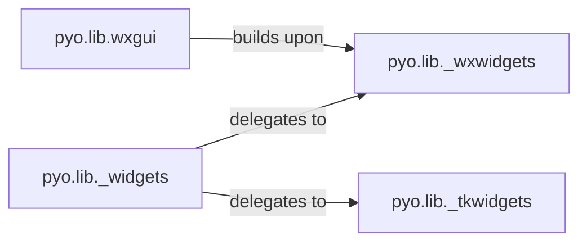

## Details

The PyoGUI subsystem provides the graphical user interface elements for interacting with and visualizing audio processes within the Pyo project. It is designed with a flexible architecture to support multiple GUI backends.

### pyo.lib._widgets
This component serves as the GUI Abstraction Layer. It provides a unified, toolkit-independent API for creating various GUI windows (e.g., controls, graphs, tables, spectrum analyzers, scopes, editors, server GUI). It acts as a dispatcher, abstracting away the underlying GUI toolkit (wxWidgets or Tkinter), which is crucial for maintaining flexibility and allowing Pyo to support multiple GUI backends.

**Related Classes/Methods**:

- <a href="https://github.com/belangeo/pyo/blob/master/pyo/lib/_widgets.py" target="_blank" rel="noopener noreferrer">`pyo.lib._widgets`</a>

### pyo.lib._wxwidgets
This component is the wxPython GUI Backend. It implements the fundamental graphical controls and display elements using the wxPython library. It handles low-level user input, drawing routines, and visual state management for wxWidgets components, serving as a concrete backend for the _widgets abstraction.

**Related Classes/Methods**:

- <a href="https://github.com/belangeo/pyo/blob/master/pyo/lib/_wxwidgets.py" target="_blank" rel="noopener noreferrer">`pyo.lib._wxwidgets`</a>

### pyo.lib._tkwidgets
This component is the Tkinter GUI Backend. It provides an alternative implementation of graphical controls and display elements using the Tkinter library. Similar to _wxwidgets, it handles Tkinter-specific widget creation and user interactions, serving as another concrete backend for the _widgets abstraction.

**Related Classes/Methods**:

- <a href="https://github.com/belangeo/pyo/blob/master/pyo/lib/_tkwidgets.py" target="_blank" rel="noopener noreferrer">`pyo.lib._tkwidgets`</a>

### pyo.lib.wxgui
This component provides DSP-Specific GUI Elements. It builds upon pyo.lib._wxwidgets to create specialized GUI components that are tightly integrated with Pyo's audio analysis and data structures. This includes components like scopes, spectrum analyzers, and custom controls that directly visualize or manipulate Pyo's audio objects and data tables. It manages callbacks for user interactions and links GUI elements to Pyo's internal state, vital for providing DSP-specific visualization and control.

**Related Classes/Methods**:

- <a href="https://github.com/belangeo/pyo/blob/master/pyo/lib/wxgui.py" target="_blank" rel="noopener noreferrer">`pyo.lib.wxgui`</a>

### [FAQ](https://github.com/CodeBoarding/GeneratedOnBoardings/tree/main?tab=readme-ov-file#faq)