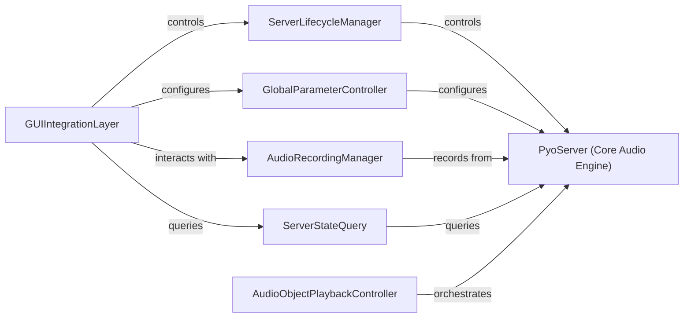

## Details

The `pyo` audio engine is centered around the `PyoServer (Core Audio Engine)`, implemented by the `pyo.lib.server.Server` class, which is responsible for the real-time audio processing graph and I/O. Its operational state is managed by the `ServerLifecycleManager`, which handles starting, stopping, and shutting down the server. Global audio parameters are controlled through the `GlobalParameterController`, allowing for system-wide configuration. Audio output can be recorded via the `AudioRecordingManager`, while the `ServerStateQuery` provides real-time status information. The `AudioObjectPlaybackController` represents the `PyoServer`'s role in orchestrating the activation and deactivation of individual audio processing objects within the audio graph. Finally, the `GUIIntegrationLayer` provides a user-friendly interface, directly interacting with the `PyoServer` and its associated managers to offer visual control over the audio engine's functionalities.

### PyoServer (Core Audio Engine)
The foundational and central component responsible for initializing, managing, and orchestrating the entire real-time audio processing graph. It handles audio I/O, manages global settings, and serves as the central hub for all audio-related operations.

**Related Classes/Methods**:

- <a href="https://github.com/belangeo/pyo/blob/master/pyo/lib/server.py#L29-L1498" target="_blank" rel="noopener noreferrer">`pyo.lib.server.Server`:29-1498</a>

### ServerLifecycleManager
Manages the operational state of the `PyoServer`, including its initialization (`boot`), activation (`start`), deactivation (`stop`), and complete termination (`shutdown`, `__del__`). This component ensures proper resource management and real-time audio flow control.

**Related Classes/Methods**:

- <a href="https://github.com/belangeo/pyo/blob/master/pyo/lib/server.py#L29-L1498" target="_blank" rel="noopener noreferrer">`pyo.lib.server.Server`:29-1498</a>
- <a href="https://github.com/belangeo/pyo/blob/master/pyo/lib/server.py#L29-L1498" target="_blank" rel="noopener noreferrer">`pyo.lib.server.Server`:29-1498</a>
- <a href="https://github.com/belangeo/pyo/blob/master/pyo/lib/server.py#L29-L1498" target="_blank" rel="noopener noreferrer">`pyo.lib.server.Server`:29-1498</a>
- <a href="https://github.com/belangeo/pyo/blob/master/pyo/lib/server.py#L29-L1498" target="_blank" rel="noopener noreferrer">`pyo.lib.server.Server`:29-1498</a>
- <a href="https://github.com/belangeo/pyo/blob/master/pyo/lib/server.py#L29-L1498" target="_blank" rel="noopener noreferrer">`pyo.lib.server.Server`:29-1498</a>

### GlobalParameterController
Provides an interface for setting and retrieving global parameters that influence the entire audio engine's behavior, such as master amplitude, verbosity, start offset, and random seed. This ensures consistent behavior across the audio graph.

**Related Classes/Methods**:

- <a href="https://github.com/belangeo/pyo/blob/master/pyo/lib/server.py#L29-L1498" target="_blank" rel="noopener noreferrer">`pyo.lib.server.Server`:29-1498</a>
- <a href="https://github.com/belangeo/pyo/blob/master/pyo/lib/server.py#L29-L1498" target="_blank" rel="noopener noreferrer">`pyo.lib.server.Server`:29-1498</a>
- <a href="https://github.com/belangeo/pyo/blob/master/pyo/lib/server.py#L29-L1498" target="_blank" rel="noopener noreferrer">`pyo.lib.server.Server`:29-1498</a>
- <a href="https://github.com/belangeo/pyo/blob/master/pyo/lib/server.py#L29-L1498" target="_blank" rel="noopener noreferrer">`pyo.lib.server.Server`:29-1498</a>

### AudioRecordingManager
Handles the initiation (`recstart`) and termination (`recstop`) of audio output recording directly from the `PyoServer`, allowing for capturing the processed audio stream.

**Related Classes/Methods**:

- <a href="https://github.com/belangeo/pyo/blob/master/pyo/lib/server.py#L29-L1498" target="_blank" rel="noopener noreferrer">`pyo.lib.server.Server`:29-1498</a>
- <a href="https://github.com/belangeo/pyo/blob/master/pyo/lib/server.py#L29-L1498" target="_blank" rel="noopener noreferrer">`pyo.lib.server.Server`:29-1498</a>

### ServerStateQuery
Offers methods to query the current operational status of the `PyoServer`, indicating whether it is running (`getIsStarted`) or fully initialized (`getIsBooted`). This is crucial for external monitoring and control.

**Related Classes/Methods**:

- <a href="https://github.com/belangeo/pyo/blob/master/pyo/lib/server.py#L29-L1498" target="_blank" rel="noopener noreferrer">`pyo.lib.server.Server`:29-1498</a>
- <a href="https://github.com/belangeo/pyo/blob/master/pyo/lib/server.py#L29-L1498" target="_blank" rel="noopener noreferrer">`pyo.lib.server.Server`:29-1498</a>
- <a href="https://github.com/belangeo/pyo/blob/master/pyo/lib/server.py#L29-L1498" target="_blank" rel="noopener noreferrer">`pyo.lib.server.Server`:29-1498</a>

### AudioObjectPlaybackController
Manages the interaction between individual audio processing objects (e.g., oscillators, filters, effects) and the central `PyoServer` for their activation (`play`) and deactivation (`stop`) within the real-time audio graph. This component is key to the signal-flow architecture.

**Related Classes/Methods**:

- <a href="https://github.com/belangeo/pyo/blob/master/pyo/lib/server.py#L29-L1498" target="_blank" rel="noopener noreferrer">`pyo.lib.server.Server`:29-1498</a>

### GUIIntegrationLayer
Acts as an interface for graphical user interface components to interact with and control various aspects of the `PyoServer`'s functionality, enabling visual control over the audio engine.

**Related Classes/Methods**:

- <a href="https://github.com/belangeo/pyo/blob/master/pyo/lib/server.py#L259-L300" target="_blank" rel="noopener noreferrer">`pyo.lib.server.Server.gui`:259-300</a>
- <a href="https://github.com/belangeo/pyo/blob/master/pyo/lib/_widgets.py#L493-L577" target="_blank" rel="noopener noreferrer">`pyo.lib._widgets.createServerGUI`:493-577</a>

### [FAQ](https://github.com/CodeBoarding/GeneratedOnBoardings/tree/main?tab=readme-ov-file#faq)