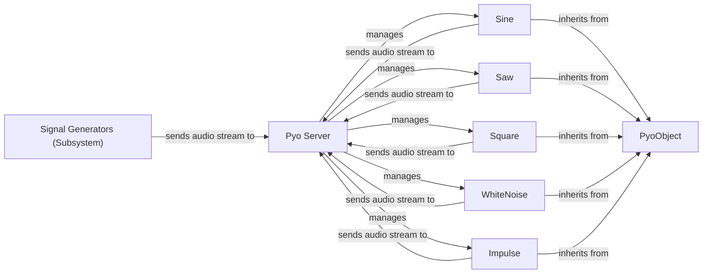

## Details

The `pyo` audio synthesis library's core functionality for generating sound is centered around its `Signal Generators` subsystem, which produces various audio waveforms. These generators, all inheriting from the foundational `PyoObject`, are managed and orchestrated by the `Pyo Server`. The `Pyo Server` acts as the central audio engine, responsible for the lifecycle of these signal sources and for processing their generated audio streams, ultimately routing them for playback or further processing within the pyo environment. This architecture clearly separates signal generation from audio management, allowing for flexible and efficient sound synthesis.

### Signal Generators (Subsystem)
The overarching module (`pyo.lib.generators`) providing various oscillators (e.g., sine, sawtooth, square, triangle waves) and noise sources (e.g., white, pink noise) to create raw audio signals. It serves as the collection point for all fundamental sound sources.

**Related Classes/Methods**:

- <a href="https://github.com/belangeo/pyo/blob/master/pyo/lib/generators.py" target="_blank" rel="noopener noreferrer">`pyo.lib.generators`</a>

### PyoObject
The common base class for all pyo processing units, including signal generators. It provides shared functionalities such as registration with the Pyo Server, common methods for audio buffer management, basic parameter handling, and signal chain integration, as well as lifecycle methods (play(), stop()).

**Related Classes/Methods**:

- <a href="https://github.com/belangeo/pyo/blob/master/pyo/lib/_core.py#L1153-L1841" target="_blank" rel="noopener noreferrer">`pyo.lib._core.PyoObject`:1153-1841</a>

### Sine
A specific signal generator responsible for synthesizing a pure sine wave, a fundamental building block in audio synthesis.

**Related Classes/Methods**:

- <a href="https://github.com/belangeo/pyo/blob/master/pyo/lib/generators.py#L34-L124" target="_blank" rel="noopener noreferrer">`pyo.lib.generators.Sine`:34-124</a>

### Saw
A specific signal generator that produces a sawtooth wave, commonly used for rich harmonic content in synthesis.

**Related Classes/Methods**:

- <a href="https://github.com/belangeo/pyo/blob/master/pyo/lib/generators.py" target="_blank" rel="noopener noreferrer">`pyo.lib.generators.Saw`</a>

### Square
A specific signal generator that produces a square wave, known for its distinct hollow sound and odd harmonics.

**Related Classes/Methods**:

- <a href="https://github.com/belangeo/pyo/blob/master/pyo/lib/generators.py" target="_blank" rel="noopener noreferrer">`pyo.lib.generators.Square`</a>

### WhiteNoise
A specific signal generator that produces white noise, a random signal with equal energy across all frequencies, often used for percussive sounds or effects.

**Related Classes/Methods**:

- <a href="https://github.com/belangeo/pyo/blob/master/pyo/lib/generators.py" target="_blank" rel="noopener noreferrer">`pyo.lib.generators.WhiteNoise`</a>

### Impulse
A specific signal generator that produces a single or periodic impulse, useful for triggering events or creating percussive attacks.

**Related Classes/Methods**:

- <a href="https://github.com/belangeo/pyo/blob/master/pyo/lib/generators.py" target="_blank" rel="noopener noreferrer">`pyo.lib.generators.Impulse`</a>

### Pyo Server
The central mixer and playback engine of pyo. It is responsible for the instantiation, lifecycle management (starting, stopping), and scheduling of signal generator instances within the real-time audio processing loop. While external to the Signal Generators module's internal implementation, it is crucial for their operation.

**Related Classes/Methods**:

- <a href="https://github.com/belangeo/pyo/blob/master/pyo/lib/server.py#L29-L300" target="_blank" rel="noopener noreferrer">`pyo.Server`:29-300</a>

### [FAQ](https://github.com/CodeBoarding/GeneratedOnBoardings/tree/main?tab=readme-ov-file#faq)