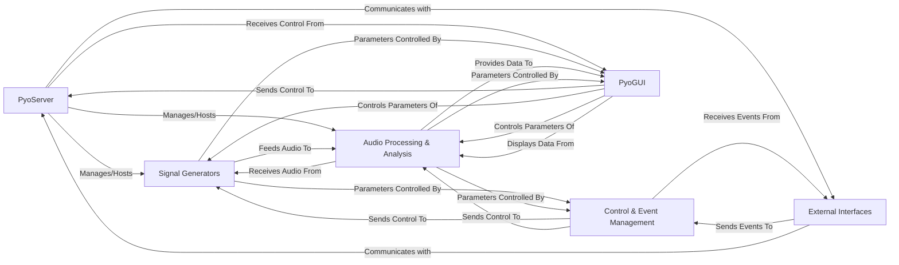

## Details

The `pyo` library is architected as a highly interconnected, real-time digital signal processing system, with the `PyoServer` at its core orchestrating all audio operations. The primary data flow begins with `Signal Generators` producing raw audio, which then passes through the `Audio Processing & Analysis` component for various transformations and effects. This audio stream is ultimately managed by the `PyoServer` for output. Control over this audio flow is achieved through the `Control & Event Management` component, which processes events from `External Interfaces` (like MIDI and OSC) to dynamically adjust parameters within both `Signal Generators` and `Audio Processing & Analysis` modules. User interaction is facilitated by the `PyoGUI`, which provides visual controls that directly influence the `PyoServer` and the audio processing chain, while also displaying real-time audio analysis data. This design emphasizes a clear, directed signal and control flow, making it ideal for visual representation as a dataflow graph. The `PyoCore` provides foundational utilities supporting all these components, and the `PyoEditor` acts as an external IDE for development and interaction with the system.

### PyoServer [[Expand]](./PyoServer.md)
The central audio processing engine, managing audio I/O, global settings, and orchestrating the real-time signal processing graph.

**Related Classes/Methods**:

- <a href="https://github.com/belangeo/pyo/blob/master/pyo/lib/_core.py#L358-L359" target="_blank" rel="noopener noreferrer">`PyoServer`:358-359</a>

### Signal Generators [[Expand]](./Signal_Generators.md)
Modules providing various oscillators and noise sources to create raw audio signals.

**Related Classes/Methods**:

- <a href="https://github.com/belangeo/pyo/blob/master/pyo/lib/generators.py" target="_blank" rel="noopener noreferrer">`Signal Generators`</a>

### Audio Processing & Analysis [[Expand]](./Audio_Processing_Analysis.md)
A comprehensive component for applying effects, filters, dynamics, spatialization, managing audio data tables, and performing various forms of audio analysis.

**Related Classes/Methods**:

- <a href="https://github.com/belangeo/pyo/blob/master/pyo/lib/effects.py" target="_blank" rel="noopener noreferrer">`Audio Processing & Analysis`</a>
- <a href="https://github.com/belangeo/pyo/blob/master/pyo/lib/dynamics.py" target="_blank" rel="noopener noreferrer">`Audio Processing & Analysis`</a>
- <a href="https://github.com/belangeo/pyo/blob/master/pyo/lib/pan.py" target="_blank" rel="noopener noreferrer">`Audio Processing & Analysis`</a>
- <a href="https://github.com/belangeo/pyo/blob/master/pyo/lib/hrtf.py" target="_blank" rel="noopener noreferrer">`Audio Processing & Analysis`</a>
- <a href="https://github.com/belangeo/pyo/blob/master/pyo/lib/matrixprocess.py" target="_blank" rel="noopener noreferrer">`Audio Processing & Analysis`</a>
- <a href="https://github.com/belangeo/pyo/blob/master/pyo/lib/filters.py" target="_blank" rel="noopener noreferrer">`Audio Processing & Analysis`</a>
- <a href="https://github.com/belangeo/pyo/blob/master/pyo/lib/analysis.py" target="_blank" rel="noopener noreferrer">`Audio Processing & Analysis`</a>
- <a href="https://github.com/belangeo/pyo/blob/master/pyo/lib/fourier.py" target="_blank" rel="noopener noreferrer">`Audio Processing & Analysis`</a>
- <a href="https://github.com/belangeo/pyo/blob/master/pyo/lib/phasevoc.py" target="_blank" rel="noopener noreferrer">`Audio Processing & Analysis`</a>
- <a href="https://github.com/belangeo/pyo/blob/master/pyo/lib/tables.py" target="_blank" rel="noopener noreferrer">`Audio Processing & Analysis`</a>
- <a href="https://github.com/belangeo/pyo/blob/master/pyo/lib/players.py" target="_blank" rel="noopener noreferrer">`Audio Processing & Analysis`</a>
- <a href="https://github.com/belangeo/pyo/blob/master/pyo/lib/tableprocess.py" target="_blank" rel="noopener noreferrer">`Audio Processing & Analysis`</a>

### Control & Event Management [[Expand]](./Control_Event_Management.md)
Provides tools for creating, managing, and sequencing musical events, patterns, and control signals over time.

**Related Classes/Methods**:

- <a href="https://github.com/belangeo/pyo/blob/master/pyo/lib/events.py" target="_blank" rel="noopener noreferrer">`Control & Event Management`</a>
- <a href="https://github.com/belangeo/pyo/blob/master/pyo/lib/triggers.py" target="_blank" rel="noopener noreferrer">`Control & Event Management`</a>
- <a href="https://github.com/belangeo/pyo/blob/master/pyo/lib/pattern.py" target="_blank" rel="noopener noreferrer">`Control & Event Management`</a>
- <a href="https://github.com/belangeo/pyo/blob/master/pyo/lib/randoms.py" target="_blank" rel="noopener noreferrer">`Control & Event Management`</a>
- <a href="https://github.com/belangeo/pyo/blob/master/pyo/lib/controls.py" target="_blank" rel="noopener noreferrer">`Control & Event Management`</a>
- <a href="https://github.com/belangeo/pyo/blob/master/pyo/lib/mmlmusic.py" target="_blank" rel="noopener noreferrer">`Control & Event Management`</a>

### External Interfaces [[Expand]](./External_Interfaces.md)
Handles communication with external hardware and software, primarily MIDI and Open Sound Control (OSC).

**Related Classes/Methods**:

- <a href="https://github.com/belangeo/pyo/blob/master/pyo/lib/midi.py" target="_blank" rel="noopener noreferrer">`External Interfaces`</a>
- <a href="https://github.com/belangeo/pyo/blob/master/pyo/lib/opensndctrl.py" target="_blank" rel="noopener noreferrer">`External Interfaces`</a>

### PyoGUI [[Expand]](./PyoGUI.md)
Provides graphical user interface elements for interacting with and visualizing audio processes.

**Related Classes/Methods**:

- <a href="https://github.com/belangeo/pyo/blob/master/pyo/lib/wxgui.py" target="_blank" rel="noopener noreferrer">`PyoGUI`</a>
- <a href="https://github.com/belangeo/pyo/blob/master/pyo/lib/_wxwidgets.py" target="_blank" rel="noopener noreferrer">`PyoGUI`</a>
- <a href="https://github.com/belangeo/pyo/blob/master/pyo/lib/_tkwidgets.py" target="_blank" rel="noopener noreferrer">`PyoGUI`</a>
- <a href="https://github.com/belangeo/pyo/blob/master/pyo/lib/_widgets.py" target="_blank" rel="noopener noreferrer">`PyoGUI`</a>

### [FAQ](https://github.com/CodeBoarding/GeneratedOnBoardings/tree/main?tab=readme-ov-file#faq)