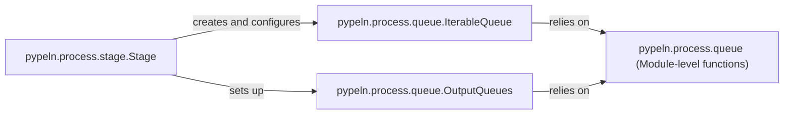

## Details

The `pypeln.process` subsystem orchestrates concurrent data processing through a pipeline of stages. The `Stage` component defines individual processing steps, managing their input and output data flow. It leverages `IterableQueue` for consuming data from preceding stages and `OutputQueues` for directing processed data to subsequent stages. Both `IterableQueue` and `OutputQueues` rely on the foundational `pypeln.process.queue` module-level functions for low-level queue operations, ensuring efficient and synchronized data transfer across the pipeline. This architecture promotes a clear separation of concerns, with stages defining processing logic and queues handling inter-stage communication and buffering.

### pypeln.process.stage.Stage
This component represents a single stage in the data processing pipeline. It is responsible for building the worker processes, managing input and output queues, and orchestrating the flow of data through its specific part of the pipeline. It embodies the "Pipeline" pattern by defining a processing step and connecting it to other stages.

**Related Classes/Methods**:

- <a href="https://github.com/cgarciae/pypeln/blob/master/pypeln/process/stage.py#L13-L89" target="_blank" rel="noopener noreferrer">`pypeln.process.stage.Stage`:13-89</a>

### pypeln.process.queue.IterableQueue
This component serves as the consumer-facing interface for data queues. It provides an iterable mechanism, allowing subsequent pipeline stages to asynchronously consume buffered data. It embodies the "Producer-Consumer" pattern by enabling stages to pull data when ready.

**Related Classes/Methods**:

- <a href="https://github.com/cgarciae/pypeln/blob/master/pypeln/process/queue.py#L17-L111" target="_blank" rel="noopener noreferrer">`pypeln.process.queue.IterableQueue`:17-111</a>

### pypeln.process.queue.OutputQueues
This component manages the collection of output queues for a given pipeline stage. Its primary responsibility is to facilitate the pushing of processed data from one stage to the input queues of subsequent stages, thereby supporting the "Pipeline" pattern by directing data flow.

**Related Classes/Methods**:

- <a href="https://github.com/cgarciae/pypeln/blob/master/pypeln/process/queue.py#L114-L129" target="_blank" rel="noopener noreferrer">`pypeln.process.queue.OutputQueues`:114-129</a>

### pypeln.process.queue (Module-level functions)
This component comprises the foundational, low-level functions within the `pypeln.process.queue` module. It encapsulates critical queue operations such as item transfer (`get`, `put`), worker state management (`worker_done`, `is_done`), and pipeline-wide exception handling (`raise_exception`, `get_pipeline_exception`). It acts as the core buffering, synchronization, and control mechanism for inter-stage data flow.

**Related Classes/Methods**: _None_

### [FAQ](https://github.com/CodeBoarding/GeneratedOnBoardings/tree/main?tab=readme-ov-file#faq)