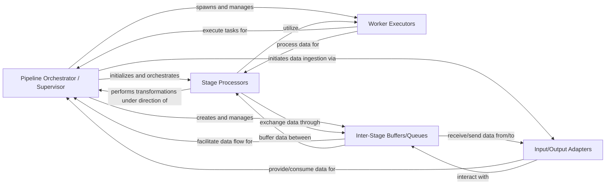

## Details

The `pypeln.process` subsystem is designed around a robust pipeline architecture, centrally managed by the **Pipeline Orchestrator / Supervisor**. This orchestrator is responsible for setting up and overseeing the entire data processing flow. It dynamically spawns and manages **Worker Executors** which are the actual units of parallel computation. Data flows between different processing steps, represented by **Stage Processors**, through **Inter-Stage Buffers/Queues**, ensuring efficient and asynchronous communication. **Input/Output Adapters** handle the ingestion of initial data into the pipeline and the emission of final processed results. The supervisor integrates functionalities for error handling, resource management, and configuration, ensuring a cohesive and resilient pipeline execution. This design promotes modularity, allowing users to define custom processing stages while the framework handles the complexities of parallel execution and data synchronization.

### Pipeline Orchestrator / Supervisor [[Expand]](./Pipeline_Orchestrator_Supervisor.md)
This is the central control unit that oversees the entire pipeline's execution. It initiates all stages, manages their lifecycle, coordinates the start and shutdown of workers and queues, and handles overall resource allocation and error propagation.

**Related Classes/Methods**:

- <a href="https://github.com/cgarciae/pypeln/blob/master/" target="_blank" rel="noopener noreferrer">`pypeln.process.supervisor`</a>

### Stage Processors
Abstract or concrete components representing the individual transformation steps within the pipeline. Users implement these to define their data processing logic.

**Related Classes/Methods**:

- <a href="https://github.com/cgarciae/pypeln/blob/master/" target="_blank" rel="noopener noreferrer">`pypeln.process.api.each`</a>

### Worker Executors
Components responsible for running the actual processing tasks within each stage, leveraging Python's `multiprocessing` capabilities to achieve parallelism.

**Related Classes/Methods**:

- <a href="https://github.com/cgarciae/pypeln/blob/master/" target="_blank" rel="noopener noreferrer">`pypeln.process.worker`</a>

### Inter-Stage Buffers/Queues
Data structures (e.g., `multiprocessing.Queue`) that facilitate asynchronous and synchronized data transfer between pipeline stages, acting as producer-consumer buffers.

**Related Classes/Methods**:

- <a href="https://github.com/cgarciae/pypeln/blob/master/" target="_blank" rel="noopener noreferrer">`pypeln.process.queue`</a>

### Input/Output Adapters
Components responsible for ingesting raw data into the pipeline and emitting processed data from the pipeline.

**Related Classes/Methods**:

- <a href="https://github.com/cgarciae/pypeln/blob/master/" target="_blank" rel="noopener noreferrer">`pypeln.process.api.from_iterable`</a>
- <a href="https://github.com/cgarciae/pypeln/blob/master/" target="_blank" rel="noopener noreferrer">`pypeln.process.api.to_iterable`</a>

### [FAQ](https://github.com/CodeBoarding/GeneratedOnBoardings/tree/main?tab=readme-ov-file#faq)