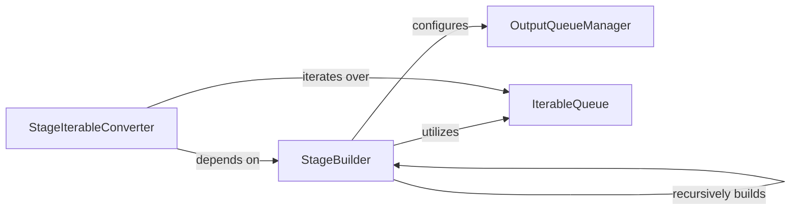

## Details

The `Stage Definition & Configuration` subsystem is responsible for translating high-level API calls into concrete, executable pipeline stages. Its boundaries encompass the logic for defining how a stage operates, including its input/output mechanisms, worker configuration, and the function to be applied. It primarily interacts with the core `pypeln.process.stage` and `pypeln.process.queue` modules.

### StageBuilder
This component is the core of stage definition. It constructs and configures the internal structure of a pipeline stage, including its input/output queues, worker parameters (e.g., `workers`, `maxsize`, `timeout`), and the function (`f`) to be applied. It handles the recursive assembly of complex, nested stages, acting as the "blueprint" creator for pipeline segments. This component is fundamental for defining the processing units in a data pipeline.

**Related Classes/Methods**:

- <a href="https://github.com/cgarciae/pypeln/blob/master/pypeln/process/stage.py#L29-L67" target="_blank" rel="noopener noreferrer">`pypeln.process.stage.build`:29-67</a>

### StageIterableConverter
This component transforms a defined stage into an iterable object, making its output consumable by subsequent stages or the final consumer. It acts as the crucial bridge between the static stage definition and its dynamic execution, allowing data to flow through the configured stage. It is essential for enabling the data flow aspect of the pipeline.

**Related Classes/Methods**:

- <a href="https://github.com/cgarciae/pypeln/blob/master/pypeln/process/stage.py#L69-L86" target="_blank" rel="noopener noreferrer">`pypeln.process.stage.to_iterable`:69-86</a>

### OutputQueueManager
Manages the creation, configuration, and lifecycle of output queues for a stage. It ensures that processed data can be correctly routed to subsequent stages or final consumers, handling the mechanics of inter-stage data transfer. This component is vital for implementing the Producer-Consumer pattern between pipeline stages.

**Related Classes/Methods**:

- <a href="https://github.com/cgarciae/pypeln/blob/master/pypeln/process/queue.py#L114-L129" target="_blank" rel="noopener noreferrer">`pypeln.process.queue.OutputQueues`:114-129</a>

### IterableQueue
Provides an iterable interface over a queue, allowing data to be pulled from the queue in an iterative fashion. It acts as an internal buffer and a fundamental mechanism for stages to consume input or provide output iteratively, supporting the producer-consumer pattern. This component directly supports the data flow and buffering requirements of a data processing library.

**Related Classes/Methods**:

- <a href="https://github.com/cgarciae/pypeln/blob/master/pypeln/process/queue.py#L17-L111" target="_blank" rel="noopener noreferrer">`pypeln.process.queue.IterableQueue`:17-111</a>

### [FAQ](https://github.com/CodeBoarding/GeneratedOnBoardings/tree/main?tab=readme-ov-file#faq)