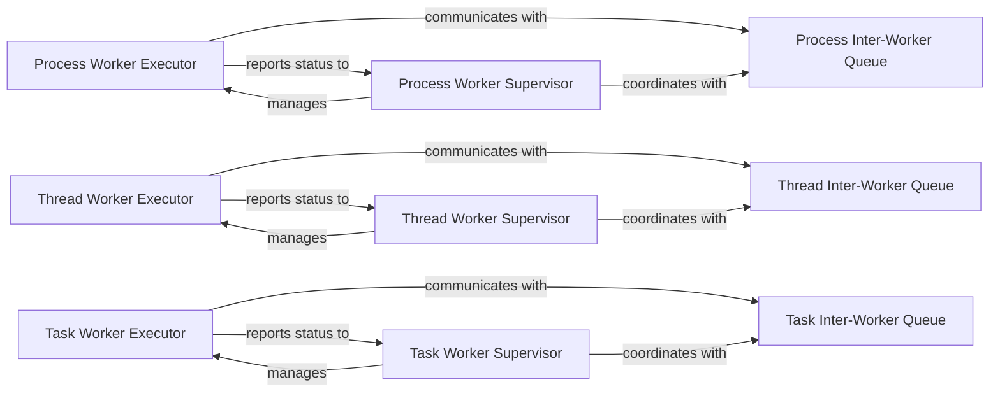

## Details

The `Worker Pool / Executor` subsystem in Pypeln is responsible for the concurrent execution of user-defined functions for each item within a pipeline stage. It encapsulates the mechanisms for managing concurrency across different paradigms: processes, threads, and asyncio tasks. This subsystem includes the individual worker executors, their respective supervisors that manage the worker pools, and the inter-worker queues that facilitate data flow and communication.

### Process Worker Executor
Executes user-defined functions within a dedicated operating system process. It manages the lifecycle of the process, applies the function to input data items, and signals completion or errors.

**Related Classes/Methods**:

- <a href="https://github.com/cgarciae/pypeln/blob/master/pypeln/process/worker.py" target="_blank" rel="noopener noreferrer">`pypeln.process.worker`</a>

### Thread Worker Executor
Executes user-defined functions within a separate thread of execution. It handles the thread's lifecycle, applies the function to input data, and manages its state within the thread pool.

**Related Classes/Methods**:

- <a href="https://github.com/cgarciae/pypeln/blob/master/pypeln/thread/worker.py" target="_blank" rel="noopener noreferrer">`pypeln.thread.worker`</a>

### Task Worker Executor
Executes user-defined asynchronous functions as `asyncio` tasks. It manages the asynchronous task's lifecycle, processes input items, and handles non-blocking I/O operations.

**Related Classes/Methods**:

- <a href="https://github.com/cgarciae/pypeln/blob/master/pypeln/task/worker.py" target="_blank" rel="noopener noreferrer">`pypeln.task.worker`</a>

### Process Worker Supervisor
Manages the pool of `Process Worker Executor` instances. It is responsible for spawning, monitoring, and orchestrating the process workers to achieve the desired level of parallel execution.

**Related Classes/Methods**:

- <a href="https://github.com/cgarciae/pypeln/blob/master/pypeln/process/supervisor.py" target="_blank" rel="noopener noreferrer">`pypeln.process.supervisor`</a>

### Thread Worker Supervisor
Manages the pool of `Thread Worker Executor` instances. It handles the creation, monitoring, and coordination of thread workers to ensure efficient concurrent execution.

**Related Classes/Methods**:

- <a href="https://github.com/cgarciae/pypeln/blob/master/pypeln/thread/supervisor.py" target="_blank" rel="noopener noreferrer">`pypeln.thread.supervisor`</a>

### Task Worker Supervisor
Manages the pool of `Task Worker Executor` instances. It is responsible for scheduling, monitoring, and coordinating `asyncio` tasks to ensure efficient asynchronous concurrency.

**Related Classes/Methods**:

- <a href="https://github.com/cgarciae/pypeln/blob/master/pypeln/task/supervisor.py" target="_blank" rel="noopener noreferrer">`pypeln.task.supervisor`</a>

### Process Inter-Worker Queue
Provides a robust, process-safe queue mechanism for buffering and transferring data items between `Process Worker Executor` instances or between pipeline stages.

**Related Classes/Methods**:

- <a href="https://github.com/cgarciae/pypeln/blob/master/pypeln/process/queue.py" target="_blank" rel="noopener noreferrer">`pypeln.process.queue`</a>

### Thread Inter-Worker Queue
Provides a thread-safe queue for buffering and transferring data items between `Thread Worker Executor` instances, ensuring safe concurrent access.

**Related Classes/Methods**:

- <a href="https://github.com/cgarciae/pypeln/blob/master/pypeln/thread/queue.py" target="_blank" rel="noopener noreferrer">`pypeln.thread.queue`</a>

### Task Inter-Worker Queue
Provides an asynchronous queue for buffering and transferring data items between `Task Worker Executor` instances, supporting non-blocking data flow.

**Related Classes/Methods**:

- <a href="https://github.com/cgarciae/pypeln/blob/master/pypeln/task/queue.py" target="_blank" rel="noopener noreferrer">`pypeln.task.queue`</a>

### [FAQ](https://github.com/CodeBoarding/GeneratedOnBoardings/tree/main?tab=readme-ov-file#faq)