```mermaid
graph LR
    Pipeline_API_Layer["Pipeline API Layer"]
    Stage_Definition_Configuration["Stage Definition & Configuration"]
    Inter_Stage_Data_Queues["Inter-Stage Data Queues"]
    Worker_Pool_Executor["Worker Pool / Executor"]
    Pipeline_Orchestrator_Supervisor["Pipeline Orchestrator / Supervisor"]
    Pipeline_API_Layer -- "defines the structure for" --> Stage_Definition_Configuration
    Stage_Definition_Configuration -- "configures" --> Inter_Stage_Data_Queues
    Stage_Definition_Configuration -- "initiates" --> Worker_Pool_Executor
    Worker_Pool_Executor -- "reads data from" --> Inter_Stage_Data_Queues
    Worker_Pool_Executor -- "writes results to" --> Inter_Stage_Data_Queues
    Pipeline_Orchestrator_Supervisor -- "manages the lifecycle of" --> Stage_Definition_Configuration
    Pipeline_Orchestrator_Supervisor -- "oversees" --> Worker_Pool_Executor
    Pipeline_Orchestrator_Supervisor -- "coordinates the state of" --> Inter_Stage_Data_Queues
    click Stage_Definition_Configuration href "https://github.com/CodeBoarding/GeneratedOnBoardings/blob/main/pypeln/Stage_Definition_Configuration.md" "Details"
    click Inter_Stage_Data_Queues href "https://github.com/CodeBoarding/GeneratedOnBoardings/blob/main/pypeln/Inter_Stage_Data_Queues.md" "Details"
    click Worker_Pool_Executor href "https://github.com/CodeBoarding/GeneratedOnBoardings/blob/main/pypeln/Worker_Pool_Executor.md" "Details"
    click Pipeline_Orchestrator_Supervisor href "https://github.com/CodeBoarding/GeneratedOnBoardings/blob/main/pypeln/Pipeline_Orchestrator_Supervisor.md" "Details"
```

## Details

The `pypeln` project, designed for concurrent data processing, is structured around a clear separation of concerns to facilitate the creation and execution of data pipelines. The `Pipeline API Layer` provides a user-friendly interface for defining pipeline stages. These high-level definitions are then translated by the `Stage Definition & Configuration` component into concrete, executable stages, which involve setting up `Inter-Stage Data Queues` for communication and initiating `Worker Pool / Executor` instances for task execution. The entire pipeline's lifecycle, from initiation to shutdown, is centrally managed by the `Pipeline Orchestrator / Supervisor`, ensuring coordinated data flow and resource management across all stages. This architecture promotes modularity, allowing for flexible pipeline construction and efficient concurrent processing.

### Pipeline API Layer
The public interface for users to construct data pipelines using high-level functions like `map`, `filter`, `each`, and `from_iterable`. It provides a consistent way to define pipeline stages regardless of the underlying concurrency model.

**Related Classes/Methods**:

- <a href="https://github.com/cgarciae/pypeln/blob/master/pypeln/process/api/map.py" target="_blank" rel="noopener noreferrer">`pypeln.process.api.map`</a>
- <a href="https://github.com/cgarciae/pypeln/blob/master/pypeln/process/api/filter.py" target="_blank" rel="noopener noreferrer">`pypeln.process.api.filter`</a>
- <a href="https://github.com/cgarciae/pypeln/blob/master/pypeln/process/api/each.py" target="_blank" rel="noopener noreferrer">`pypeln.process.api.each`</a>
- <a href="https://github.com/cgarciae/pypeln/blob/master/pypeln/process/api/from_iterable.py" target="_blank" rel="noopener noreferrer">`pypeln.process.api.from_iterable`</a>

### Stage Definition & Configuration [[Expand]](./Stage_Definition_Configuration.md)
This component translates high-level API calls into concrete, executable pipeline stages. It defines how a stage operates, including its input/output mechanisms, worker configuration, and the function to apply.

**Related Classes/Methods**:

- <a href="https://github.com/cgarciae/pypeln/blob/master/pypeln/process/stage.py#L29-L67" target="_blank" rel="noopener noreferrer">`pypeln.process.stage.build`:29-67</a>
- <a href="https://github.com/cgarciae/pypeln/blob/master/pypeln/process/stage.py#L69-L86" target="_blank" rel="noopener noreferrer">`pypeln.process.stage.to_iterable`:69-86</a>

### Inter-Stage Data Queues [[Expand]](./Inter_Stage_Data_Queues.md)
These are the communication channels between different pipeline stages. They act as buffers, ensuring smooth data flow, handling backpressure, and enabling asynchronous processing across concurrent units.

**Related Classes/Methods**:

- <a href="https://github.com/cgarciae/pypeln/blob/master/pypeln/process/queue.py#L17-L111" target="_blank" rel="noopener noreferrer">`pypeln.process.queue.IterableQueue`:17-111</a>

### Worker Pool / Executor [[Expand]](./Worker_Pool_Executor.md)
This component manages the execution of the user-defined function for each item within a pipeline stage. It handles the concurrency aspect, whether it's spawning processes, managing threads, or scheduling asyncio tasks.

**Related Classes/Methods**:

- <a href="https://github.com/cgarciae/pypeln/blob/master/pypeln/process/worker.py#L183-L186" target="_blank" rel="noopener noreferrer">`pypeln.process.worker.__call__`:183-186</a>
- <a href="https://github.com/cgarciae/pypeln/blob/master/pypeln/process/worker.py#L129-L130" target="_blank" rel="noopener noreferrer">`pypeln.process.worker.start`:129-130</a>

### Pipeline Orchestrator / Supervisor [[Expand]](./Pipeline_Orchestrator_Supervisor.md)
This is the central control unit that oversees the entire pipeline's execution. It initiates all stages, manages their lifecycle, coordinates the start and shutdown of workers and queues, and handles overall resource allocation and error propagation.

**Related Classes/Methods**:

- <a href="https://github.com/cgarciae/pypeln/blob/master/pypeln/process/supervisor.py#L37-L38" target="_blank" rel="noopener noreferrer">`pypeln.process.supervisor.__enter__`:37-38</a>
- <a href="https://github.com/cgarciae/pypeln/blob/master/pypeln/process/supervisor.py#L49-L55" target="_blank" rel="noopener noreferrer">`pypeln.process.supervisor.start`:49-55</a>

### [FAQ](https://github.com/CodeBoarding/GeneratedOnBoardings/tree/main?tab=readme-ov-file#faq)