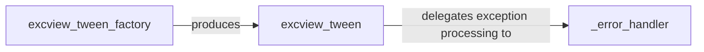

## Details

The `Middleware Pipeline (Tweens)` subsystem in Pyramid is responsible for intercepting and processing requests and responses, particularly focusing on exception handling within the request-response cycle.

### excview_tween_factory
This is a higher-order function that acts as a factory for creating `excview_tween` instances. It receives the next handler in the middleware pipeline and the application's registry, enabling it to configure the exception handling behavior dynamically. Its role is crucial in setting up the middleware chain.

**Related Classes/Methods**:

- <a href="https://github.com/Pylons/pyramid/blob/main/src/pyramid/tweens.py#L22-L46" target="_blank" rel="noopener noreferrer">`excview_tween_factory`:22-46</a>

### excview_tween
This is the core middleware callable. It intercepts incoming requests and wraps the execution of the subsequent handler (the next component in the pipeline) within a `try-except` block. Its primary responsibility is to catch exceptions that occur during request processing and delegate their handling to a specialized error handler.

**Related Classes/Methods**:

- <a href="https://github.com/Pylons/pyramid/blob/main/src/pyramid/tweens.py#L39-L44" target="_blank" rel="noopener noreferrer">`excview_tween`:39-44</a>

### _error_handler
This internal mechanism is responsible for processing exceptions caught by `excview_tween`. It transforms these exceptions into appropriate HTTP responses, typically by locating and executing a registered "exception view" that can render a user-friendly error page or a structured error response.

**Related Classes/Methods**:

- <a href="https://github.com/Pylons/pyramid/blob/main/src/pyramid/tweens.py#L7-L19" target="_blank" rel="noopener noreferrer">`_error_handler`:7-19</a>

### [FAQ](https://github.com/CodeBoarding/GeneratedOnBoardings/tree/main?tab=readme-ov-file#faq)