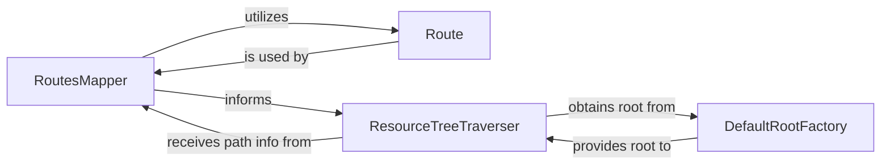

## Details

The `Request Dispatcher (Routing & Traversal)` subsystem is responsible for the initial processing of an incoming HTTP request within the Pyramid web framework. Its core function is to translate a raw URL path into a specific application resource (context) and an associated view callable, preparing the request for further processing by the application's business logic. This involves two main phases: URL matching (routing) and resource tree navigation (traversal).

### RoutesMapper
This component acts as the central registry for all defined URL patterns (`Route` objects). Its primary responsibility is to receive an incoming request's path information (`request.path_info`), iterate through its registered routes, and find the first `Route` that successfully matches the path. Upon a successful match, it extracts any dynamic URL parameters into a `matchdict` and identifies the corresponding `Route` object, which then guides the subsequent traversal or view lookup.

**Related Classes/Methods**:

- <a href="https://github.com/Pylons/pyramid/blob/main/src/pyramid/interfaces.py#L987-L1020" target="_blank" rel="noopener noreferrer">`RoutesMapper`:987-1020</a>

### Route
Represents a single, configurable URL pattern within the application. Each `Route` object encapsulates the logic required to determine if a given incoming path matches its defined pattern. If a match occurs, it is also responsible for parsing the path and extracting any variable segments (e.g., `{id}`, `{slug}`) into a dictionary of parameters.

**Related Classes/Methods**:

- <a href="https://github.com/Pylons/pyramid/blob/main/src/pyramid/interfaces.py#L947-L984" target="_blank" rel="noopener noreferrer">`Route`:947-984</a>

### ResourceTreeTraverser
This component is responsible for navigating a hierarchical resource structure (the "resource tree") based on the remaining path segments of the URL. Starting from a `root` resource (provided by a `RootFactory`), it iteratively calls the `__getitem__` method on each resource, using path segments to descend deeper into the tree. Its goal is to locate the final `context` object (the resource corresponding to the URL), identify any `view_name` embedded in the path, and determine the `subpath` (any remaining path segments not consumed by traversal).

**Related Classes/Methods**:

- <a href="https://github.com/Pylons/pyramid/blob/main/src/pyramid/traversal.py#L582-L704" target="_blank" rel="noopener noreferrer">`ResourceTreeTraverser`:582-704</a>

### DefaultRootFactory
A simple, default implementation of a root factory. Its sole responsibility is to provide the initial "root" resource object from which the `ResourceTreeTraverser` begins its navigation. This factory is used when no custom root factory is explicitly configured, offering a basic starting point for resource lookup.

**Related Classes/Methods**:

- <a href="https://github.com/Pylons/pyramid/blob/main/src/pyramid/interfaces.py#L781-L783" target="_blank" rel="noopener noreferrer">`DefaultRootFactory`:781-783</a>

### [FAQ](https://github.com/CodeBoarding/GeneratedOnBoardings/tree/main?tab=readme-ov-file#faq)