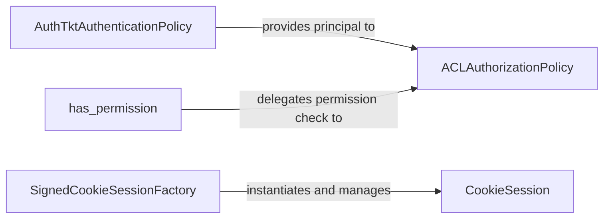

## Details

The `Security & Session Management` subsystem in `pyramid` is responsible for handling user authentication, authorization, and managing user-specific data across requests. It integrates core security policies with session state management, crucial for maintaining user context in a web application.

### AuthTktAuthenticationPolicy
This component is responsible for authenticating incoming requests. It verifies user credentials, typically extracted from HTTP headers or cookies, and establishes the authenticated identity (principal) for the current request. It's a key part of the initial security gate.

**Related Classes/Methods**:

- <a href="https://github.com/Pylons/pyramid/blob/main/src/pyramid/authentication.py#L430-L651" target="_blank" rel="noopener noreferrer">`AuthTktAuthenticationPolicy`:430-651</a>

### ACLAuthorizationPolicy
Following authentication, this component handles authorization. It determines if an authenticated principal has the necessary permissions to access a specific resource or perform a particular action, based on defined Access Control Lists (ACLs). It enforces access rules.

**Related Classes/Methods**:

- <a href="https://github.com/Pylons/pyramid/blob/main/src/pyramid/authorization.py#L49-L84" target="_blank" rel="noopener noreferrer">`ACLAuthorizationPolicy`:49-84</a>

### has_permission
A utility function that provides a convenient interface for application code to check if the current user possesses a specific permission. It abstracts the underlying authorization mechanism, making permission checks simpler for developers.

**Related Classes/Methods**:

- <a href="https://github.com/Pylons/pyramid/blob/main/src/pyramid/security.py#L252-L277" target="_blank" rel="noopener noreferrer">`has_permission`:252-277</a>

### SignedCookieSessionFactory
This component is the factory responsible for creating, loading, and saving session data. It specifically uses signed cookies to store session information securely on the client-side, handling the serialization, deserialization, and cryptographic signing/verification of session data to prevent tampering.

**Related Classes/Methods**:

- <a href="https://github.com/Pylons/pyramid/blob/main/src/pyramid/session.py#L347-L493" target="_blank" rel="noopener noreferrer">`SignedCookieSessionFactory`:347-493</a>

### CookieSession
Represents the actual data store for a user's session. It provides a dictionary-like interface, allowing application code to store and retrieve arbitrary data that needs to persist across multiple requests from the same user. This is where user-specific state is maintained.

**Related Classes/Methods**:

- <a href="https://github.com/Pylons/pyramid/blob/main/src/pyramid/session.py#L190-L342" target="_blank" rel="noopener noreferrer">`CookieSession`:190-342</a>

### [FAQ](https://github.com/CodeBoarding/GeneratedOnBoardings/tree/main?tab=readme-ov-file#faq)