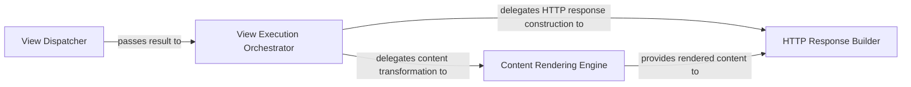

## Details

The View & Response Handler subsystem in pyramid is central to the request-response cycle, focusing on executing application logic and generating the final HTTP response. Its boundaries are primarily defined by the pyramid.view and pyramid.renderers packages.

### View Dispatcher
Responsible for locating and invoking the appropriate view callable based on the incoming request and the application's routing configuration. It acts as the initial entry point for executing application-specific business logic, effectively serving as the "Controller" in an MVC pattern.

**Related Classes/Methods**:

- <a href="https://github.com/Pylons/pyramid/blob/main/src/pyramid/view.py#L636-L682" target="_blank" rel="noopener noreferrer">`pyramid.view._call_view`:636-682</a>
- <a href="https://github.com/Pylons/pyramid/blob/main/src/pyramid/view.py#L596-L633" target="_blank" rel="noopener noreferrer">`pyramid.view._find_views`:596-633</a>

### View Execution Orchestrator
Manages the lifecycle of view execution, including handling the view's return value, applying renderers, and preparing the data for the final HTTP response. It bridges the view's output with the rendering pipeline, ensuring proper flow and error handling.

**Related Classes/Methods**:

- <a href="https://github.com/Pylons/pyramid/blob/main/src/pyramid/view.py#L28-L76" target="_blank" rel="noopener noreferrer">`pyramid.view.render_view_to_response`:28-76</a>

### Content Rendering Engine
Provides the core functionality for transforming Python data structures into various output formats (e.g., HTML, JSON). It encompasses both the generic rendering interface and specific format implementations (like JSON), along with helper utilities for content presentation.

**Related Classes/Methods**:

- <a href="https://github.com/Pylons/pyramid/blob/main/src/pyramid/renderers.py#L21-L69" target="_blank" rel="noopener noreferrer">`pyramid.renderers.render`:21-69</a>
- <a href="https://github.com/Pylons/pyramid/blob/main/src/pyramid/renderers.py#L180-L293" target="_blank" rel="noopener noreferrer">`pyramid.renderers.JSON`:180-293</a>
- <a href="https://github.com/Pylons/pyramid/blob/main/src/pyramid/renderers.py#L301-L396" target="_blank" rel="noopener noreferrer">`pyramid.renderers.JSONP`:301-396</a>
- <a href="https://github.com/Pylons/pyramid/blob/main/src/pyramid/renderers.py#L399-L498" target="_blank" rel="noopener noreferrer">`pyramid.renderers.RendererHelper`:399-498</a>

### HTTP Response Builder
Constructs the final WebOb HTTP response object, encapsulating the rendered content, setting appropriate headers, and defining the status code. This component is responsible for packaging the complete response for the client.

**Related Classes/Methods**:

- <a href="https://github.com/Pylons/pyramid/blob/main/src/pyramid/renderers.py#L72-L132" target="_blank" rel="noopener noreferrer">`pyramid.renderers.render_to_response`:72-132</a>
- <a href="https://github.com/Pylons/pyramid/blob/main/src/pyramid/renderers.py#L469-L489" target="_blank" rel="noopener noreferrer">`pyramid.renderers._make_response`:469-489</a>

### [FAQ](https://github.com/CodeBoarding/GeneratedOnBoardings/tree/main?tab=readme-ov-file#faq)