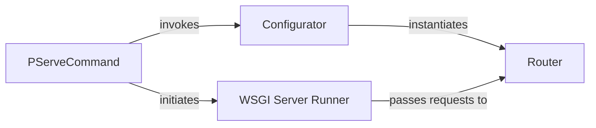

## Details

This section details the core components of the Pyramid application's startup and request handling, focusing on their responsibilities and interactions within the web framework's request-response cycle.

### PServeCommand
The primary command-line interface for launching and managing the Pyramid application. It acts as the orchestrator for the entire startup process, from parsing command-line arguments to initiating the WSGI server and obtaining the configured WSGI application.

**Related Classes/Methods**:

- <a href="https://github.com/Pylons/pyramid/blob/main/src/pyramid/scripts/pserve.py#L180-L290" target="_blank" rel="noopener noreferrer">`src.pyramid.scripts.pserve:run`:180-290</a>

### Configurator
A central configuration object in Pyramid. Its `make_wsgi_app` method is crucial for transforming the accumulated application configuration (routes, views, renderers, etc.) into a functional WSGI application object, specifically the `Router`.

**Related Classes/Methods**:

- <a href="https://github.com/Pylons/pyramid/blob/main/src/pyramid/config/__init__.py#L884-L907" target="_blank" rel="noopener noreferrer">`src.pyramid.config.Configurator:make_wsgi_app`:884-907</a>

### Router
The core WSGI application object returned by `Configurator.make_wsgi_app`. It implements the WSGI interface and is responsible for receiving HTTP requests from the WSGI server and dispatching them to the appropriate view callables based on the application's routing configuration.

**Related Classes/Methods**:

- <a href="https://github.com/Pylons/pyramid/blob/main/src/pyramid/router.py" target="_blank" rel="noopener noreferrer">`src.pyramid.router.Router`</a>

### WSGI Server Runner
A component responsible for integrating with and running a specific WSGI server (e.g., `wsgiref`). It takes the WSGI application object (`Router`) and binds it to a network address and port, making it accessible to clients.

**Related Classes/Methods**:

- <a href="https://github.com/Pylons/pyramid/blob/main/src/pyramid/scripts/pserve.py#L294-L300" target="_blank" rel="noopener noreferrer">`src.pyramid.scripts.pserve:wsgiref_server_runner`:294-300</a>

### [FAQ](https://github.com/CodeBoarding/GeneratedOnBoardings/tree/main?tab=readme-ov-file#faq)