```mermaid
graph LR
    WSGI_Entry_Point["WSGI Entry Point"]
    Configuration_Registry["Configuration & Registry"]
    Middleware_Pipeline_Tweens_["Middleware Pipeline (Tweens)"]
    Request_Dispatcher_Routing_Traversal_["Request Dispatcher (Routing & Traversal)"]
    Security_Session_Management["Security & Session Management"]
    View_Response_Handler["View & Response Handler"]
    Static_File_Handler["Static File Handler"]
    WSGI_Entry_Point -- "initializes and loads configuration from" --> Configuration_Registry
    WSGI_Entry_Point -- "passes initial request to" --> Middleware_Pipeline_Tweens_
    Middleware_Pipeline_Tweens_ -- "passes request to" --> Request_Dispatcher_Routing_Traversal_
    Request_Dispatcher_Routing_Traversal_ -- "dispatches request to" --> View_Response_Handler
    Request_Dispatcher_Routing_Traversal_ -- "provides context for security checks to" --> Security_Session_Management
    Security_Session_Management -- "influences access for" --> View_Response_Handler
    View_Response_Handler -- "returns data to" --> Middleware_Pipeline_Tweens_
    Middleware_Pipeline_Tweens_ -- "returns final response to" --> WSGI_Entry_Point
    WSGI_Entry_Point -- "delegates static file requests to" --> Static_File_Handler
    Static_File_Handler -- "returns static file responses to" --> Middleware_Pipeline_Tweens_
    click WSGI_Entry_Point href "https://github.com/CodeBoarding/GeneratedOnBoardings/blob/main/pyramid/WSGI_Entry_Point.md" "Details"
    click Configuration_Registry href "https://github.com/CodeBoarding/GeneratedOnBoardings/blob/main/pyramid/Configuration_Registry.md" "Details"
    click Middleware_Pipeline_Tweens_ href "https://github.com/CodeBoarding/GeneratedOnBoardings/blob/main/pyramid/Middleware_Pipeline_Tweens_.md" "Details"
    click Request_Dispatcher_Routing_Traversal_ href "https://github.com/CodeBoarding/GeneratedOnBoardings/blob/main/pyramid/Request_Dispatcher_Routing_Traversal_.md" "Details"
    click Security_Session_Management href "https://github.com/CodeBoarding/GeneratedOnBoardings/blob/main/pyramid/Security_Session_Management.md" "Details"
    click View_Response_Handler href "https://github.com/CodeBoarding/GeneratedOnBoardings/blob/main/pyramid/View_Response_Handler.md" "Details"
```

## Details

The Pyramid web framework operates on a request-response cycle, starting with an External WSGI Server forwarding HTTP requests to the WSGI Entry Point. This entry point, configured by the Configuration & Registry, initiates a flow through the Middleware Pipeline (Tweens) for request pre-processing. The Request Dispatcher (Routing & Traversal) then identifies the appropriate view or resource based on the URL. Security & Session Management components handle authentication, authorization, and state, often interacting with the request before or during view execution. The core application logic is executed by the View & Response Handler, which processes the request and renders the final HTTP response. This response then traverses back through the Middleware Pipeline (Tweens) for post-processing before being returned to the client. A dedicated Static File Handler efficiently serves static assets, bypassing the dynamic processing for specific requests. This modular design, driven by configuration, allows for flexible and extensible web application development.

### WSGI Entry Point [[Expand]](./WSGI_Entry_Point.md)
The initial interface for receiving HTTP requests from a WSGI server, setting up the request context, and initiating the processing pipeline.

**Related Classes/Methods**:

- <a href="https://github.com/Pylons/pyramid/blob/main/src/pyramid/scripts/pserve.py#L26-L30" target="_blank" rel="noopener noreferrer">`src.pyramid.scripts.pserve.main`:26-30</a>
- <a href="https://github.com/Pylons/pyramid/blob/main/src/pyramid/config/__init__.py#L884-L907" target="_blank" rel="noopener noreferrer">`src.pyramid.config.__init__.make_wsgi_app`:884-907</a>

### Configuration & Registry [[Expand]](./Configuration_Registry.md)
The central repository for application settings and registered components, configured during startup, providing lookup for services.

**Related Classes/Methods**:

- <a href="https://github.com/Pylons/pyramid/blob/main/src/pyramid/config/__init__.py" target="_blank" rel="noopener noreferrer">`src.pyramid.config.__init__.Configurator`</a>
- <a href="https://github.com/Pylons/pyramid/blob/main/src/pyramid/registry.py#L11-L114" target="_blank" rel="noopener noreferrer">`src.pyramid.registry.Registry`:11-114</a>

### Middleware Pipeline (Tweens) [[Expand]](./Middleware_Pipeline_Tweens_.md)
A configurable sequence of components that intercept and process requests/responses at various stages, handling cross-cutting concerns.

**Related Classes/Methods**:

- <a href="https://github.com/Pylons/pyramid/blob/main/src/pyramid/tweens.py#L22-L46" target="_blank" rel="noopener noreferrer">`src.pyramid.tweens.excview_tween_factory`:22-46</a>

### Request Dispatcher (Routing & Traversal) [[Expand]](./Request_Dispatcher_Routing_Traversal_.md)
Matches incoming URLs to routes, extracts parameters, and navigates the resource tree to locate the context object for the request.

**Related Classes/Methods**:

- <a href="https://github.com/Pylons/pyramid/blob/main/src/pyramid/urldispatch.py#L26-L92" target="_blank" rel="noopener noreferrer">`src.pyramid.urldispatch.RoutesMapper`:26-92</a>
- <a href="https://github.com/Pylons/pyramid/blob/main/src/pyramid/urldispatch.py" target="_blank" rel="noopener noreferrer">`src.pyramid.urldispatch.Route`</a>
- <a href="https://github.com/Pylons/pyramid/blob/main/src/pyramid/traversal.py#L582-L704" target="_blank" rel="noopener noreferrer">`src.pyramid.traversal.ResourceTreeTraverser`:582-704</a>
- <a href="https://github.com/Pylons/pyramid/blob/main/src/pyramid/traversal.py#L753-L758" target="_blank" rel="noopener noreferrer">`src.pyramid.traversal.DefaultRootFactory`:753-758</a>

### Security & Session Management [[Expand]](./Security_Session_Management.md)
Handles user authentication, authorization checks against resources, and manages user-specific data across requests.

**Related Classes/Methods**:

- <a href="https://github.com/Pylons/pyramid/blob/main/src/pyramid/authentication.py#L430-L651" target="_blank" rel="noopener noreferrer">`src.pyramid.authentication.AuthTktAuthenticationPolicy`:430-651</a>
- <a href="https://github.com/Pylons/pyramid/blob/main/src/pyramid/authorization.py#L49-L84" target="_blank" rel="noopener noreferrer">`src.pyramid.authorization.ACLAuthorizationPolicy`:49-84</a>
- <a href="https://github.com/Pylons/pyramid/blob/main/src/pyramid/security.py#L252-L277" target="_blank" rel="noopener noreferrer">`src.pyramid.security.has_permission`:252-277</a>
- <a href="https://github.com/Pylons/pyramid/blob/main/src/pyramid/session.py#L347-L493" target="_blank" rel="noopener noreferrer">`src.pyramid.session.SignedCookieSessionFactory`:347-493</a>
- <a href="https://github.com/Pylons/pyramid/blob/main/src/pyramid/session.py#L190-L342" target="_blank" rel="noopener noreferrer">`src.pyramid.session.CookieSession`:190-342</a>

### View & Response Handler [[Expand]](./View_Response_Handler.md)
Discovers and invokes the appropriate view callable, executes business logic, and transforms the view's output into the final HTTP response body.

**Related Classes/Methods**:

- <a href="https://github.com/Pylons/pyramid/blob/main/src/pyramid/view.py#L636-L682" target="_blank" rel="noopener noreferrer">`src.pyramid.view._call_view`:636-682</a>
- <a href="https://github.com/Pylons/pyramid/blob/main/src/pyramid/view.py#L28-L76" target="_blank" rel="noopener noreferrer">`src.pyramid.view.render_view_to_response`:28-76</a>
- <a href="https://github.com/Pylons/pyramid/blob/main/src/pyramid/renderers.py#L21-L69" target="_blank" rel="noopener noreferrer">`src.pyramid.renderers.render`:21-69</a>
- <a href="https://github.com/Pylons/pyramid/blob/main/src/pyramid/renderers.py#L180-L293" target="_blank" rel="noopener noreferrer">`src.pyramid.renderers.JSON`:180-293</a>

### Static File Handler
Efficiently serves static assets directly from the filesystem, bypassing the dynamic request-response cycle for specific URL patterns.

**Related Classes/Methods**:

- <a href="https://github.com/Pylons/pyramid/blob/main/src/pyramid/static.py#L16-L254" target="_blank" rel="noopener noreferrer">`src.pyramid.static.static_view`:16-254</a>

### [FAQ](https://github.com/CodeBoarding/GeneratedOnBoardings/tree/main?tab=readme-ov-file#faq)