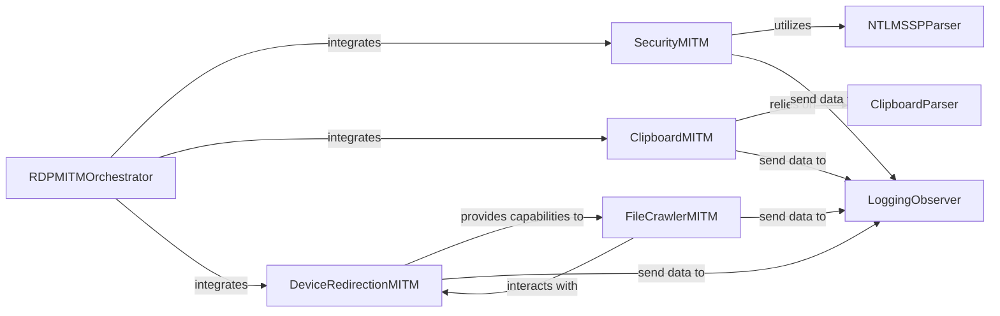

## Details

The `pyrdp.mitm` subsystem acts as the core Man-in-the-Middle (MITM) framework for RDP traffic. The central `RDPMITMOrchestrator` (`pyrdp.mitm.RDPMITM`) is responsible for setting up and coordinating various specialized MITM components. These components, such as `SecurityMITM`, `ClipboardMITM`, `DeviceRedirectionMITM`, and `FileCrawlerMITM`, intercept and manipulate specific RDP virtual channels or protocol layers. `SecurityMITM` focuses on credential capture, leveraging `NTLMSSPParser` for NTLM message analysis. `ClipboardMITM` handles clipboard data, relying on `ClipboardParser` for data serialization and deserialization. `DeviceRedirectionMITM` manages file system interactions, providing the foundation for `FileCrawlerMITM` to automate file exfiltration. All these MITM components feed extracted data and events to the `LoggingObserver` for persistent storage and analysis.

### RDPMITMOrchestrator
The primary orchestrator for the MITM functionality. It is responsible for instantiating, configuring, and integrating various MITM components into the RDP traffic flow, ensuring they can intercept and process relevant data.

**Related Classes/Methods**:

- <a href="https://github.com/GoSecure/pyrdp/blob/main/pyrdp/mitm/RDPMITM.py#L47-L300" target="_blank" rel="noopener noreferrer">`pyrdp.mitm.RDPMITM`:47-300</a>

### SecurityMITM
Intercepts and processes RDP security exchanges, specifically designed to extract NTLM hashes and client capabilities. It acts as a credential logger, capturing authentication-related artifacts.

**Related Classes/Methods**:

- <a href="https://github.com/GoSecure/pyrdp/blob/main/pyrdp/mitm/SecurityMITM.py#L21-L120" target="_blank" rel="noopener noreferrer">`pyrdp.mitm.security.SecurityMITM`:21-120</a>

### ClipboardMITM
Intercepts, manipulates, and exfiltrates clipboard content exchanged over the RDP virtual channel. It enables the capture and potential modification of data copied and pasted by users.

**Related Classes/Methods**:

- <a href="https://github.com/GoSecure/pyrdp/blob/main/pyrdp/mitm/ClipboardMITM.py#L32-L290" target="_blank" rel="noopener noreferrer">`pyrdp.mitm.clipboard.ClipboardMITM`:32-290</a>

### DeviceRedirectionMITM
Handles the RDP device redirection virtual channel, enabling file system interactions (listing, reading, writing) and forging responses to facilitate file exfiltration. It provides the foundational capabilities for remote drive crawling.

**Related Classes/Methods**:

- <a href="https://github.com/GoSecure/pyrdp/blob/main/pyrdp/mitm/DeviceRedirectionMITM.py#L44-L300" target="_blank" rel="noopener noreferrer">`pyrdp.mitm.device_redirection.DeviceRedirectionMITM`:44-300</a>

### FileCrawlerMITM
Orchestrates the crawling of remote file systems and initiates file downloads based on predefined patterns. It leverages the capabilities provided by `DeviceRedirectionMITM` to automate file exfiltration.

**Related Classes/Methods**:

- <a href="https://github.com/GoSecure/pyrdp/blob/main/pyrdp/mitm/file_crawler.py#L36-L300" target="_blank" rel="noopener noreferrer">`pyrdp.mitm.file_crawler.FileCrawlerMITM`:36-300</a>

### LoggingObserver
A crucial component for recording artifacts. It acts as a central consumer of data and events generated by other MITM components, ensuring that extracted information (like NTLM hashes, clipboard content, or exfiltrated files) is properly logged or stored.

**Related Classes/Methods**:

- <a href="https://github.com/GoSecure/pyrdp/blob/main/pyrdp/logging/observers.py#L16-L25" target="_blank" rel="noopener noreferrer">`pyrdp.logging.observers.LoggingObserver`:16-25</a>

### NTLMSSPParser
A specialized parser responsible for interpreting and extracting information from NTLMSSP (NT LAN Manager Security Support Provider) messages. It is specifically utilized by `SecurityMITM` for NTLM hash extraction.

**Related Classes/Methods**:

- <a href="https://github.com/GoSecure/pyrdp/blob/main/pyrdp/security/ntlmssp.py" target="_blank" rel="noopener noreferrer">`pyrdp.security.ntlmssp.NTLMSSPParser`</a>

### ClipboardParser
Handles the parsing of incoming clipboard data and the serialization of outgoing clipboard data according to the RDP clipboard protocol. It is a key dependency for `ClipboardMITM`.

**Related Classes/Methods**:

- <a href="https://github.com/GoSecure/pyrdp/blob/main/pyrdp/parser/rdp/virtual_channel/clipboard.py#L15-L174" target="_blank" rel="noopener noreferrer">`pyrdp.parser.rdp.virtual_channel.clipboard.ClipboardParser`:15-174</a>

### [FAQ](https://github.com/CodeBoarding/GeneratedOnBoardings/tree/main?tab=readme-ov-file#faq)