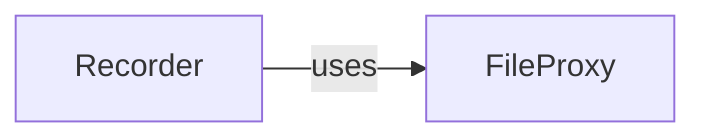

## Details

The `pyrdp` persistence subsystem is centered around the `Recorder` component, which acts as the primary control point for capturing and managing RDP session data. The `Recorder` orchestrates the collection of various data streams, ensuring they are properly prepared for storage. To achieve physical data persistence, the `Recorder` interacts with the `FileProxy` component. `FileProxy` provides a low-level abstraction for file system operations, handling the reliable writing of data to disk. This clear separation of concerns allows the `Recorder` to focus on session management and data aggregation, while `FileProxy` manages the intricacies of file I/O, forming a robust pipeline for RDP session recording and storage.

### Recorder
The `Recorder` component (`pyrdp.recording.recorder.Recorder`) serves as the primary orchestrator for data capture and session management within the persistence layer. It initiates, controls, and manages the lifecycle of RDP session recordings. Its core responsibility is to integrate various data streams—such as raw RDP traffic, extracted credentials, transferred files, and session metadata—and ensure they are properly timestamped and prepared for storage. This component embodies the "Data Capture & Storage" aspect of the project, acting as a critical point in the "Pipeline/Event Processing" flow for data persistence.

**Related Classes/Methods**:

- <a href="https://github.com/GoSecure/pyrdp/blob/main/pyrdp/recording/recorder.py#L19-L91" target="_blank" rel="noopener noreferrer">`pyrdp.recording.recorder.Recorder`:19-91</a>

### FileProxy
The `FileProxy` component (`pyrdp.core.FileProxy.FileProxy`) provides a fundamental abstraction layer for low-level file system operations. Its core responsibility is to handle the physical persistence of data to local files, encompassing operations like file creation, writing, seeking, and closing. It ensures reliable disk I/O, abstracting the complexities of direct file manipulation from higher-level components. This utility is crucial for the `Recorder` to achieve its data storage objectives.

**Related Classes/Methods**:

- <a href="https://github.com/GoSecure/pyrdp/blob/main/pyrdp/core/FileProxy.py#L26-L67" target="_blank" rel="noopener noreferrer">`pyrdp.core.FileProxy.FileProxy`:26-67</a>

### [FAQ](https://github.com/CodeBoarding/GeneratedOnBoardings/tree/main?tab=readme-ov-file#faq)