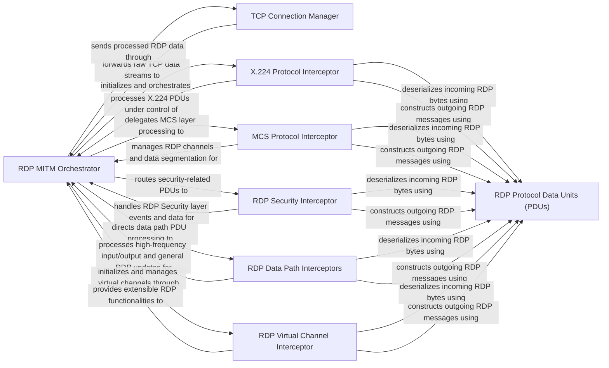

## Details

The `pyrdp` MITM subsystem operates as a layered RDP proxy, orchestrated by the `RDP MITM Orchestrator`. This orchestrator manages the flow of RDP traffic, delegating specific protocol layer processing to a series of specialized interceptor components. The `TCP Connection Manager` serves as the foundational network interface, handling raw TCP data streams. Above this, the `X.224 Protocol Interceptor` manages connection establishment, followed by the `MCS Protocol Interceptor` for channel management and data segmentation. The `RDP Security Interceptor` handles encryption and authentication, while `RDP Data Path Interceptors` process high-frequency RDP updates and input/output. Extensible RDP functionalities, such as clipboard sharing, are managed by the `RDP Virtual Channel Interceptor`. All interceptor components interact with `RDP Protocol Data Units (PDUs)` for the crucial tasks of deserializing incoming RDP bytes into structured objects and constructing outgoing RDP messages from these objects, ensuring proper RDP protocol adherence throughout the MITM session.

### RDP MITM Orchestrator
The central orchestrator of the RDP MITM session, coordinating various RDP protocol layers.

**Related Classes/Methods**:

- <a href="https://github.com/GoSecure/pyrdp/blob/main/pyrdp/mitm/RDPMITM.py" target="_blank" rel="noopener noreferrer">`pyrdp.mitm.RDPMITM`</a>

### TCP Connection Manager
Manages raw TCP connections, serving as the network entry/exit point for the MITM.

**Related Classes/Methods**:

- <a href="https://github.com/GoSecure/pyrdp/blob/main/pyrdp/mitm/TCPMITM.py" target="_blank" rel="noopener noreferrer">`pyrdp.mitm.TCPMITM`</a>

### X.224 Protocol Interceptor
Handles the X.224 (T.125) protocol layer for connection establishment.

**Related Classes/Methods**:

- <a href="https://github.com/GoSecure/pyrdp/blob/main/pyrdp/mitm/X224MITM.py" target="_blank" rel="noopener noreferrer">`pyrdp.mitm.X224MITM`</a>

### MCS Protocol Interceptor
Manages the MCS (Multipoint Communication Service) layer, dealing with channel management and data segmentation.

**Related Classes/Methods**:

- <a href="https://github.com/GoSecure/pyrdp/blob/main/pyrdp/mitm/MCSMITM.py" target="_blank" rel="noopener noreferrer">`pyrdp.mitm.MCSMITM`</a>

### RDP Security Interceptor
Intercepts and processes PDUs related to the RDP Security layer, including encryption and authentication.

**Related Classes/Methods**:

- <a href="https://github.com/GoSecure/pyrdp/blob/main/pyrdp/mitm/SecurityMITM.py" target="_blank" rel="noopener noreferrer">`pyrdp.mitm.SecurityMITM`</a>

### RDP Data Path Interceptors
Specializes in handling Fast Path and Slow Path PDUs for optimized and general RDP updates and input/output events.

**Related Classes/Methods**:

- <a href="https://github.com/GoSecure/pyrdp/blob/main/pyrdp/mitm/FastPathMITM.py" target="_blank" rel="noopener noreferrer">`pyrdp.mitm.FastPathMITM`</a>
- <a href="https://github.com/GoSecure/pyrdp/blob/main/pyrdp/mitm/SlowPathMITM.py" target="_blank" rel="noopener noreferrer">`pyrdp.mitm.SlowPathMITM`</a>

### RDP Virtual Channel Interceptor
Provides a base for handling RDP Virtual Channels, enabling extensions like clipboard sharing and device redirection.

**Related Classes/Methods**:

- <a href="https://github.com/GoSecure/pyrdp/blob/main/pyrdp/mitm/VirtualChannelMITM.py" target="_blank" rel="noopener noreferrer">`pyrdp.mitm.VirtualChannelMITM`</a>

### RDP Protocol Data Units (PDUs)
Defines the data structures for various RDP Protocol Data Units and includes logic for deserializing raw RDP PDU bytes into structured Python objects.

**Related Classes/Methods**:

- <a href="https://github.com/GoSecure/pyrdp/blob/main/pyrdp/parser/parser.py" target="_blank" rel="noopener noreferrer">`pyrdp.parser.parser`</a>
- <a href="https://github.com/GoSecure/pyrdp/blob/main/pyrdp/parser/x224.py" target="_blank" rel="noopener noreferrer">`pyrdp.parser.x224`</a>
- <a href="https://github.com/GoSecure/pyrdp/blob/main/pyrdp/parser/mcs.py" target="_blank" rel="noopener noreferrer">`pyrdp.parser.mcs`</a>
- <a href="https://github.com/GoSecure/pyrdp/blob/main/pyrdp/parser/rdp/connection.py" target="_blank" rel="noopener noreferrer">`pyrdp.parser.rdp.connection`</a>
- <a href="https://github.com/GoSecure/pyrdp/blob/main/pyrdp/parser/rdp/security.py" target="_blank" rel="noopener noreferrer">`pyrdp.parser.rdp.security`</a>
- <a href="https://github.com/GoSecure/pyrdp/blob/main/pyrdp/parser/rdp/fastpath.py" target="_blank" rel="noopener noreferrer">`pyrdp.parser.rdp.fastpath`</a>
- <a href="https://github.com/GoSecure/pyrdp/blob/main/pyrdp/parser/rdp/slowpath.py" target="_blank" rel="noopener noreferrer">`pyrdp.parser.rdp.slowpath`</a>
- <a href="https://github.com/GoSecure/pyrdp/blob/main/pyrdp/parser/rdp/virtual_channel/clipboard.py" target="_blank" rel="noopener noreferrer">`pyrdp.parser.rdp.virtual_channel.clipboard`</a>
- <a href="https://github.com/GoSecure/pyrdp/blob/main/pyrdp/parser/rdp/virtual_channel/device_redirection.py" target="_blank" rel="noopener noreferrer">`pyrdp.parser.rdp.virtual_channel.device_redirection`</a>
- <a href="https://github.com/GoSecure/pyrdp/blob/main/pyrdp/pdu/x224.py" target="_blank" rel="noopener noreferrer">`pyrdp.pdu.x224`</a>
- <a href="https://github.com/GoSecure/pyrdp/blob/main/pyrdp/pdu/mcs.py" target="_blank" rel="noopener noreferrer">`pyrdp.pdu.mcs`</a>
- <a href="https://github.com/GoSecure/pyrdp/blob/main/pyrdp/pdu/rdp/connection.py" target="_blank" rel="noopener noreferrer">`pyrdp.pdu.rdp.connection`</a>
- <a href="https://github.com/GoSecure/pyrdp/blob/main/pyrdp/pdu/rdp/fastpath.py" target="_blank" rel="noopener noreferrer">`pyrdp.pdu.rdp.fastpath`</a>
- <a href="https://github.com/GoSecure/pyrdp/blob/main/pyrdp/pdu/rdp/input.py" target="_blank" rel="noopener noreferrer">`pyrdp.pdu.rdp.input`</a>
- <a href="https://github.com/GoSecure/pyrdp/blob/main/pyrdp/pdu/rdp/licensing.py" target="_blank" rel="noopener noreferrer">`pyrdp.pdu.rdp.licensing`</a>
- <a href="https://github.com/GoSecure/pyrdp/blob/main/pyrdp/ntlmssp.py" target="_blank" rel="noopener noreferrer">`pyrdp.pdu.rdp.ntlmssp`</a>
- <a href="https://github.com/GoSecure/pyrdp/blob/main/pyrdp/pdu/rdp/pointer.py" target="_blank" rel="noopener noreferrer">`pyrdp.pdu.rdp.pointer`</a>
- <a href="https://github.com/GoSecure/pyrdp/blob/main/pyrdp/pdu/rdp/capability.py" target="_blank" rel="noopener noreferrer">`pyrdp.pdu.rdp.capability`</a>
- <a href="https://github.com/GoSecure/pyrdp/blob/main/pyrdp/pdu/rdp/virtual_channel/clipboard.py" target="_blank" rel="noopener noreferrer">`pyrdp.pdu.rdp.virtual_channel.clipboard`</a>
- <a href="https://github.com/GoSecure/pyrdp/blob/main/pyrdp/pdu/rdp/virtual_channel/device_redirection.py" target="_blank" rel="noopener noreferrer">`pyrdp.pdu.rdp.virtual_channel.device_redirection`</a>

### [FAQ](https://github.com/CodeBoarding/GeneratedOnBoardings/tree/main?tab=readme-ov-file#faq)