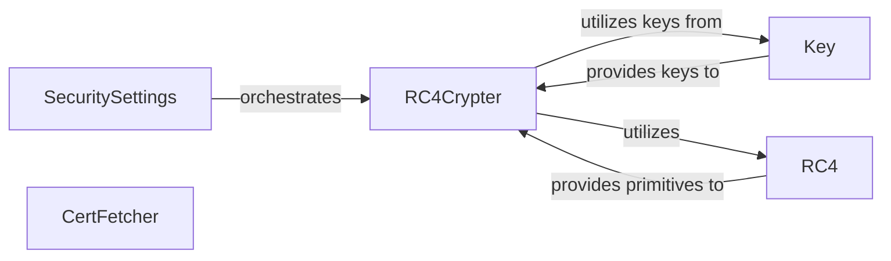

## Details

The `Security & Certificate Management` subsystem is crucial for `pyrdp`'s MITM capabilities, handling all cryptographic operations and certificate manipulation. The subsystem is primarily defined by the `pyrdp.security` package and the `pyrdp.bin.clonecert` module, encompassing functionalities for certificate fetching, key management, and cryptographic algorithms.

### SecuritySettings
Manages security-related configurations and orchestrates the creation and configuration of cryptographic components, acting as the central point for security setup.

**Related Classes/Methods**:

- <a href="https://github.com/GoSecure/pyrdp/blob/main/pyrdp/security/settings.py#L29-L124" target="_blank" rel="noopener noreferrer">`pyrdp.security.settings.SecuritySettings`:29-124</a>

### RC4Crypter
Provides the high-level interface for performing RC4-based encryption and decryption operations on data streams, abstracting the underlying RC4 algorithm.

**Related Classes/Methods**:

- <a href="https://github.com/GoSecure/pyrdp/blob/main/pyrdp/security/crypto.py#L121-L217" target="_blank" rel="noopener noreferrer">`pyrdp.security.crypto.RC4Crypter`:121-217</a>

### Key
An abstract base class defining the interface and providing mechanisms for deriving and updating cryptographic keys, ensuring secure key management.

**Related Classes/Methods**:

- <a href="https://github.com/GoSecure/pyrdp/blob/main/pyrdp/security/key.py" target="_blank" rel="noopener noreferrer">`pyrdp.security.key.Key`</a>

### RC4
Implements the core RC4 stream cipher algorithm, including its Key-Scheduling Algorithm (KSA) and Pseudo-Random Generation Algorithm (PRGA), providing the low-level cryptographic primitive.

**Related Classes/Methods**:

- <a href="https://github.com/GoSecure/pyrdp/blob/main/pyrdp/security/rc4.py#L49-L51" target="_blank" rel="noopener noreferrer">`pyrdp.security.rc4.RC4`:49-51</a>

### CertFetcher
Handles the process of connecting to a target RDP server, fetching its SSL/TLS certificate, and saving it, enabling certificate cloning for MITM.

**Related Classes/Methods**:

- <a href="https://github.com/GoSecure/pyrdp/blob/main/pyrdp/bin/clonecert.py#L60-L98" target="_blank" rel="noopener noreferrer">`pyrdp.bin.clonecert.CertFetcher`:60-98</a>

### [FAQ](https://github.com/CodeBoarding/GeneratedOnBoardings/tree/main?tab=readme-ov-file#faq)