```mermaid
graph LR
    pyrdp_convert_RDPReplayer["pyrdp.convert.RDPReplayer"]
    pyrdp_player_Replay["pyrdp.player.Replay"]
    pyrdp_player_RenderingEventHandler["pyrdp.player.RenderingEventHandler"]
    pyrdp_player_gdi_draw["pyrdp.player.gdi.draw"]
    pyrdp_convert_RDPReplayer -- "provides data to" --> pyrdp_player_Replay
    pyrdp_player_Replay -- "feeds events to" --> pyrdp_player_RenderingEventHandler
    pyrdp_player_RenderingEventHandler -- "delegates operations to" --> pyrdp_player_gdi_draw
```

## Details

The `pyrdp` player subsystem is designed around a clear pipeline for replaying captured RDP sessions. The `pyrdp.convert.RDPReplayer` initiates the process by converting raw RDP data into a structured event stream. This stream is then consumed by the `pyrdp.player.Replay` component, which acts as the central playback engine, managing the chronological dispatch of RDP events. The `pyrdp.player.RenderingEventHandler` receives these events and dispatches them as generic rendering commands to the `pyrdp.player.gdi.draw` component, which is responsible for the low-level graphics rendering, translating RDP drawing orders into visual output. This modular design ensures a clear separation of concerns, from data conversion and playback control to event handling and graphical rendering.

### pyrdp.convert.RDPReplayer
This component acts as the **Converter Module** for playback. It is responsible for parsing raw captured RDP data, reassembling fragmented packets, and organizing the RDP events into a structured, chronological stream suitable for sequential playback. It transforms raw session logs into an actionable format for the player.

**Related Classes/Methods**:

- <a href="https://github.com/GoSecure/pyrdp/blob/main/pyrdp/convert/RDPReplayer.py" target="_blank" rel="noopener noreferrer">`pyrdp.convert.RDPReplayer`</a>

### pyrdp.player.Replay
This component serves as the central **Player/Replay Engine**. It manages the sequential playback of the prepared RDP events, consuming the structured data provided by the `RDPReplayer` and dispatching individual RDP output events in chronological order. It controls the overall playback timeline and speed.

**Related Classes/Methods**:

- <a href="https://github.com/GoSecure/pyrdp/blob/main/pyrdp/player/Replay.py" target="_blank" rel="noopener noreferrer">`pyrdp.player.Replay`</a>

### pyrdp.player.RenderingEventHandler
This component acts as an **Event Dispatcher** within the playback engine. It processes various RDP output events (e.g., updates, drawing commands) received from the `Replay` component and translates them into generic rendering commands. It then delegates these commands to the appropriate low-level drawing components.

**Related Classes/Methods**:

- <a href="https://github.com/GoSecure/pyrdp/blob/main/pyrdp/player/RenderingEventHandler.py" target="_blank" rel="noopener noreferrer">`pyrdp.player.RenderingEventHandler`</a>

### pyrdp.player.gdi.draw
This component is the **Graphics Renderer**. It interprets RDP Graphics Device Interface (GDI) drawing orders and renders them onto a display surface. It handles low-level graphics operations, including bitmap blitting, line drawing, and color conversions, effectively translating RDP drawing commands into visual output.

**Related Classes/Methods**:

- <a href="https://github.com/GoSecure/pyrdp/blob/main/pyrdp/player/gdi/draw.py" target="_blank" rel="noopener noreferrer">`pyrdp.player.gdi.draw`</a>

### [FAQ](https://github.com/CodeBoarding/GeneratedOnBoardings/tree/main?tab=readme-ov-file#faq)