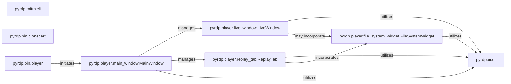

## Details

The pyrdp project's player subsystem is centered around a Qt-based graphical user interface for interacting with RDP session data. The pyrdp.bin.player component serves as the primary entry point, responsible for initializing the Qt environment and launching the pyrdp.player.main_window.MainWindow. This MainWindow acts as the central orchestrator, managing distinct views for live RDP sessions through pyrdp.player.live_window.LiveWindow and recorded session replays via pyrdp.player.replay_tab.ReplayTab. Both the live and replay functionalities can incorporate the pyrdp.player.file_system_widget.FileSystemWidget for displaying and interacting with redirected file systems. All these GUI components heavily rely on the pyrdp.ui.qt module for fundamental Qt utilities and rendering capabilities, ensuring a consistent visual experience. This modular design allows for clear separation of concerns between the core application window, its specialized tabs, and reusable widgets, all built upon a common UI framework.

### pyrdp.mitm.cli
Manages command-line arguments and configurations specifically for the core MITM functionality. It serves as the primary CLI interface for initiating and controlling the MITM proxy.

**Related Classes/Methods**:

- <a href="https://github.com/GoSecure/pyrdp/blob/main/pyrdp/mitm/cli.py" target="_blank" rel="noopener noreferrer">`pyrdp.mitm.cli`</a>

### pyrdp.bin.clonecert
Handles command-line operations related to certificate management, allowing users to clone or manage SSL/TLS certificates for MITM operations.

**Related Classes/Methods**:

- <a href="https://github.com/GoSecure/pyrdp/blob/main/pyrdp/bin/clonecert.py" target="_blank" rel="noopener noreferrer">`pyrdp.bin.clonecert`</a>

### pyrdp.bin.player
The entry point for launching the graphical player application. It initializes the Qt environment and starts the main GUI window.

**Related Classes/Methods**:

- <a href="https://github.com/GoSecure/pyrdp/blob/main/pyrdp/bin/player.py" target="_blank" rel="noopener noreferrer">`pyrdp.bin.player`</a>

### pyrdp.player.main_window.MainWindow
The primary window orchestrating the overall GUI player application. It acts as the central hub, managing different tabs and views for live sessions and replay.

**Related Classes/Methods**:

- <a href="https://github.com/GoSecure/pyrdp/blob/main/pyrdp/player/MainWindow.py" target="_blank" rel="noopener noreferrer">`pyrdp.player.main_window.MainWindow`</a>

### pyrdp.player.live_window.LiveWindow
A dedicated GUI window or tab responsible for displaying real-time RDP session data captured by the MITM engine.

**Related Classes/Methods**:

- <a href="https://github.com/GoSecure/pyrdp/blob/main/pyrdp/player/LiveWindow.py" target="_blank" rel="noopener noreferrer">`pyrdp.player.live_window.LiveWindow`</a>

### pyrdp.player.replay_tab.ReplayTab
A GUI tab within the MainWindow that manages the replay of previously recorded RDP sessions, allowing users to navigate and analyze captured data.

**Related Classes/Methods**:

- <a href="https://github.com/GoSecure/pyrdp/blob/main/pyrdp/player/ReplayTab.py" target="_blank" rel="noopener noreferrer">`pyrdp.player.replay_tab.ReplayTab`</a>

### pyrdp.player.file_system_widget.FileSystemWidget
A reusable GUI widget specifically designed for interacting with and displaying data from redirected file systems within RDP sessions, used in both live and replay contexts.

**Related Classes/Methods**:

- <a href="https://github.com/GoSecure/pyrdp/blob/main/pyrdp/player/FileSystemWidget.py" target="_blank" rel="noopener noreferrer">`pyrdp.player.file_system_widget.FileSystemWidget`</a>

### pyrdp.ui.qt
Provides foundational Qt-specific utilities, helper functions, and rendering capabilities that are utilized by various GUI components to build the visual interface.

**Related Classes/Methods**:

- <a href="https://github.com/GoSecure/pyrdp/blob/main/pyrdp/ui/qt.py" target="_blank" rel="noopener noreferrer">`pyrdp.ui.qt`</a>

### [FAQ](https://github.com/CodeBoarding/GeneratedOnBoardings/tree/main?tab=readme-ov-file#faq)