```mermaid
graph LR
    RDP_MITM_Core["RDP MITM Core"]
    Data_Interception_Artifacts["Data Interception & Artifacts"]
    Data_Persistence_Recording["Data Persistence & Recording"]
    Session_Analysis_Playback["Session Analysis & Playback"]
    Security_Certificate_Management["Security & Certificate Management"]
    User_Interface["User Interface"]
    PCAP_Conversion_Utilities["PCAP Conversion Utilities"]
    RDP_MITM_Core -- "Initiates/Controls" --> User_Interface
    RDP_MITM_Core -- "Uses/Provides Crypto" --> Security_Certificate_Management
    RDP_MITM_Core -- "Feeds Raw Data" --> Data_Interception_Artifacts
    RDP_MITM_Core -- "Records Session Data" --> Data_Persistence_Recording
    Data_Interception_Artifacts -- "Extracts Data From" --> RDP_MITM_Core
    Data_Interception_Artifacts -- "Stores Extracted Artifacts" --> Data_Persistence_Recording
    Data_Interception_Artifacts -- "Displays Live Data To" --> User_Interface
    Data_Persistence_Recording -- "Stores Data From" --> RDP_MITM_Core
    Data_Persistence_Recording -- "Stores Artifacts From" --> Data_Interception_Artifacts
    Data_Persistence_Recording -- "Provides Recorded Data To" --> Session_Analysis_Playback
    Data_Persistence_Recording -- "Receives Converted Data From" --> PCAP_Conversion_Utilities
    Session_Analysis_Playback -- "Retrieves Data From" --> Data_Persistence_Recording
    Session_Analysis_Playback -- "Displays Replay To" --> User_Interface
    Session_Analysis_Playback -- "Receives Converted Data From" --> PCAP_Conversion_Utilities
    Security_Certificate_Management -- "Provides Crypto Services To" --> RDP_MITM_Core
    Security_Certificate_Management -- "Provides Crypto Services To" --> PCAP_Conversion_Utilities
    User_Interface -- "Controls" --> RDP_MITM_Core
    User_Interface -- "Controls" --> Session_Analysis_Playback
    User_Interface -- "Displays Live Data From" --> Data_Interception_Artifacts
    User_Interface -- "Displays Replay From" --> Session_Analysis_Playback
    PCAP_Conversion_Utilities -- "Uses Crypto From" --> Security_Certificate_Management
    PCAP_Conversion_Utilities -- "Outputs Converted Data To" --> Data_Persistence_Recording
    PCAP_Conversion_Utilities -- "Feeds Converted Data To" --> Session_Analysis_Playback
    click RDP_MITM_Core href "https://github.com/CodeBoarding/GeneratedOnBoardings/blob/main/pyrdp/RDP_MITM_Core.md" "Details"
    click Data_Interception_Artifacts href "https://github.com/CodeBoarding/GeneratedOnBoardings/blob/main/pyrdp/Data_Interception_Artifacts.md" "Details"
    click Data_Persistence_Recording href "https://github.com/CodeBoarding/GeneratedOnBoardings/blob/main/pyrdp/Data_Persistence_Recording.md" "Details"
    click Session_Analysis_Playback href "https://github.com/CodeBoarding/GeneratedOnBoardings/blob/main/pyrdp/Session_Analysis_Playback.md" "Details"
    click Security_Certificate_Management href "https://github.com/CodeBoarding/GeneratedOnBoardings/blob/main/pyrdp/Security_Certificate_Management.md" "Details"
    click User_Interface href "https://github.com/CodeBoarding/GeneratedOnBoardings/blob/main/pyrdp/User_Interface.md" "Details"
    click PCAP_Conversion_Utilities href "https://github.com/CodeBoarding/GeneratedOnBoardings/blob/main/pyrdp/PCAP_Conversion_Utilities.md" "Details"
```

## Details

The `pyrdp` project is architected around a core Man-in-the-Middle (MITM) engine for RDP sessions, complemented by modules for data interception, persistence, session analysis, and a user interface. Security and PCAP conversion utilities support the main functionalities. The architecture is designed for both live RDP session manipulation and post-capture analysis, providing a comprehensive tool for RDP security research and forensics.

### RDP MITM Core [[Expand]](./RDP_MITM_Core.md)
The central engine for `pyrdp`, establishing and managing TCP connections for RDP sessions as a Man-in-the-Middle. It handles the intricate parsing, serialization, and processing of all RDP protocol data units (PDUs) across various layers (X.224, MCS, Security, Fast Path, Slow Path, Virtual Channels), and defines the fundamental structure of these PDUs.

**Related Classes/Methods**:

- <a href="https://github.com/GoSecure/pyrdp/blob/main/pyrdp/mitm/TCPMITM.py" target="_blank" rel="noopener noreferrer">`pyrdp.mitm.tcp`</a>
- <a href="https://github.com/GoSecure/pyrdp/blob/main/pyrdp/mitm/RDPMITM.py" target="_blank" rel="noopener noreferrer">`pyrdp.mitm.rdp`</a>
- <a href="https://github.com/GoSecure/pyrdp/blob/main/pyrdp/mitm/X224MITM.py" target="_blank" rel="noopener noreferrer">`pyrdp.mitm.x224`</a>
- <a href="https://github.com/GoSecure/pyrdp/blob/main/pyrdp/mitm/MCSMITM.py" target="_blank" rel="noopener noreferrer">`pyrdp.mitm.mcs`</a>
- <a href="https://github.com/GoSecure/pyrdp/blob/main/pyrdp/mitm/SecurityMITM.py" target="_blank" rel="noopener noreferrer">`pyrdp.mitm.security`</a>
- <a href="https://github.com/GoSecure/pyrdp/blob/main/pyrdp/mitm/FastPathMITM.py" target="_blank" rel="noopener noreferrer">`pyrdp.mitm.fastpath`</a>
- <a href="https://github.com/GoSecure/pyrdp/blob/main/pyrdp/mitm/SlowPathMITM.py" target="_blank" rel="noopener noreferrer">`pyrdp.mitm.slowpath`</a>
- <a href="https://github.com/GoSecure/pyrdp/blob/main/pyrdp/mitm/VirtualChannelMITM.py" target="_blank" rel="noopener noreferrer">`pyrdp.mitm.virtual_channel`</a>
- <a href="https://github.com/GoSecure/pyrdp/blob/main/pyrdp/parser/parser.py" target="_blank" rel="noopener noreferrer">`pyrdp.parser.parser`</a>
- <a href="https://github.com/GoSecure/pyrdp/blob/main/pyrdp/parser/x224.py" target="_blank" rel="noopener noreferrer">`pyrdp.parser.x224`</a>
- <a href="https://github.com/GoSecure/pyrdp/blob/main/pyrdp/parser/mcs.py" target="_blank" rel="noopener noreferrer">`pyrdp.parser.mcs`</a>
- <a href="https://github.com/GoSecure/pyrdp/blob/main/pyrdp/parser/rdp/connection.py" target="_blank" rel="noopener noreferrer">`pyrdp.parser.rdp.connection`</a>
- <a href="https://github.com/GoSecure/pyrdp/blob/main/pyrdp/parser/rdp/security.py" target="_blank" rel="noopener noreferrer">`pyrdp.parser.rdp.security`</a>
- <a href="https://github.com/GoSecure/pyrdp/blob/main/pyrdp/parser/rdp/fastpath.py" target="_blank" rel="noopener noreferrer">`pyrdp.parser.rdp.fastpath`</a>
- <a href="https://github.com/GoSecure/pyrdp/blob/main/pyrdp/parser/rdp/slowpath.py" target="_blank" rel="noopener noreferrer">`pyrdp.parser.rdp.slowpath`</a>
- <a href="https://github.com/GoSecure/pyrdp/blob/main/pyrdp/parser/rdp/virtual_channel/clipboard.py" target="_blank" rel="noopener noreferrer">`pyrdp.parser.rdp.virtual_channel.clipboard`</a>
- <a href="https://github.com/GoSecure/pyrdp/blob/main/pyrdp/parser/rdp/virtual_channel/device_redirection.py" target="_blank" rel="noopener noreferrer">`pyrdp.parser.rdp.virtual_channel.device_redirection`</a>
- <a href="https://github.com/GoSecure/pyrdp/blob/main/pyrdp/pdu/x224.py" target="_blank" rel="noopener noreferrer">`pyrdp.pdu.x224`</a>
- <a href="https://github.com/GoSecure/pyrdp/blob/main/pyrdp/pdu/mcs.py" target="_blank" rel="noopener noreferrer">`pyrdp.pdu.mcs`</a>
- <a href="https://github.com/GoSecure/pyrdp/blob/main/pyrdp/pdu/rdp/connection.py" target="_blank" rel="noopener noreferrer">`pyrdp.pdu.rdp.connection`</a>
- <a href="https://github.com/GoSecure/pyrdp/blob/main/pyrdp/pdu/rdp/fastpath.py" target="_blank" rel="noopener noreferrer">`pyrdp.pdu.rdp.fastpath`</a>
- <a href="https://github.com/GoSecure/pyrdp/blob/main/pyrdp/pdu/rdp/input.py" target="_blank" rel="noopener noreferrer">`pyrdp.pdu.rdp.input`</a>
- <a href="https://github.com/GoSecure/pyrdp/blob/main/pyrdp/pdu/rdp/licensing.py" target="_blank" rel="noopener noreferrer">`pyrdp.pdu.rdp.licensing`</a>
- <a href="https://github.com/GoSecure/pyrdp/blob/main/pyrdp/pdu/rdp/ntlmssp.py" target="_blank" rel="noopener noreferrer">`pyrdp.pdu.rdp.ntlmssp`</a>
- <a href="https://github.com/GoSecure/pyrdp/blob/main/pyrdp/pdu/rdp/pointer.py" target="_blank" rel="noopener noreferrer">`pyrdp.pdu.rdp.pointer`</a>
- <a href="https://github.com/GoSecure/pyrdp/blob/main/pyrdp/pdu/rdp/capability.py" target="_blank" rel="noopener noreferrer">`pyrdp.pdu.rdp.capability`</a>
- <a href="https://github.com/GoSecure/pyrdp/blob/main/pyrdp/pdu/rdp/virtual_channel/clipboard.py" target="_blank" rel="noopener noreferrer">`pyrdp.pdu.rdp.virtual_channel.clipboard`</a>
- <a href="https://github.com/GoSecure/pyrdp/blob/main/pyrdp/pdu/rdp/virtual_channel/device_redirection.py" target="_blank" rel="noopener noreferrer">`pyrdp.pdu.rdp.virtual_channel.device_redirection`</a>

### Data Interception & Artifacts [[Expand]](./Data_Interception_Artifacts.md)
Implements the "Monster-in-the-Middle" features, specifically designed to extract sensitive information (NTLM hashes, client capabilities) and to intercept, manipulate, and exfiltrate files and clipboard content exchanged over RDP virtual channels.

**Related Classes/Methods**:

- <a href="https://github.com/GoSecure/pyrdp/blob/main/pyrdp/mitm/SecurityMITM.py" target="_blank" rel="noopener noreferrer">`pyrdp.mitm.security`</a>
- <a href="https://github.com/GoSecure/pyrdp/blob/main/pyrdp/logging/observers.py" target="_blank" rel="noopener noreferrer">`pyrdp.logging.observers`</a>
- <a href="https://github.com/GoSecure/pyrdp/blob/main/pyrdp/mitm/FileCrawlerMITM.py" target="_blank" rel="noopener noreferrer">`pyrdp.mitm.file_crawler`</a>
- <a href="https://github.com/GoSecure/pyrdp/blob/main/pyrdp/mitm/ClipboardMITM.py" target="_blank" rel="noopener noreferrer">`pyrdp.mitm.clipboard`</a>
- <a href="https://github.com/GoSecure/pyrdp/blob/main/pyrdp/mitm/DeviceRedirectionMITM.py" target="_blank" rel="noopener noreferrer">`pyrdp.mitm.device_redirection`</a>

### Data Persistence & Recording [[Expand]](./Data_Persistence_Recording.md)
Manages the persistent storage of all intercepted RDP session data, including raw traffic, extracted artifacts (like credentials and files), and session metadata, typically saving them to local files for later analysis or replay.

**Related Classes/Methods**:

- <a href="https://github.com/GoSecure/pyrdp/blob/main/pyrdp/recording/recorder.py" target="_blank" rel="noopener noreferrer">`pyrdp.recording.recorder`</a>
- <a href="https://github.com/GoSecure/pyrdp/blob/main/pyrdp/core/file_proxy.py" target="_blank" rel="noopener noreferrer">`pyrdp.core.file_proxy`</a>

### Session Analysis & Playback [[Expand]](./Session_Analysis_Playback.md)
Responsible for post-capture analysis and visual playback of recorded RDP sessions. It reads stored session data, reconstructs the sequence of events, interprets RDP graphics orders (GDI commands), and renders them onto a display surface, enabling a visual replay of the RDP session.

**Related Classes/Methods**:

- <a href="https://github.com/GoSecure/pyrdp/blob/main/pyrdp/convert/replayer.py" target="_blank" rel="noopener noreferrer">`pyrdp.convert.replayer`</a>
- <a href="https://github.com/GoSecure/pyrdp/blob/main/pyrdp/player/replay.py" target="_blank" rel="noopener noreferrer">`pyrdp.player.replay`</a>
- <a href="https://github.com/GoSecure/pyrdp/blob/main/pyrdp/player/gdi/draw.py" target="_blank" rel="noopener noreferrer">`pyrdp.player.gdi.draw`</a>
- <a href="https://github.com/GoSecure/pyrdp/blob/main/pyrdp/player/rendering_event_handler.py" target="_blank" rel="noopener noreferrer">`pyrdp.player.rendering_event_handler`</a>

### Security & Certificate Management [[Expand]](./Security_Certificate_Management.md)
A supporting component handling all cryptographic operations and certificate management necessary for secure RDP MITM connections. It includes functionalities for fetching, cloning, and generating SSL/TLS certificates, as well as implementing various cryptographic algorithms (e.g., NTLMSSP, TLS encryption/decryption, RC4) and key management.

**Related Classes/Methods**:

- <a href="https://github.com/GoSecure/pyrdp/blob/main/pyrdp/bin/clonecert.py" target="_blank" rel="noopener noreferrer">`pyrdp.bin.clonecert`</a>
- <a href="https://github.com/GoSecure/pyrdp/blob/main/pyrdp/security/crypto.py" target="_blank" rel="noopener noreferrer">`pyrdp.security.crypto`</a>
- <a href="https://github.com/GoSecure/pyrdp/blob/main/pyrdp/security/key.py" target="_blank" rel="noopener noreferrer">`pyrdp.security.key`</a>
- <a href="https://github.com/GoSecure/pyrdp/blob/main/pyrdp/security/rc4.py" target="_blank" rel="noopener noreferrer">`pyrdp.security.rc4`</a>

### User Interface [[Expand]](./User_Interface.md)
Provides the interactive front-end for `pyrdp`, offering both command-line (CLI) and graphical user interface (GUI) options. Users can control MITM operations, view live RDP sessions, and initiate the replay of recorded sessions through this component.

**Related Classes/Methods**:

- <a href="https://github.com/GoSecure/pyrdp/blob/main/pyrdp/bin/player.py" target="_blank" rel="noopener noreferrer">`pyrdp.bin.player`</a>
- <a href="https://github.com/GoSecure/pyrdp/blob/main/pyrdp/bin/clonecert.py" target="_blank" rel="noopener noreferrer">`pyrdp.bin.clonecert`</a>
- <a href="https://github.com/GoSecure/pyrdp/blob/main/pyrdp/mitm/cli.py" target="_blank" rel="noopener noreferrer">`pyrdp.mitm.cli`</a>
- <a href="https://github.com/GoSecure/pyrdp/blob/main/pyrdp/player/main_window.py" target="_blank" rel="noopener noreferrer">`pyrdp.player.main_window`</a>
- <a href="https://github.com/GoSecure/pyrdp/blob/main/pyrdp/player/live_window.py" target="_blank" rel="noopener noreferrer">`pyrdp.player.live_window`</a>
- <a href="https://github.com/GoSecure/pyrdp/blob/main/pyrdp/player/replay_tab.py" target="_blank" rel="noopener noreferrer">`pyrdp.player.replay_tab`</a>
- <a href="https://github.com/GoSecure/pyrdp/blob/main/pyrdp/player/file_system_widget.py" target="_blank" rel="noopener noreferrer">`pyrdp.player.file_system_widget`</a>
- <a href="https://github.com/GoSecure/pyrdp/blob/main/pyrdp/ui/qt.py" target="_blank" rel="noopener noreferrer">`pyrdp.ui.qt`</a>

### PCAP Conversion Utilities [[Expand]](./PCAP_Conversion_Utilities.md)
Provides utilities for converting raw network capture files (PCAP) into a format that can be replayed or analyzed by `pyrdp`. This includes specialized functionality for decrypting TLS streams within PCAP files to expose the underlying RDP traffic.

**Related Classes/Methods**:

- <a href="https://github.com/GoSecure/pyrdp/blob/main/pyrdp/convert/pcap.py" target="_blank" rel="noopener noreferrer">`pyrdp.convert.pcap`</a>
- <a href="https://github.com/GoSecure/pyrdp/blob/main/pyrdp/convert/tls_stream.py" target="_blank" rel="noopener noreferrer">`pyrdp.convert.tls_stream`</a>

### [FAQ](https://github.com/CodeBoarding/GeneratedOnBoardings/tree/main?tab=readme-ov-file#faq)