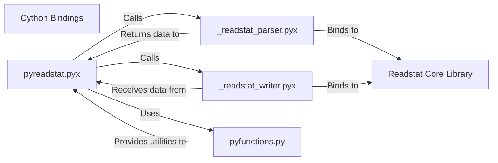

## Details

One paragraph explaining the functionality which is represented by this graph. What the main flow is and what is its purpose.

### Cython Bindings [[Expand]](./Cython_Bindings.md)
These Cython modules serve as the high-performance bridge between the Python layer and the core C `Readstat Core Library`. They handle efficient data type conversions, memory management, and direct calls to the C functions.

**Related Classes/Methods**:

- `pyreadstat/_readstat_parser.pyx` (1:1)
- `pyreadstat/_readstat_writer.pyx` (1:1)
- `pyreadstat/pyreadstat.pyx` (1:1)

### pyreadstat.pyx
This Cython module serves as the primary user-facing API for the `pyreadstat` library. It orchestrates the data reading and writing workflows by calling into the lower-level `_readstat_parser.pyx` and `_readstat_writer.pyx` components. It handles high-level data flow, error handling, and exposes functions like `read_file` and `write_file`. It is a key part of the "Cython Bindings" as it's written in Cython and bridges Python to the C-level operations.

**Related Classes/Methods**:

- `pyreadstat/pyreadstat.pyx` (1:1)

### _readstat_parser.pyx
This Cython module is responsible for the direct, low-level parsing of statistical data files. It acts as a direct binding to the `readstat` C library's parsing functionalities, handling efficient data type conversions and memory management. It reads raw data, metadata, and variable information from various file formats and returns the structured data to the `pyreadstat.pyx` orchestrator. It is a core part of the "Cython Bindings".

**Related Classes/Methods**:

- `pyreadstat/_readstat_parser.pyx` (1:1)

### _readstat_writer.pyx
This Cython module handles the efficient serialization of Python data structures into statistical file formats. Similar to the parser, it provides direct bindings to the `readstat` C library's writing functionalities, managing data conversion and memory. It receives data from `pyreadstat.pyx` and writes it to disk. It is a core part of the "Cython Bindings".

**Related Classes/Methods**:

- `pyreadstat/_readstat_writer.pyx` (1:1)

### pyfunctions.py
This Python module contains various helper functions that support the overall functionality of the `pyreadstat` library. These functions likely handle tasks such as data validation, type conversions, error handling, or other pre/post-processing steps that are more conveniently implemented in Python rather than Cython.

**Related Classes/Methods**:

- <a href="https://github.com/Roche/pyreadstat/pyreadstat/pyfunctions.py#L1-L1" target="_blank" rel="noopener noreferrer">`pyreadstat/pyfunctions.py` (1:1)</a>

### Readstat Core Library
This is the underlying C library that provides the core functionalities for reading and writing various statistical file formats (e.g., SAS, SPSS, Stata). The Cython modules (`_readstat_parser.pyx`, `_readstat_writer.pyx`) directly interface with this library to perform high-performance data operations.

**Related Classes/Methods**: _None_

### [FAQ](https://github.com/CodeBoarding/GeneratedOnBoardings/tree/main?tab=readme-ov-file#faq)