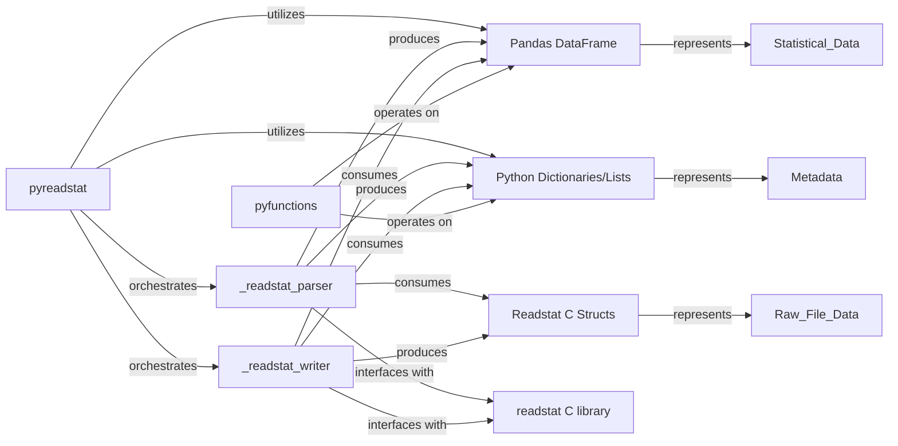

## Details

The `getClassHierarchy` tool did not return any class hierarchy for the `pyreadstat` package. This suggests that the package might primarily consist of functions and direct module-level code rather than a complex class-based inheritance structure. Given the previous analysis, which identified Cython components (`.pyx` files) and a Python helper module, it's likely that the "Internal Data Representation" is handled through a combination of Python's built-in data structures (like Pandas DataFrames, dictionaries, and lists) and the C structs managed by the `readstat` C library, rather than a formal class hierarchy within `pyreadstat` itself. Therefore, the fundamental components for "Internal Data Representation" are not defined by a class hierarchy within `pyreadstat`, but rather by the types of data structures used and how they are processed by the different modules.

### Pandas DataFrame
The primary high-level internal data representation for statistical datasets within pyreadstat. It's used for efficient storage and manipulation of tabular data, providing a user-friendly interface for data analysis.

**Related Classes/Methods**:

- `pyreadstat.pyreadstat` (0:0)
- <a href="https://github.com/Roche/pyreadstat/pyreadstat/pyfunctions.py#L0-L0" target="_blank" rel="noopener noreferrer">`pyreadstat.pyfunctions` (0:0)</a>

### Python Dictionaries/Lists
Used for representing metadata (e.g., variable labels, value labels, missing values) and other file-specific information. Dictionaries are ideal for key-value pairs, while lists handle ordered collections.

**Related Classes/Methods**:

- `pyreadstat.pyreadstat` (0:0)
- <a href="https://github.com/Roche/pyreadstat/pyreadstat/pyfunctions.py#L0-L0" target="_blank" rel="noopener noreferrer">`pyreadstat.pyfunctions` (0:0)</a>
- `pyreadstat._readstat_parser` (0:0)
- `pyreadstat._readstat_writer` (0:0)

### Readstat C Structs
Low-level data structures defined within the readstat C library. These structs are used to directly interact with the binary statistical file formats, holding raw data and metadata during parsing and writing operations.

**Related Classes/Methods**: _None_

### _readstat_parser
This Cython component is responsible for transforming Readstat C Structs (raw data from files) into Pandas DataFrames and Python Dictionaries/Lists (high-level internal data representation). It acts as the bridge between the C library and Python.

**Related Classes/Methods**:

- `pyreadstat._readstat_parser` (0:0)

### _readstat_writer
This Cython component handles the serialization of Pandas DataFrames and Python Dictionaries/Lists back into Readstat C Structs for writing to statistical file formats. It manages the conversion from high-level Python data to low-level C structures.

**Related Classes/Methods**:

- `pyreadstat._readstat_writer` (0:0)

### pyreadstat
The main Python module that orchestrates the reading and writing processes. It utilizes _readstat_parser and _readstat_writer and works with Pandas DataFrames and Python Dictionaries/Lists as its primary data handling mechanisms.

**Related Classes/Methods**:

- `pyreadstat.pyreadstat` (0:0)

### pyfunctions
A module containing Python helper functions that operate on Pandas DataFrames and Python Dictionaries/Lists for tasks such as data validation, type conversions, and other manipulations, supporting the main pyreadstat module.

**Related Classes/Methods**:

- <a href="https://github.com/Roche/pyreadstat/pyreadstat/pyfunctions.py#L0-L0" target="_blank" rel="noopener noreferrer">`pyreadstat.pyfunctions` (0:0)</a>

### readstat C library
The external C library that _readstat_parser and _readstat_writer directly interface with for low-level data handling and file I/O, primarily through Readstat C Structs.

**Related Classes/Methods**: _None_

### [FAQ](https://github.com/CodeBoarding/GeneratedOnBoardings/tree/main?tab=readme-ov-file#faq)