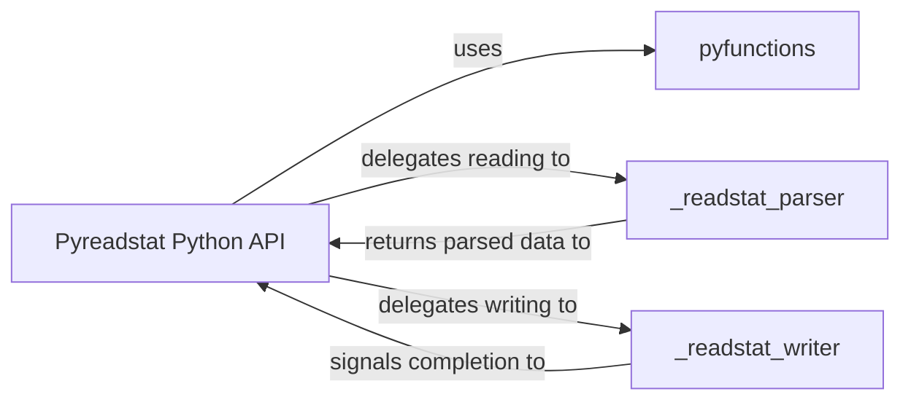

## Details

The `Pyreadstat Python API` subsystem is designed with a clear separation of concerns, leveraging Python for user interaction and orchestration, and Cython for high-performance, low-level interactions with the `readstat` C library. The architecture relies on module-level organization and direct function calls between these distinct components, rather than a deep class hierarchy.

### Pyreadstat Python API [[Expand]](./Pyreadstat_Python_API.md)
This is the top-level Python interface that users interact with. It provides the primary API functions (e.g., `read_sas7bdat`, `read_sav`, `read_dta`, `write_file`) for reading and writing statistical files. It acts as a facade, orchestrating the overall data loading and saving process by delegating to the specialized Cython components.

**Related Classes/Methods**:

- `pyreadstat` (1:1)
- `pyreadstat.pyreadstat` (1:1)

### _readstat_parser
This component is a Cython extension responsible for the efficient, low-level parsing of statistical data files. It directly interfaces with the `readstat` C library to read data, metadata, and variable information from various formats (e.g., SAS, SPSS, Stata). It efficiently translates the C library's output into Python-friendly data structures, typically Pandas DataFrames and dictionaries, which are then returned to the `Pyreadstat Python API`.

**Related Classes/Methods**:

- `pyreadstat._readstat_parser` (1:1)

### _readstat_writer
This component is a Cython extension that handles the serialization of Python data structures into statistical file formats. It takes data and metadata from the `Pyreadstat Python API` and writes them to disk using the `readstat` C library, ensuring proper formatting and adherence to file specifications.

**Related Classes/Methods**:

- `pyreadstat._readstat_writer` (1:1)

### pyfunctions
This module contains Python-level helper functions that support the main `Pyreadstat Python API` module. These functions likely handle common tasks such as data type conversions, data validation, error handling, or other utility operations that prepare data for the Cython components or process results received from them.

**Related Classes/Methods**:

- <a href="https://github.com/Roche/pyreadstat/pyreadstat/pyfunctions.py#L1-L1" target="_blank" rel="noopener noreferrer">`pyreadstat.pyfunctions` (1:1)</a>

### [FAQ](https://github.com/CodeBoarding/GeneratedOnBoardings/tree/main?tab=readme-ov-file#faq)