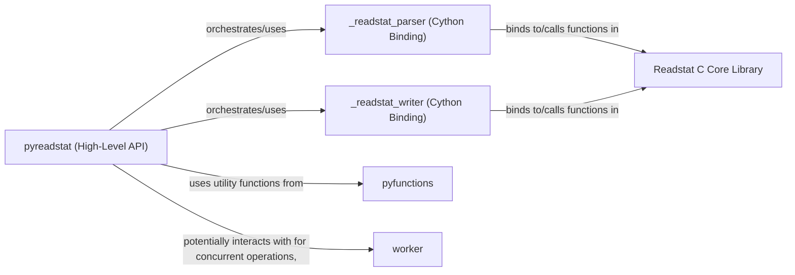

## Details

This analysis focuses on the `Readstat C Core Library` and its direct interactions within the `pyreadstat` project, which serves as a Python wrapper. The subsystem is designed for efficient and robust handling of various statistical file formats (SAS, SPSS, Stata).

### Readstat C Core Library [[Expand]](./Readstat_C_Core_Library.md)
This is the foundational C library responsible for the low-level, platform-agnostic operations of reading and writing statistical file formats. It directly manages file I/O, performs data decoding, and extracts raw metadata, including format-specific logic for SAS, SPSS, and Stata files. It is the core engine for data manipulation.

**Related Classes/Methods**:

- `readstat.c` (1:1)
- `readstat_parser.c` (1:1)
- `readstat_writer.c` (1:1)
- `sas` (1:1)
- `spss` (1:1)
- `stata` (1:1)

### pyreadstat (High-Level API)
This is the primary Python-level interface that users interact with. It orchestrates the overall reading and writing operations by coordinating calls to the underlying Cython binding components. It exposes user-facing functions like `read_file` and `write_file`, providing a convenient and abstract layer over the C library's functionalities.

**Related Classes/Methods**:

- `pyreadstat.pyreadstat` (1:1)

### _readstat_parser (Cython Binding)
This Cython component acts as a crucial binding layer, directly interfacing with the low-level parsing functionalities of the `Readstat C Core Library`. It translates Python calls into C function calls for reading data and processes the raw data and metadata returned from the C library, converting them into Python-friendly structures.

**Related Classes/Methods**:

- `pyreadstat._readstat_parser` (1:1)

### _readstat_writer (Cython Binding)
Similar to the parser, this Cython component serves as a binding layer for writing operations. It handles the serialization of Python data structures into statistical file formats by interfacing with the writing functionalities of the `Readstat C Core Library`. It translates Python data into C-compatible structures for efficient writing to disk.

**Related Classes/Methods**:

- `pyreadstat._readstat_writer` (1:1)

### pyfunctions
This Python module contains various helper functions that support the main `pyreadstat` module. These functions likely handle data manipulation, type conversions, validation, or error handling, ensuring data integrity and consistency before or after interactions with the Cython components.

**Related Classes/Methods**:

- <a href="https://github.com/Roche/pyreadstat/pyreadstat/pyfunctions.py#L1-L1" target="_blank" rel="noopener noreferrer">`pyreadstat.pyfunctions` (1:1)</a>

### worker
This Python module is likely designed to manage concurrent operations, potentially for handling large files or complex data processing tasks. It could contain logic for multi-threading, multiprocessing, or other background tasks to improve performance and responsiveness during file operations.

**Related Classes/Methods**:

- <a href="https://github.com/Roche/pyreadstat/pyreadstat/worker.py#L21-L24" target="_blank" rel="noopener noreferrer">`pyreadstat.worker` (21:24)</a>

### [FAQ](https://github.com/CodeBoarding/GeneratedOnBoardings/tree/main?tab=readme-ov-file#faq)