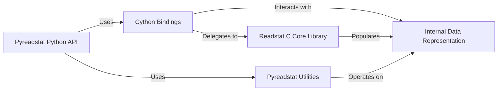

## Details

Final architecture analysis for `pyreadstat`, consolidating the insights from the CFG and Source Analysis into a high-level data flow overview. This describes the abstract components and their relationships within the project, including the Python API, Cython bindings, C core library, utilities, and internal data representation.

### Pyreadstat Python API [[Expand]](./Pyreadstat_Python_API.md)
This is the top-level Python interface that users interact with. It provides the primary API functions (e.g., `read_sas7bdat`, `read_sav`, `read_dta`, `write_file`) for reading and writing statistical files, orchestrating the overall data loading and saving process.

**Related Classes/Methods**:

- <a href="https://github.com/Roche/pyreadstat/pyreadstat/__init__.py#L1-L1" target="_blank" rel="noopener noreferrer">`pyreadstat/__init__.py` (1:1)</a>
- `pyreadstat/pyreadstat.py` (1:1)

### Cython Bindings [[Expand]](./Cython_Bindings.md)
These Cython modules serve as the high-performance bridge between the Python layer and the core C `Readstat Core Library`. They handle efficient data type conversions, memory management, and direct calls to the C functions.

**Related Classes/Methods**:

- `pyreadstat/_readstat_parser.pyx` (1:1)
- `pyreadstat/_readstat_writer.pyx` (1:1)
- `pyreadstat/pyreadstat.pyx` (1:1)

### Readstat C Core Library [[Expand]](./Readstat_C_Core_Library.md)
This is the foundational C library that performs the low-level, platform-agnostic operations of reading and writing various statistical file formats. It manages file I/O, handles data decoding, and extracts raw metadata, including format-specific logic for SAS, SPSS, and Stata files.

**Related Classes/Methods**:

- `src/readstat.c` (1:1)
- `src/readstat_parser.c` (1:1)
- `src/readstat_writer.c` (1:1)
- `src/sas/` (1:1)
- `src/spss/` (1:1)
- `src/stata/` (1:1)

### Pyreadstat Utilities
This Python module provides a collection of helper functions that perform post-processing tasks, such as setting catalog information, handling value labels, applying variable formats, and other data manipulation specific to the `pyreadstat` context.

**Related Classes/Methods**:

- <a href="https://github.com/Roche/pyreadstat/pyreadstat/pyfunctions.py#L1-L1" target="_blank" rel="noopener noreferrer">`pyreadstat/pyfunctions.py` (1:1)</a>

### Internal Data Representation [[Expand]](./Internal_Data_Representation.md)
This represents the various internal data models used throughout the system to hold statistical data, variable metadata, value labels, and other file-specific information. This includes both Python objects (e.g., Pandas DataFrames) and C structs used by the `readstat` library.

**Related Classes/Methods**: _None_

### [FAQ](https://github.com/CodeBoarding/GeneratedOnBoardings/tree/main?tab=readme-ov-file#faq)