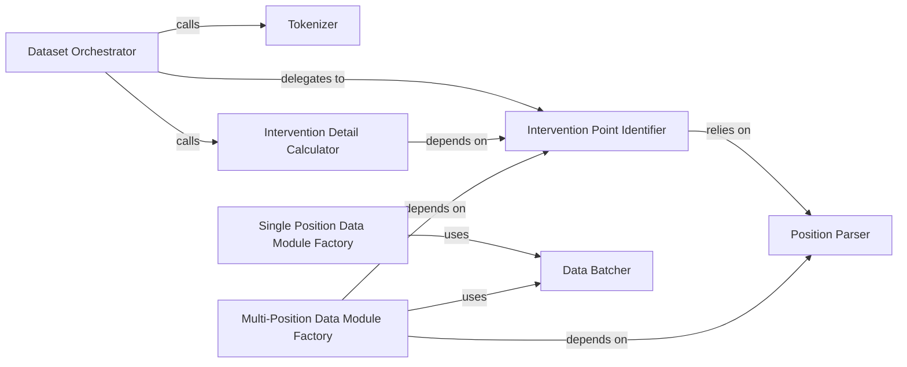

## Details

The `Data Processing & Dataset Generation` subsystem is responsible for preparing raw data for ReFT fine-tuning, encompassing tokenization, identifying intervention points, and structuring datasets for training. Its boundaries are primarily defined by the `pyreft/dataset.py` file.

### Dataset Orchestrator
The primary entry point, coordinating the overall data preparation workflow. It initiates and manages the sequence of data processing steps, including tokenization, pre-processing, and post-processing. It also delegates to the Intervention Point Identifier and Intervention Detail Calculator for ReFT-specific data preparation.

**Related Classes/Methods**:

- <a href="https://github.com/stanfordnlp/pyreft/blob/main/pyreft/dataset.py#L439-L456" target="_blank" rel="noopener noreferrer">`pyreft.dataset.__init__`:439-456</a>

### Tokenizer
Handles the tokenization of input data, converting raw text into numerical tokens. This is a foundational step for any NLP task.

**Related Classes/Methods**:

- <a href="https://github.com/stanfordnlp/pyreft/blob/main/pyreft/dataset.py#L713-L755" target="_blank" rel="noopener noreferrer">`pyreft.dataset.tokenize`:713-755</a>

### Intervention Point Identifier
Identifies specific points within the data where ReFT interventions will be applied. Its core responsibility is to locate and mark the positions within the tokenized data where ReFT interventions are to be applied. It relies on the Position Parser for interpreting position specifications.

**Related Classes/Methods**:

- <a href="https://github.com/stanfordnlp/pyreft/blob/main/pyreft/dataset.py#L338-L339" target="_blank" rel="noopener noreferrer">`pyreft.dataset.get_intervention_locations`:338-339</a>

### Intervention Detail Calculator
Computes specific intervention details and associated subspaces. Computes the precise details required for applying interventions, such as subspace dimensions, based on the identified intervention points.

**Related Classes/Methods**:

- <a href="https://github.com/stanfordnlp/pyreft/blob/main/pyreft/dataset.py#L210-L253" target="_blank" rel="noopener noreferrer">`pyreft.dataset.compute_intervention_and_subspaces`:210-253</a>

### Data Batcher
A data collator responsible for structuring and batching processed data for training. Takes individual processed data samples and collates them into batches, handling padding and tensor conversion as needed.

**Related Classes/Methods**:

- <a href="https://github.com/stanfordnlp/pyreft/blob/main/pyreft/dataset.py#L112-L122" target="_blank" rel="noopener noreferrer">`pyreft.dataset.ReftDataCollator`:112-122</a>

### Single Position Data Module Factory
Creates data modules (`torch.utils.data.Dataset` and `torch.utils.data.DataLoader`) specifically for single-position supervised ReFT tasks.

**Related Classes/Methods**:

- <a href="https://github.com/stanfordnlp/pyreft/blob/main/pyreft/dataset.py#L537-L579" target="_blank" rel="noopener noreferrer">`pyreft.dataset.make_last_position_supervised_data_module`:537-579</a>

### Multi-Position Data Module Factory
Creates data modules (`torch.utils.data.Dataset` and `torch.utils.data.DataLoader`) specifically for multi-position supervised ReFT tasks.

**Related Classes/Methods**:

- <a href="https://github.com/stanfordnlp/pyreft/blob/main/pyreft/dataset.py#L582-L634" target="_blank" rel="noopener noreferrer">`pyreft.dataset.make_multiple_position_supervised_data_module`:582-634</a>

### Position Parser
A utility component that parses and interprets various formats of position-related information, serving as a helper for Intervention Point Identifier and Multi-Position Data Module Factory.

**Related Classes/Methods**:

- <a href="https://github.com/stanfordnlp/pyreft/blob/main/pyreft/dataset.py" target="_blank" rel="noopener noreferrer">`pyreft.dataset.PositionParser`</a>

### [FAQ](https://github.com/CodeBoarding/GeneratedOnBoardings/tree/main?tab=readme-ov-file#faq)