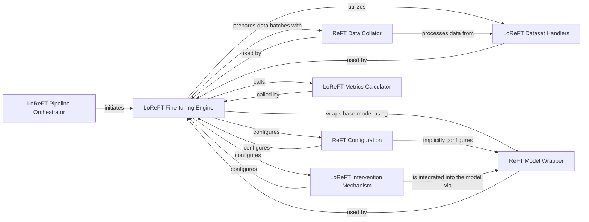

## Details

This analysis provides an overview of the components and their relationships within the LoReFT fine-tuning project, including details on source code references.

### LoReFT Pipeline Orchestrator
The main entry point responsible for initiating and managing the overall LoReFT fine-tuning process. It sets up the environment and triggers the core fine-tuning logic.

**Related Classes/Methods**:

- <a href="https://github.com/stanfordnlp/pyreft/blob/main/examples/loreft/train.py#L468-L528" target="_blank" rel="noopener noreferrer">`examples.loreft.train.main`:468-528</a>

### LoReFT Fine-tuning Engine
Encapsulates the core fine-tuning loop, handling model loading, data iteration, forward/backward passes, and optimization. It coordinates the use of other components for data, model configuration, and evaluation.

**Related Classes/Methods**:

- <a href="https://github.com/stanfordnlp/pyreft/blob/main/examples/loreft/train.py#L76-L466" target="_blank" rel="noopener noreferrer">`examples.loreft.train.finetune`:76-466</a>

### LoReFT Dataset Handlers
Specialized components for loading, formatting, and preparing task-specific datasets for LoReFT. They handle data tokenization and identify intervention locations within the data.

**Related Classes/Methods**:

- <a href="https://github.com/stanfordnlp/pyreft/blob/main/examples/loreft/dataset.py#L42-L81" target="_blank" rel="noopener noreferrer">`examples.loreft.dataset.LoReftGLUEDataset`:42-81</a>
- <a href="https://github.com/stanfordnlp/pyreft/blob/main/examples/loreft/dataset.py#L84-L202" target="_blank" rel="noopener noreferrer">`examples.loreft.dataset.LoReftSupervisedDataset`:84-202</a>

### ReFT Model Wrapper
A core utility from pyreft that wraps a base HuggingFace model, integrating ReFT capabilities and enabling the application of interventions during model execution.

**Related Classes/Methods**:

- <a href="https://github.com/stanfordnlp/pyreft/blob/main/pyreft/reft_model.py" target="_blank" rel="noopener noreferrer">`pyreft.reft_model.get_reft_model`</a>

### ReFT Configuration
Defines the parameters and settings for the ReFT process, such as the rank of the low-rank adaptation and the specific layers where interventions should be applied.

**Related Classes/Methods**:

- <a href="https://github.com/stanfordnlp/pyreft/blob/main/pyreft/config.py" target="_blank" rel="noopener noreferrer">`pyreft.ReftConfig`</a>

### LoReFT Intervention Mechanism
Implements the specific low-rank ReFT intervention logic, which modifies the model's internal representations (activations) based on the defined configuration.

**Related Classes/Methods**:

- <a href="https://github.com/stanfordnlp/pyreft/blob/main/pyreft/interventions.py#L27-L83" target="_blank" rel="noopener noreferrer">`pyreft.interventions.LoreftIntervention`:27-83</a>

### ReFT Data Collator
A custom data collator responsible for batching and preparing data with interventions. It ensures that the input data is correctly formatted for the ReFT model during training and evaluation.

**Related Classes/Methods**:

- <a href="https://github.com/stanfordnlp/pyreft/blob/main/examples/loreft/original_code/trainer.py#L93-L103" target="_blank" rel="noopener noreferrer">`examples.loreft.original_code.trainer.ReftDataCollator`:93-103</a>

### LoReFT Metrics Calculator
Computes and reports various evaluation metrics to assess the performance of the fine-tuned LoReFT model on specific tasks.

**Related Classes/Methods**:

- <a href="https://github.com/stanfordnlp/pyreft/blob/main/examples/loreft/compute_metrics.py#L111-L292" target="_blank" rel="noopener noreferrer">`examples.loreft.compute_metrics.compute_metrics`:111-292</a>

### [FAQ](https://github.com/CodeBoarding/GeneratedOnBoardings/tree/main?tab=readme-ov-file#faq)