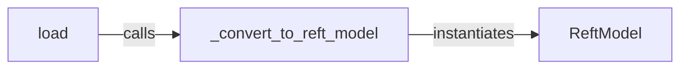

## Details

The `Model Loading & Adaptation` subsystem is a critical part of the `pyreft` project, focusing on preparing pre-trained language models for ReFT interventions. The core boundaries of the `Model Loading & Adaptation` subsystem are primarily defined by the `pyreft/reft_model.py` file. This file encapsulates the logic for loading base models and integrating the ReFT intervention layers, forming a cohesive unit responsible for model preparation.

### load
Serves as the primary entry point and orchestrator for the entire subsystem. It is responsible for loading a pre-trained language model (e.g., from HuggingFace Transformers) and initiating its adaptation by integrating ReFT intervention layers. This component embodies both the "Base Model Loader" and aspects of a "ReFT Configuration Module."

**Related Classes/Methods**:

- <a href="https://github.com/stanfordnlp/pyreft/blob/main/examples/loreft/original_code/data.py#L46-L51" target="_blank" rel="noopener noreferrer">`load`:46-51</a>

### _convert_to_reft_model
An internal utility function that performs the crucial transformation of a loaded base model into a `ReftModel`. This involves injecting and configuring the specific ReFT intervention layers. It directly represents the "Intervention Application Layer" within the subsystem.

**Related Classes/Methods**:

- <a href="https://github.com/stanfordnlp/pyreft/blob/main/pyreft/reft_model.py#L16-L22" target="_blank" rel="noopener noreferrer">`_convert_to_reft_model`:16-22</a>

### ReftModel
This is the central data structure and representation of the adapted model. It encapsulates the original base model and manages the integrated ReFT intervention layers. It enables forward passes through the model while applying these interventions. It acts as the "Base Model Wrapper" and the core "Intervention-centric" component, representing the final output of the adaptation process.

**Related Classes/Methods**:

- <a href="https://github.com/stanfordnlp/pyreft/blob/main/pyreft/reft_model.py#L9-L55" target="_blank" rel="noopener noreferrer">`ReftModel`:9-55</a>

### [FAQ](https://github.com/CodeBoarding/GeneratedOnBoardings/tree/main?tab=readme-ov-file#faq)