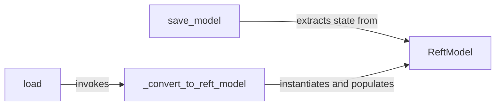

## Details

The `pyreft` subsystem centers around the `ReftModel`, which serves as the core data structure for trained models. The persistence of these models is handled by `save_model` and `load` functions. While currently located in example directories, their described role as public APIs suggests they are intended for serializing and deserializing `ReftModel` instances. The `_convert_to_reft_model` utility plays a crucial internal role in reconstructing `ReftModel` objects during the loading process. For improved clarity and adherence to library design patterns, the placement of `save_model` and `load` should be re-evaluated to reside within core `pyreft` modules if they are indeed public APIs.

### ReftModel
The fundamental data structure representing a trained ReFT model. It encapsulates the model's architecture, parameters, and state, serving as the primary entity that is persisted.

**Related Classes/Methods**:

- <a href="https://github.com/stanfordnlp/pyreft/blob/main/pyreft/reft_model.py#L9-L55" target="_blank" rel="noopener noreferrer">`ReftModel`:9-55</a>

### save_model
This function is currently located in an 'examples' directory, suggesting it might be an illustrative implementation rather than a core public API. If intended as a public API for serializing and saving a trained ReftModel instance, its placement should be re-evaluated and potentially moved to a core `pyreft` module (e.g., `reft_model.py` or `reft_trainer.py`).

**Related Classes/Methods**:

- <a href="https://github.com/stanfordnlp/pyreft/blob/main/examples/dpo/dpo_trainer.py#L123-L129" target="_blank" rel="noopener noreferrer">`save_model`:123-129</a>

### load
Similar to `save_model`, this function is found in an 'examples' directory. If it's meant to be a public API for deserializing and loading a previously saved ReFT model, its location should be reconsidered and potentially moved to a core `pyreft` module to reflect its public interface role.

**Related Classes/Methods**:

- <a href="https://github.com/stanfordnlp/pyreft/blob/main/examples/loreft/original_code/data.py#L46-L51" target="_blank" rel="noopener noreferrer">`load`:46-51</a>

### _convert_to_reft_model
An internal utility function that handles the conversion of loaded raw data (e.g., from a checkpoint) into a fully instantiated and populated ReftModel object.

**Related Classes/Methods**:

- <a href="https://github.com/stanfordnlp/pyreft/blob/main/pyreft/reft_model.py#L16-L22" target="_blank" rel="noopener noreferrer">`_convert_to_reft_model`:16-22</a>

### [FAQ](https://github.com/CodeBoarding/GeneratedOnBoardings/tree/main?tab=readme-ov-file#faq)