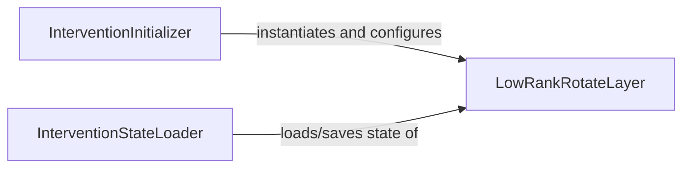

## Details

The ReFT Intervention Layer subsystem encapsulates the core logic for applying low-rank rotational interventions to model activations within pyreft. It enables targeted modifications of LLM representations and is primarily defined by the pyreft/interventions.py module.

### LowRankRotateLayer
This is the fundamental operational unit of the ReFT intervention. It directly implements and executes the low-rank rotational transformation on model activations. It's responsible for the mathematical operation that modifies the model's internal representations.

**Related Classes/Methods**:

- <a href="https://github.com/stanfordnlp/pyreft/blob/main/pyreft/interventions.py#L13-L24" target="_blank" rel="noopener noreferrer">`LowRankRotateLayer`:13-24</a>

### InterventionInitializer
Acts as the entry point for setting up and configuring new ReFT interventions. Its responsibility is to instantiate the LowRankRotateLayer and initialize its parameters, ensuring it's ready for application.

**Related Classes/Methods**:

- <a href="https://github.com/stanfordnlp/pyreft/blob/main/pyreft/interventions.py" target="_blank" rel="noopener noreferrer">`InterventionInitializer`</a>

### InterventionStateLoader
Manages the persistence of the intervention layer's state. This component is responsible for loading and saving the learned weights and configurations of the LowRankRotateLayer, enabling the reuse and deployment of trained interventions.

**Related Classes/Methods**:

- <a href="https://github.com/stanfordnlp/pyreft/blob/main/pyreft/interventions.py" target="_blank" rel="noopener noreferrer">`InterventionStateLoader`</a>

### [FAQ](https://github.com/CodeBoarding/GeneratedOnBoardings/tree/main?tab=readme-ov-file#faq)