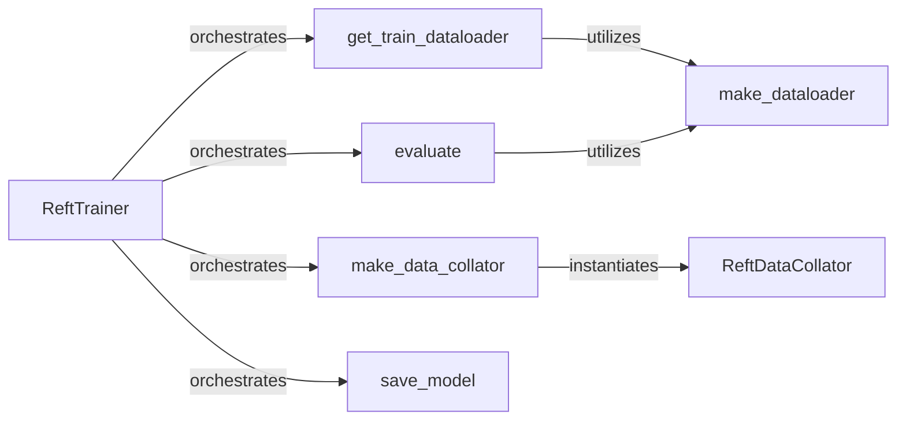

## Details

The Training & Evaluation Engine subsystem is primarily encapsulated within the pyreft/reft_trainer.py file. It encompasses all functionalities related to orchestrating the fine-tuning process, from data preparation and loading to model training, optimization, evaluation, and persistence.

### ReftTrainer
The core orchestrator of the entire fine-tuning workflow. It manages the training loop, coordinates data loading, executes forward and backward passes, handles optimization, updates model parameters, and initiates evaluation.

**Related Classes/Methods**:

- <a href="https://github.com/stanfordnlp/pyreft/blob/main/examples/dpo/dpo_trainer.py#L7-L129" target="_blank" rel="noopener noreferrer">`ReftTrainer`:7-129</a>

### ReftDataCollator
Responsible for preparing raw input data into structured batches suitable for the ReFT model. This includes tasks such as padding, tokenization, and specific formatting required by the model.

**Related Classes/Methods**:

- <a href="https://github.com/stanfordnlp/pyreft/blob/main/examples/loreft/original_code/trainer.py#L93-L103" target="_blank" rel="noopener noreferrer">`ReftDataCollator`:93-103</a>

### make_data_collator
Acts as a factory function, creating and returning instances of `ReftDataCollator` based on the specific data collation strategy required for training or evaluation. This provides flexibility in data handling.

**Related Classes/Methods**:

- <a href="https://github.com/stanfordnlp/pyreft/blob/main/examples/loreft/compute_metrics.py#L96-L104" target="_blank" rel="noopener noreferrer">`make_data_collator`:96-104</a>

### make_dataloader
A generic utility function providing a mechanism for creating PyTorch `DataLoader` instances for both training and evaluation datasets, ensuring consistent data loading across the subsystem.

**Related Classes/Methods**:

- <a href="https://github.com/stanfordnlp/pyreft/blob/main/examples/loreft/compute_metrics.py#L107-L108" target="_blank" rel="noopener noreferrer">`make_dataloader`:107-108</a>

### get_train_dataloader
Specifically configures and retrieves the data loader tailored for the training dataset. It leverages the generic `make_dataloader` for its core functionality.

**Related Classes/Methods**:

- <a href="https://github.com/stanfordnlp/pyreft/blob/main/examples/loreft/original_code/trainer.py#L122-L123" target="_blank" rel="noopener noreferrer">`get_train_dataloader`:122-123</a>

### evaluate
Manages the process of evaluating the trained model on a validation or test dataset. It computes and reports relevant performance metrics, providing insights into the model's effectiveness.

**Related Classes/Methods**:

- <a href="https://github.com/stanfordnlp/pyreft/blob/main/examples/reward/eval.py#L28-L101" target="_blank" rel="noopener noreferrer">`evaluate`:28-101</a>

### save_model
Handles the serialization and persistence of the trained ReFT model. This includes saving its parameters, configuration, and any associated state, enabling later deployment, inference, or further fine-tuning.

**Related Classes/Methods**:

- <a href="https://github.com/stanfordnlp/pyreft/blob/main/examples/dpo/dpo_trainer.py#L123-L129" target="_blank" rel="noopener noreferrer">`save_model`:123-129</a>

### [FAQ](https://github.com/CodeBoarding/GeneratedOnBoardings/tree/main?tab=readme-ov-file#faq)