```mermaid
graph LR
    Model_Loading_Adaptation["Model Loading & Adaptation"]
    ReFT_Intervention_Layer["ReFT Intervention Layer"]
    Data_Processing_Dataset_Generation["Data Processing & Dataset Generation"]
    Training_Evaluation_Engine["Training & Evaluation Engine"]
    Model_Persistence["Model Persistence"]
    DPO_Example_Pipeline["DPO Example Pipeline"]
    Reward_Modeling_Example_Pipeline["Reward Modeling Example Pipeline"]
    LoReFT_Example_Pipeline["LoReFT Example Pipeline"]
    Model_Loading_Adaptation -- "provides adapted model to" --> ReFT_Intervention_Layer
    Data_Processing_Dataset_Generation -- "supplies prepared data to" --> Training_Evaluation_Engine
    Training_Evaluation_Engine -- "updates" --> Model_Loading_Adaptation
    Training_Evaluation_Engine -- "updates" --> ReFT_Intervention_Layer
    Training_Evaluation_Engine -- "saves model state to" --> Model_Persistence
    Model_Persistence -- "loads model states for" --> Model_Loading_Adaptation
    DPO_Example_Pipeline -- "utilizes" --> Model_Loading_Adaptation
    DPO_Example_Pipeline -- "utilizes" --> ReFT_Intervention_Layer
    DPO_Example_Pipeline -- "utilizes" --> Data_Processing_Dataset_Generation
    DPO_Example_Pipeline -- "utilizes" --> Training_Evaluation_Engine
    DPO_Example_Pipeline -- "utilizes" --> Model_Persistence
    Reward_Modeling_Example_Pipeline -- "utilizes" --> Model_Loading_Adaptation
    Reward_Modeling_Example_Pipeline -- "utilizes" --> ReFT_Intervention_Layer
    Reward_Modeling_Example_Pipeline -- "utilizes" --> Data_Processing_Dataset_Generation
    Reward_Modeling_Example_Pipeline -- "utilizes" --> Training_Evaluation_Engine
    Reward_Modeling_Example_Pipeline -- "utilizes" --> Model_Persistence
    LoReFT_Example_Pipeline -- "utilizes" --> Model_Loading_Adaptation
    LoReFT_Example_Pipeline -- "utilizes" --> ReFT_Intervention_Layer
    LoReFT_Example_Pipeline -- "utilizes" --> Data_Processing_Dataset_Generation
    LoReFT_Example_Pipeline -- "utilizes" --> Training_Evaluation_Engine
    LoReFT_Example_Pipeline -- "utilizes" --> Model_Persistence
    click Model_Loading_Adaptation href "https://github.com/CodeBoarding/GeneratedOnBoardings/blob/main/pyreft/Model_Loading_Adaptation.md" "Details"
    click ReFT_Intervention_Layer href "https://github.com/CodeBoarding/GeneratedOnBoardings/blob/main/pyreft/ReFT_Intervention_Layer.md" "Details"
    click Data_Processing_Dataset_Generation href "https://github.com/CodeBoarding/GeneratedOnBoardings/blob/main/pyreft/Data_Processing_Dataset_Generation.md" "Details"
    click Training_Evaluation_Engine href "https://github.com/CodeBoarding/GeneratedOnBoardings/blob/main/pyreft/Training_Evaluation_Engine.md" "Details"
    click Model_Persistence href "https://github.com/CodeBoarding/GeneratedOnBoardings/blob/main/pyreft/Model_Persistence.md" "Details"
    click LoReFT_Example_Pipeline href "https://github.com/CodeBoarding/GeneratedOnBoardings/blob/main/pyreft/LoReFT_Example_Pipeline.md" "Details"
```

## Details

The `pyreft` architecture is centered around a modular pipeline for fine-tuning LLMs with low-rank rotational interventions. It begins by adapting a base model to integrate ReFT layers, followed by specialized data processing to prepare datasets with intervention points. A robust training and evaluation engine then orchestrates the fine-tuning, applying these interventions and optimizing the model. The system includes dedicated components for model persistence, allowing for saving and loading of trained states. This core functionality is demonstrated through various example pipelines, such as DPO, Reward Modeling, and LoReFT, which highlight `pyreft`'s flexibility and applicability across different LLM fine-tuning paradigms. This structure facilitates clear data and control flow, making it ideal for visual representation in a flow graph diagram.

### Model Loading & Adaptation [[Expand]](./Model_Loading_Adaptation.md)
Responsible for loading pre-trained language models (e.g., from HuggingFace Transformers) and adapting them to integrate the ReFT intervention layers. This component ensures the base model is ready for intervention application.

**Related Classes/Methods**:

- <a href="https://github.com/stanfordnlp/pyreft/blob/main/pyreft/reft_model.py" target="_blank" rel="noopener noreferrer">`pyreft/reft_model.py`</a>

### ReFT Intervention Layer [[Expand]](./ReFT_Intervention_Layer.md)
Implements the core low-rank rotational intervention mechanism. This is where the actual ReFT operations on model activations occur, allowing for targeted modifications.

**Related Classes/Methods**:

- <a href="https://github.com/stanfordnlp/pyreft/blob/main/pyreft/interventions.py" target="_blank" rel="noopener noreferrer">`pyreft/interventions.py`</a>

### Data Processing & Dataset Generation [[Expand]](./Data_Processing_Dataset_Generation.md)
Handles all aspects of preparing raw data for ReFT fine-tuning. This includes tokenization, identifying specific intervention points within the data, and structuring datasets into a format suitable for training.

**Related Classes/Methods**:

- <a href="https://github.com/stanfordnlp/pyreft/blob/main/pyreft/dataset.py" target="_blank" rel="noopener noreferrer">`pyreft/dataset.py`</a>

### Training & Evaluation Engine [[Expand]](./Training_Evaluation_Engine.md)
Orchestrates the entire fine-tuning process for ReFT models. This includes data collation, managing forward and backward passes, optimization, model updates, and general evaluation of the trained model's performance.

**Related Classes/Methods**:

- <a href="https://github.com/stanfordnlp/pyreft/blob/main/pyreft/reft_trainer.py" target="_blank" rel="noopener noreferrer">`pyreft/reft_trainer.py`</a>

### Model Persistence [[Expand]](./Model_Persistence.md)
Manages the persistence of trained ReFT models and their configurations. This component is responsible for saving the state of the model after training and loading it back for inference or further training.

**Related Classes/Methods**:

- <a href="https://github.com/stanfordnlp/pyreft/blob/main/pyreft/reft_model.py" target="_blank" rel="noopener noreferrer">`pyreft/reft_model.py`</a>
- <a href="https://github.com/stanfordnlp/pyreft/blob/main/pyreft/reft_trainer.py" target="_blank" rel="noopener noreferrer">`pyreft/reft_trainer.py`</a>

### DPO Example Pipeline
A concrete example demonstrating the application of ReFT within a Direct Preference Optimization (DPO) fine-tuning workflow. This pipeline integrates the core `pyreft` components to achieve DPO-specific objectives.

**Related Classes/Methods**:

- <a href="https://github.com/stanfordnlp/pyreft/blob/main/examples/dpo/dpo.py" target="_blank" rel="noopener noreferrer">`examples/dpo/dpo.py`</a>
- <a href="https://github.com/stanfordnlp/pyreft/blob/main/examples/dpo/dpo_trainer.py" target="_blank" rel="noopener noreferrer">`examples/dpo/dpo_trainer.py`</a>

### Reward Modeling Example Pipeline
An example showcasing ReFT's utility in training reward models, typically used in Reinforcement Learning from Human Feedback (RLHF) scenarios. This pipeline demonstrates how `pyreft` can be used for reward-based fine-tuning.

**Related Classes/Methods**:

- <a href="https://github.com/stanfordnlp/pyreft/blob/main/examples/reward/train.py" target="_blank" rel="noopener noreferrer">`examples/reward/train.py`</a>
- <a href="https://github.com/stanfordnlp/pyreft/blob/main/examples/reward/eval.py" target="_blank" rel="noopener noreferrer">`examples/reward/eval.py`</a>

### LoReFT Example Pipeline [[Expand]](./LoReFT_Example_Pipeline.md)
An example illustrating fine-tuning using the LoReFT (Low-Rank ReFT) approach. This pipeline provides a specific use case for applying ReFT with low-rank adaptations.

**Related Classes/Methods**:

- <a href="https://github.com/stanfordnlp/pyreft/blob/main/examples/loreft/train.py" target="_blank" rel="noopener noreferrer">`examples/loreft/train.py`</a>
- <a href="https://github.com/stanfordnlp/pyreft/blob/main/examples/loreft/compute_metrics.py" target="_blank" rel="noopener noreferrer">`examples/loreft/compute_metrics.py`</a>

### [FAQ](https://github.com/CodeBoarding/GeneratedOnBoardings/tree/main?tab=readme-ov-file#faq)