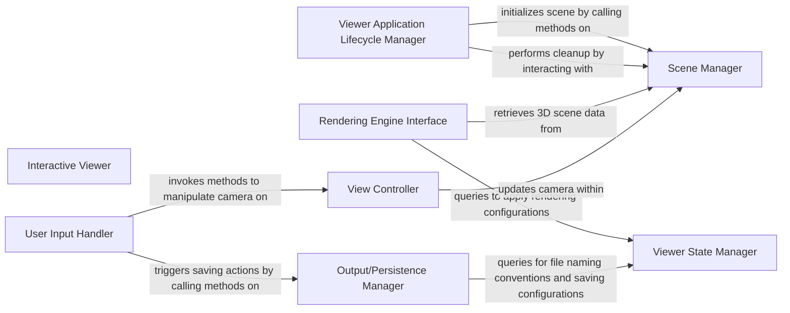

## Details

The `Interactive Viewer` subsystem is primarily encapsulated within the `pyrender.viewer.Viewer` class, located at `/mnt/e/StartUp/pyrender/pyrender/viewer.py`. This class serves as the comprehensive user-facing application for real-time 3D scene visualization and interaction.

### Interactive Viewer [[Expand]](./Interactive_Viewer.md)
The overarching component responsible for orchestrating the entire interactive visualization process. It integrates all other components to provide a real-time 3D scene viewer, handling the main rendering loop, user input, and camera control.

**Related Classes/Methods**:

- <a href="https://github.com/mmatl/pyrender/blob/master/pyrender/viewer.py#L38-L1157" target="_blank" rel="noopener noreferrer">`pyrender.viewer.Viewer`:38-1157</a>

### Viewer Application Lifecycle Manager
Manages the complete lifecycle of the viewer application, from initialization and startup to graceful shutdown. It orchestrates the main application loop and integrates other components during setup. This component is fundamental for the viewer's operational integrity.

**Related Classes/Methods**:

- <a href="https://github.com/mmatl/pyrender/blob/master/pyrender/viewer.py#L38-L1157" target="_blank" rel="noopener noreferrer">`pyrender.viewer.Viewer:__init__`:38-1157</a>
- <a href="https://github.com/mmatl/pyrender/blob/master/pyrender/viewer.py#L38-L1157" target="_blank" rel="noopener noreferrer">`pyrender.viewer.Viewer:start`:38-1157</a>
- <a href="https://github.com/mmatl/pyrender/blob/master/pyrender/viewer.py#L38-L1157" target="_blank" rel="noopener noreferrer">`pyrender.viewer.Viewer:_init_and_start_app`:38-1157</a>
- <a href="https://github.com/mmatl/pyrender/blob/master/pyrender/viewer.py#L38-L1157" target="_blank" rel="noopener noreferrer">`pyrender.viewer.Viewer:on_close`:38-1157</a>
- <a href="https://github.com/mmatl/pyrender/blob/master/pyrender/viewer.py#L38-L1157" target="_blank" rel="noopener noreferrer">`pyrender.viewer.Viewer:close_external`:38-1157</a>

### Scene Manager
Acts as the interface to the underlying `pyrender.Scene` object, managing the 3D scene data, including adding/removing objects, lights, and cameras. It ensures the scene is correctly set up for rendering, embodying the "Model" aspect of the viewer.

**Related Classes/Methods**:

- <a href="https://github.com/mmatl/pyrender/blob/master/pyrender/viewer.py#L38-L1157" target="_blank" rel="noopener noreferrer">`pyrender.viewer.Viewer:scene`:38-1157</a>
- <a href="https://github.com/mmatl/pyrender/blob/master/pyrender/viewer.py#L38-L1157" target="_blank" rel="noopener noreferrer">`pyrender.viewer.Viewer:_create_raymond_lights`:38-1157</a>
- <a href="https://github.com/mmatl/pyrender/blob/master/pyrender/viewer.py#L38-L1157" target="_blank" rel="noopener noreferrer">`pyrender.viewer.Viewer:_create_direct_light`:38-1157</a>
- <a href="https://github.com/mmatl/pyrender/blob/master/pyrender/viewer.py#L38-L1157" target="_blank" rel="noopener noreferrer">`pyrender.viewer.Viewer:_compute_initial_camera_pose`:38-1157</a>
- <a href="https://github.com/mmatl/pyrender/blob/master/pyrender/viewer.py#L38-L1157" target="_blank" rel="noopener noreferrer">`pyrender.viewer.Viewer:_set_axes`:38-1157</a>
- <a href="https://github.com/mmatl/pyrender/blob/master/pyrender/viewer.py#L38-L1157" target="_blank" rel="noopener noreferrer">`pyrender.viewer.Viewer:_remove_axes`:38-1157</a>

### Rendering Engine Interface
Triggers the actual rendering process and applies rendering configurations. It serves as the crucial bridge between the viewer's dynamic state and the core rendering backend, ensuring the scene is drawn correctly. This component directly interacts with the "Renderer Core" and "Rendering Backends" as per the project's architectural patterns.

**Related Classes/Methods**:

- <a href="https://github.com/mmatl/pyrender/blob/master/pyrender/viewer.py#L38-L1157" target="_blank" rel="noopener noreferrer">`pyrender.viewer.Viewer:_render`:38-1157</a>
- <a href="https://github.com/mmatl/pyrender/blob/master/pyrender/viewer.py#L38-L1157" target="_blank" rel="noopener noreferrer">`pyrender.viewer.Viewer:render_flags`:38-1157</a>

### User Input Handler
Captures and dispatches user input events (keyboard presses, mouse movements, clicks, scrolls) to appropriate internal handlers, translating raw input into viewer actions. This is a critical part of the "Viewer Interaction Loop," enabling user control.

**Related Classes/Methods**:

- <a href="https://github.com/mmatl/pyrender/blob/master/pyrender/viewer.py#L38-L1157" target="_blank" rel="noopener noreferrer">`pyrender.viewer.Viewer:on_key_press`:38-1157</a>
- <a href="https://github.com/mmatl/pyrender/blob/master/pyrender/viewer.py#L38-L1157" target="_blank" rel="noopener noreferrer">`pyrender.viewer.Viewer:on_mouse_press`:38-1157</a>
- <a href="https://github.com/mmatl/pyrender/blob/master/pyrender/viewer.py#L38-L1157" target="_blank" rel="noopener noreferrer">`pyrender.viewer.Viewer:on_mouse_release`:38-1157</a>
- <a href="https://github.com/mmatl/pyrender/blob/master/pyrender/viewer.py#L38-L1157" target="_blank" rel="noopener noreferrer">`pyrender.viewer.Viewer:on_mouse_scroll`:38-1157</a>
- <a href="https://github.com/mmatl/pyrender/blob/master/pyrender/viewer.py#L38-L1157" target="_blank" rel="noopener noreferrer">`pyrender.viewer.Viewer:registered_keys`:38-1157</a>

### View Controller
Manages the camera's position, orientation, and projection within the scene. It allows for interactive view manipulation (e.g., rotation, zooming, resetting the view) in response to user input or programmatic commands, embodying the "Controller" aspect in an MVC-like pattern.

**Related Classes/Methods**:

- <a href="https://github.com/mmatl/pyrender/blob/master/pyrender/viewer.py#L38-L1157" target="_blank" rel="noopener noreferrer">`pyrender.viewer.Viewer:_reset_view`:38-1157</a>
- <a href="https://github.com/mmatl/pyrender/blob/master/pyrender/viewer.py#L38-L1157" target="_blank" rel="noopener noreferrer">`pyrender.viewer.Viewer:_rotate`:38-1157</a>
- <a href="https://github.com/mmatl/pyrender/blob/master/pyrender/viewer.py#L38-L1157" target="_blank" rel="noopener noreferrer">`pyrender.viewer.Viewer:viewport_size`:38-1157</a>
- <a href="https://github.com/mmatl/pyrender/blob/master/pyrender/viewer.py#L38-L1157" target="_blank" rel="noopener noreferrer">`pyrender.viewer.Viewer:_compute_initial_camera_pose`:38-1157</a>

### Viewer State Manager
Holds and provides access to various flags and configurations that control the viewer's behavior and appearance, such as visibility of axes, rendering options, and saving preferences. It centralizes the viewer's dynamic state.

**Related Classes/Methods**:

- <a href="https://github.com/mmatl/pyrender/blob/master/pyrender/viewer.py#L38-L1157" target="_blank" rel="noopener noreferrer">`pyrender.viewer.Viewer:viewer_flags`:38-1157</a>

### Output/Persistence Manager
Handles the saving of rendered frames or sequences (e.g., images, GIFs) to disk, including managing file naming conventions. This component provides the capability to persist visual output from the viewer.

**Related Classes/Methods**:

- <a href="https://github.com/mmatl/pyrender/blob/master/pyrender/viewer.py#L38-L1157" target="_blank" rel="noopener noreferrer">`pyrender.viewer.Viewer:save_gif`:38-1157</a>
- <a href="https://github.com/mmatl/pyrender/blob/master/pyrender/viewer.py#L38-L1157" target="_blank" rel="noopener noreferrer">`pyrender.viewer.Viewer:_save_image`:38-1157</a>
- <a href="https://github.com/mmatl/pyrender/blob/master/pyrender/viewer.py#L38-L1157" target="_blank" rel="noopener noreferrer">`pyrender.viewer.Viewer:_get_save_filename`:38-1157</a>

### [FAQ](https://github.com/CodeBoarding/GeneratedOnBoardings/tree/main?tab=readme-ov-file#faq)