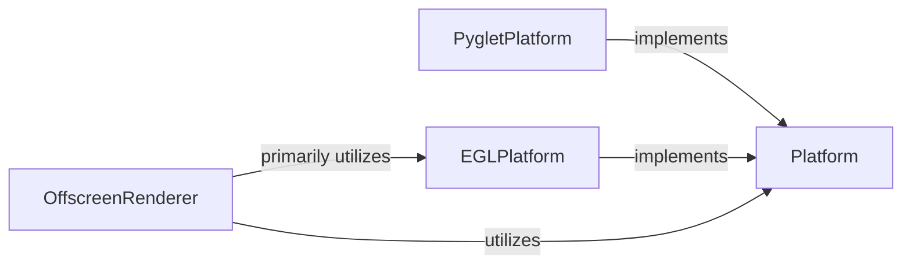

## Details

The Platform Abstraction & Context Management subsystem provides a crucial layer for pyrender to interact with various graphics environments, ensuring flexible and robust OpenGL context handling for both on-screen and off-screen rendering. It is primarily encapsulated within the pyrender.platforms package and the pyrender.offscreen.OffscreenRenderer class.

### Platform
Defines the abstract interface for managing OpenGL contexts. This includes methods for initializing, making contexts current, swapping buffers, and handling viewport dimensions. It serves as the contract for concrete platform implementations, abstracting away the specifics of different underlying graphics environments.

**Related Classes/Methods**:

- <a href="https://github.com/mmatl/pyrender/blob/master/pyrender/platforms/base.py#L6-L76" target="_blank" rel="noopener noreferrer">`pyrender.platforms.base.Platform`:6-76</a>

### PygletPlatform
Provides a concrete implementation of the Platform interface tailored for Pyglet. It manages Pyglet-based OpenGL contexts for interactive or on-screen rendering, handling window creation, event loops, and the full context lifecycle within a Pyglet environment.

**Related Classes/Methods**:

- <a href="https://github.com/mmatl/pyrender/blob/master/pyrender/platforms/pyglet_platform.py#L11-L90" target="_blank" rel="noopener noreferrer">`pyrender.platforms.pyglet_platform.PygletPlatform`:11-90</a>

### EGLPlatform
Offers a concrete implementation of the Platform interface for EGL (Embedded-GL). It handles EGL device querying, context setup, and rendering surface management. This platform is primarily used for offscreen or headless rendering environments where no display server is available, making it crucial for server-side rendering or automated image generation.

**Related Classes/Methods**:

- <a href="https://github.com/mmatl/pyrender/blob/master/pyrender/platforms/egl.py#L113-L216" target="_blank" rel="noopener noreferrer">`pyrender.platforms.egl.EGLPlatform`:113-216</a>

### OffscreenRenderer
Manages the lifecycle of an offscreen rendering context. It orchestrates the creation, rendering, and deletion of the offscreen environment, including setting up framebuffer objects (FBOs) and rendering to textures. It relies on a concrete Platform implementation (typically EGLPlatform for offscreen capabilities) to manage the underlying OpenGL context. This component provides a high-level interface for offscreen rendering to other parts of the pyrender library, abstracting the complexities of FBOs and context management.

**Related Classes/Methods**:

- <a href="https://github.com/mmatl/pyrender/blob/master/pyrender/offscreen.py#L11-L157" target="_blank" rel="noopener noreferrer">`pyrender.offscreen.OffscreenRenderer`:11-157</a>

### [FAQ](https://github.com/CodeBoarding/GeneratedOnBoardings/tree/main?tab=readme-ov-file#faq)