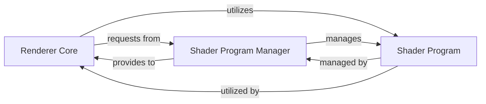

## Details

The `Rendering Engine` subsystem is the core processing unit responsible for transforming 3D scene data into a 2D image, managing the rendering pipeline and GPU interactions.

### Renderer Core
This is the central orchestrator of the 3D rendering pipeline. It manages the overall rendering process, including different rendering passes (e.g., forward, shadow mapping), configuring the OpenGL state (viewports, framebuffers, texture units), binding necessary resources like lighting and textures, and issuing drawing commands for mesh primitives. It is responsible for transforming scene data into visual output.

**Related Classes/Methods**:

- <a href="https://github.com/mmatl/pyrender/blob/master/pyrender/renderer.py#L22-L1328" target="_blank" rel="noopener noreferrer">`pyrender.renderer.Renderer`:22-1328</a>
- <a href="https://github.com/mmatl/pyrender/blob/master/pyrender/renderer.py" target="_blank" rel="noopener noreferrer">`pyrender.renderer.Renderer:_forward_pass`</a>
- <a href="https://github.com/mmatl/pyrender/blob/master/pyrender/renderer.py" target="_blank" rel="noopener noreferrer">`pyrender.renderer.Renderer:_shadow_mapping_pass`</a>
- <a href="https://github.com/mmatl/pyrender/blob/master/pyrender/renderer.py" target="_blank" rel="noopener noreferrer">`pyrender.renderer.Renderer:_bind_lighting`</a>
- <a href="https://github.com/mmatl/pyrender/blob/master/pyrender/renderer.py" target="_blank" rel="noopener noreferrer">`pyrender.renderer.Renderer:_bind_texture`</a>

### Shader Program Manager
This component is responsible for the lifecycle and efficient retrieval of compiled OpenGL shader programs. It ensures that shader programs are loaded into the OpenGL context when needed, cached for performance, and properly deleted when no longer required. It acts as a central repository and factory for shader assets, providing them to the `Renderer Core` as needed.

**Related Classes/Methods**:

- <a href="https://github.com/mmatl/pyrender/blob/master/pyrender/shader_program.py#L12-L76" target="_blank" rel="noopener noreferrer">`pyrender.shader_program.ShaderProgramCache`:12-76</a>
- <a href="https://github.com/mmatl/pyrender/blob/master/pyrender/shader_program.py" target="_blank" rel="noopener noreferrer">`pyrender.shader_program.ShaderProgramCache:_add_to_context`</a>
- <a href="https://github.com/mmatl/pyrender/blob/master/pyrender/shader_program.py" target="_blank" rel="noopener noreferrer">`pyrender.shader_program.ShaderProgramCache:_load`</a>
- <a href="https://github.com/mmatl/pyrender/blob/master/pyrender/shader_program.py" target="_blank" rel="noopener noreferrer">`pyrender.shader_program.ShaderProgramCache:delete`</a>

### Shader Program
Represents an individual compiled OpenGL shader program, typically comprising vertex and fragment shaders (and potentially others). It encapsulates the compiled code that runs on the GPU and provides an interface for setting uniforms and attributes before drawing. This component is managed by the `Shader Program Manager` and utilized by the `Renderer Core`.

**Related Classes/Methods**:

- <a href="https://github.com/mmatl/pyrender/blob/master/pyrender/shader_program.py#L79-L283" target="_blank" rel="noopener noreferrer">`pyrender.shader_program.ShaderProgram`:79-283</a>

### [FAQ](https://github.com/CodeBoarding/GeneratedOnBoardings/tree/main?tab=readme-ov-file#faq)