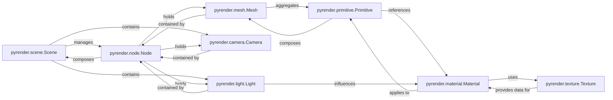

## Details

The `pyrender` subsystem is designed around a flexible, hierarchical scene graph, with the `Scene` class serving as the central orchestrator. The `Scene` manages a collection of `Node` objects, which are the fundamental building blocks for organizing 3D entities. Each `Node` defines a local transformation and can encapsulate a `Mesh` (representing renderable geometry), a `Camera` (defining the viewpoint), or a `Light` (providing illumination). `Mesh` objects, in turn, are composed of `Primitive`s, which hold the raw geometric data and reference `Material`s to define their visual properties. `Material`s can further utilize `Texture`s to add detailed visual patterns. This architecture enables the construction, manipulation, and rendering of complex 3D environments by clearly separating concerns related to scene structure, object geometry, visual appearance, and lighting.

### pyrender.scene.Scene
The `Scene` acts as the central container and manager for the 3D world. It maintains a hierarchical graph of `Node` objects, each of which can hold a `Mesh`, `Camera`, or `Light`. It provides methods to add, remove, and retrieve these elements, forming the top-level interface for scene manipulation and managing global scene properties like background color and ambient light.

**Related Classes/Methods**: _None_

### pyrender.node.Node
The `Node` is the fundamental building block of the hierarchical scene graph, defining an object's local transformation (translation, rotation, scale). It can parent other nodes and directly contain a `Mesh`, `Camera`, or `Light`, establishing spatial relationships and linking these components into the scene graph.

**Related Classes/Methods**: _None_

### pyrender.mesh.Mesh
Represents a renderable 3D object, composed of one or more `Primitive`s. Its primary responsibility is to aggregate visual geometry, delegating the actual geometric data and material application to its constituent primitives.

**Related Classes/Methods**: _None_

### pyrender.primitive.Primitive
The `Primitive` is the atomic unit of geometry within a `Mesh`, storing raw vertex data (positions, normals, UVs, colors) and referencing a `Material` for its visual properties. It defines the fundamental shape and surface characteristics of a part of a mesh and manages its OpenGL buffer data.

**Related Classes/Methods**: _None_

### pyrender.camera.Camera
Defines the viewpoint and projection parameters for observing the 3D scene. As an abstract base class, it provides common properties like near and far clipping planes (`znear`, `zfar`) and an abstract method to generate the OpenGL projection matrix, crucial for how the 3D scene is projected onto a 2D plane.

**Related Classes/Methods**: _None_

### pyrender.light.Light
Represents an abstract light source, defining its `color` and `intensity`. It serves as a base class for different light types (e.g., PointLight, SpotLight, DirectionalLight) and includes mechanisms for shadow mapping, essential for illuminating the scene and calculating surface shading.

**Related Classes/Methods**: _None_

### pyrender.material.Material
Encapsulates the visual properties of surfaces, including color, shininess, and references to various `Texture`s (normal, occlusion, emissive). As an abstract base class, it dictates how light interacts with objects, managing properties like alpha blending, double-sided rendering, and wireframe mode.

**Related Classes/Methods**: _None_

### pyrender.texture.Texture
Stores image data (`source`) and its associated `Sampler` for use by `Material`s. It is responsible for providing pixel data to add detailed visual patterns and colors to surfaces and manages the loading and binding of this image data within the OpenGL context.

**Related Classes/Methods**: _None_

### [FAQ](https://github.com/CodeBoarding/GeneratedOnBoardings/tree/main?tab=readme-ov-file#faq)