```mermaid
graph LR
    Scene_Graph_Data_Model["Scene Graph & Data Model"]
    Rendering_Engine["Rendering Engine"]
    Platform_Abstraction_Context_Management["Platform Abstraction & Context Management"]
    Interactive_Viewer["Interactive Viewer"]
    Asset_Utilities["Asset Utilities"]
    Interactive_Viewer -- "Manages Scene Content" --> Scene_Graph_Data_Model
    Interactive_Viewer -- "Triggers Rendering" --> Rendering_Engine
    Scene_Graph_Data_Model -- "Provides Scene Data" --> Rendering_Engine
    Platform_Abstraction_Context_Management -- "Provides OpenGL Context" --> Rendering_Engine
    Rendering_Engine -- "Renders to Framebuffer Managed by" --> Platform_Abstraction_Context_Management
    Asset_Utilities -- "Integrates Assets" --> Scene_Graph_Data_Model
    Asset_Utilities -- "Supplies Renderable Assets" --> Rendering_Engine
    click Scene_Graph_Data_Model href "https://github.com/CodeBoarding/GeneratedOnBoardings/blob/main/pyrender/Scene_Graph_Data_Model.md" "Details"
    click Rendering_Engine href "https://github.com/CodeBoarding/GeneratedOnBoardings/blob/main/pyrender/Rendering_Engine.md" "Details"
    click Platform_Abstraction_Context_Management href "https://github.com/CodeBoarding/GeneratedOnBoardings/blob/main/pyrender/Platform_Abstraction_Context_Management.md" "Details"
    click Interactive_Viewer href "https://github.com/CodeBoarding/GeneratedOnBoardings/blob/main/pyrender/Interactive_Viewer.md" "Details"
```

## Details

The `pyrender` project is structured around a clear separation of concerns, facilitating efficient 3D scene rendering and interaction. At its core, the `Scene Graph & Data Model` acts as the central repository for all scene-related information, providing a structured representation of 3D objects, their properties, and environmental settings. The `Rendering Engine` consumes this data, leveraging the `Platform Abstraction & Context Management` layer to interact with the underlying graphics hardware and perform the actual rendering process, outputting to framebuffers managed by the platform. For user interaction and real-time visualization, the `Interactive Viewer` orchestrates the rendering loop, manages scene content, and handles user input. Complementing these, `Asset Utilities` provide specialized functionalities for integrating and supplying various assets into the scene graph and rendering pipeline. This modular design ensures a robust and extensible architecture for 3D graphics applications.

### Scene Graph & Data Model [[Expand]](./Scene_Graph_Data_Model.md)
Central repository for all 3D scene data, defining the hierarchical structure of objects, their geometric properties, visual attributes, and lighting/camera configurations.

**Related Classes/Methods**:

- <a href="https://github.com/mmatl/pyrender/blob/master/pyrender/scene.py#L17-L585" target="_blank" rel="noopener noreferrer">`pyrender.scene.Scene`:17-585</a>
- <a href="https://github.com/mmatl/pyrender/blob/master/pyrender/node.py#L15-L263" target="_blank" rel="noopener noreferrer">`pyrender.node.Node`:15-263</a>
- <a href="https://github.com/mmatl/pyrender/blob/master/pyrender/mesh.py" target="_blank" rel="noopener noreferrer">`pyrender.mesh.Mesh`</a>
- <a href="https://github.com/mmatl/pyrender/blob/master/pyrender/primitive.py#L15-L489" target="_blank" rel="noopener noreferrer">`pyrender.primitive.Primitive`:15-489</a>
- <a href="https://github.com/mmatl/pyrender/blob/master/pyrender/camera.py#L14-L92" target="_blank" rel="noopener noreferrer">`pyrender.camera.Camera`:14-92</a>
- <a href="https://github.com/mmatl/pyrender/blob/master/pyrender/light.py#L19-L120" target="_blank" rel="noopener noreferrer">`pyrender.light.Light`:19-120</a>
- <a href="https://github.com/mmatl/pyrender/blob/master/pyrender/material.py#L17-L280" target="_blank" rel="noopener noreferrer">`pyrender.material.Material`:17-280</a>
- <a href="https://github.com/mmatl/pyrender/blob/master/pyrender/texture.py#L14-L259" target="_blank" rel="noopener noreferrer">`pyrender.texture.Texture`:14-259</a>
- <a href="https://github.com/mmatl/pyrender/blob/master/pyrender/sampler.py#L9-L102" target="_blank" rel="noopener noreferrer">`pyrender.sampler.Sampler`:9-102</a>

### Rendering Engine [[Expand]](./Rendering_Engine.md)
The core processing unit responsible for transforming 3D scene data into a 2D image, managing the rendering pipeline and GPU interactions.

**Related Classes/Methods**:

- <a href="https://github.com/mmatl/pyrender/blob/master/pyrender/renderer.py#L22-L1328" target="_blank" rel="noopener noreferrer">`pyrender.renderer.Renderer`:22-1328</a>
- <a href="https://github.com/mmatl/pyrender/blob/master/pyrender/shader_program.py#L12-L76" target="_blank" rel="noopener noreferrer">`pyrender.shader_program.ShaderProgramCache`:12-76</a>

### Platform Abstraction & Context Management [[Expand]](./Platform_Abstraction_Context_Management.md)
Provides an interface for interacting with different underlying graphics environments, handling the creation and management of OpenGL contexts.

**Related Classes/Methods**:

- <a href="https://github.com/mmatl/pyrender/blob/master/pyrender/platforms/base.py#L6-L76" target="_blank" rel="noopener noreferrer">`pyrender.platforms.base.Platform`:6-76</a>
- <a href="https://github.com/mmatl/pyrender/blob/master/pyrender/platforms/pyglet_platform.py#L11-L90" target="_blank" rel="noopener noreferrer">`pyrender.platforms.pyglet_platform.PygletPlatform`:11-90</a>
- <a href="https://github.com/mmatl/pyrender/blob/master/pyrender/platforms/egl.py#L113-L216" target="_blank" rel="noopener noreferrer">`pyrender.platforms.egl.EGLPlatform`:113-216</a>
- <a href="https://github.com/mmatl/pyrender/blob/master/pyrender/offscreen.py#L11-L157" target="_blank" rel="noopener noreferrer">`pyrender.offscreen.OffscreenRenderer`:11-157</a>

### Interactive Viewer [[Expand]](./Interactive_Viewer.md)
A user-facing application for real-time visualization and interaction with 3D scenes, handling user input, camera control, and orchestrating the rendering loop.

**Related Classes/Methods**:

- <a href="https://github.com/mmatl/pyrender/blob/master/pyrender/viewer.py#L38-L1157" target="_blank" rel="noopener noreferrer">`pyrender.viewer.Viewer`:38-1157</a>

### Asset Utilities
Contains specialized functionalities for handling specific types of assets that require unique processing before integration into the scene graph or rendering.

**Related Classes/Methods**:

- <a href="https://github.com/mmatl/pyrender/blob/master/pyrender/font.py#L17-L47" target="_blank" rel="noopener noreferrer">`pyrender.font.FontCache`:17-47</a>

### [FAQ](https://github.com/CodeBoarding/GeneratedOnBoardings/tree/main?tab=readme-ov-file#faq)