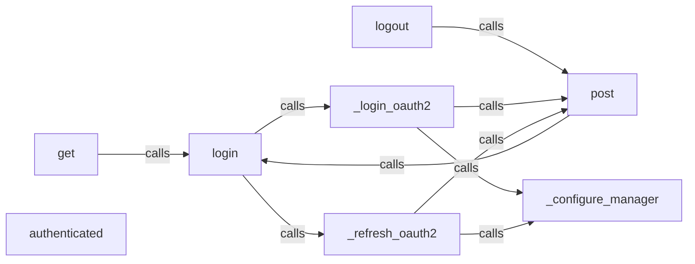

## Details

This subsystem is responsible for managing user authentication, token lifecycle, and secure session handling with the Robinhood API. It ensures that all outgoing requests are properly authenticated.

### login
The primary public interface for initiating and managing the user authentication flow. It orchestrates whether to perform a fresh login or refresh an existing token.

**Related Classes/Methods**:

- <a href="https://github.com/robinhood-unofficial/pyrh/blob/master/pyrh/models/sessionmanager.py#L150-L164" target="_blank" rel="noopener noreferrer">`pyrh.models.sessionmanager.login`:150-164</a>

### logout
Responsible for invalidating the current session and logging the user out of the Robinhood API.

**Related Classes/Methods**:

- <a href="https://github.com/robinhood-unofficial/pyrh/blob/master/pyrh/models/sessionmanager.py#L486-L499" target="_blank" rel="noopener noreferrer">`pyrh.models.sessionmanager.logout`:486-499</a>

### get
A public wrapper for making authenticated HTTP GET requests to the Robinhood API, ensuring session validity before execution.

**Related Classes/Methods**:

- <a href="https://github.com/robinhood-unofficial/pyrh/blob/master/pyrh/models/sessionmanager.py#L166-L228" target="_blank" rel="noopener noreferrer">`pyrh.models.sessionmanager.get`:166-228</a>

### post
A public wrapper for making authenticated HTTP POST requests to the Robinhood API, ensuring session validity before execution.

**Related Classes/Methods**:

- <a href="https://github.com/robinhood-unofficial/pyrh/blob/master/pyrh/models/sessionmanager.py#L230-L292" target="_blank" rel="noopener noreferrer">`pyrh.models.sessionmanager.post`:230-292</a>

### _login_oauth2
An internal core component handling the initial OAuth2 authentication process, including interaction with MFA and challenge mechanisms.

**Related Classes/Methods**:

- <a href="https://github.com/robinhood-unofficial/pyrh/blob/master/pyrh/models/sessionmanager.py#L411-L454" target="_blank" rel="noopener noreferrer">`pyrh.models.sessionmanager._login_oauth2`:411-454</a>

### _refresh_oauth2
An internal core component managing the renewal of expired OAuth2 access tokens to maintain a continuous authenticated session.

**Related Classes/Methods**:

- <a href="https://github.com/robinhood-unofficial/pyrh/blob/master/pyrh/models/sessionmanager.py#L456-L484" target="_blank" rel="noopener noreferrer">`pyrh.models.sessionmanager._refresh_oauth2`:456-484</a>

### _configure_manager
An internal helper responsible for updating the session manager with new tokens and session details after successful authentication or refresh.

**Related Classes/Methods**:

- <a href="https://github.com/robinhood-unofficial/pyrh/blob/master/pyrh/models/sessionmanager.py#L294-L310" target="_blank" rel="noopener noreferrer">`pyrh.models.sessionmanager._configure_manager`:294-310</a>

### authenticated
Provides a quick check to determine if the current session is authenticated and active.

**Related Classes/Methods**:

- <a href="https://github.com/robinhood-unofficial/pyrh/blob/master/pyrh/models/sessionmanager.py#L141-L148" target="_blank" rel="noopener noreferrer">`pyrh.models.sessionmanager.authenticated`:141-148</a>

### [FAQ](https://github.com/CodeBoarding/GeneratedOnBoardings/tree/main?tab=readme-ov-file#faq)