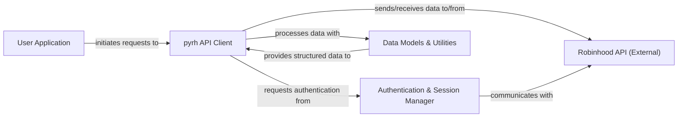

## Details

The `pyrh` library provides a Python interface to the Robinhood API, designed to facilitate programmatic interaction with financial services.

### User Application
Represents the external user or application that consumes the `pyrh` library's functionalities. It initiates requests and receives processed data. This component is external to the `pyrh` project and therefore does not have source code references within the `pyrh` repository.

**Related Classes/Methods**: _None_

### pyrh API Client [[Expand]](./pyrh_API_Client.md)
The main facade of the `pyrh` library, responsible for high-level interactions with the Robinhood API, including market data retrieval, order placement, and account information. It orchestrates calls to other internal components.

**Related Classes/Methods**:

- <a href="https://github.com/robinhood-unofficial/pyrh/blob/master/pyrh/robinhood.py" target="_blank" rel="noopener noreferrer">`pyrh.robinhood.module_content`</a>
- <a href="https://github.com/robinhood-unofficial/pyrh/blob/master/pyrh/trade_history_downloader.py" target="_blank" rel="noopener noreferrer">`pyrh.trade_history_downloader.module_content`</a>

### Authentication & Session Manager [[Expand]](./Authentication_Session_Manager.md)
Manages user authentication, token lifecycle (login, logout, refresh), and secure session handling with the Robinhood API, ensuring all requests are authenticated.

**Related Classes/Methods**:

- <a href="https://github.com/robinhood-unofficial/pyrh/blob/master/pyrh/models/sessionmanager.py" target="_blank" rel="noopener noreferrer">`pyrh.models.sessionmanager.module_content`</a>

### Data Models & Utilities
Defines the structure and provides deserialization logic for Robinhood API entities (e.g., instruments, portfolios, orders) and centralizes API endpoint configurations.

**Related Classes/Methods**:

- <a href="https://github.com/robinhood-unofficial/pyrh/blob/master/pyrh/models/base.py" target="_blank" rel="noopener noreferrer">`pyrh.models.base.module_content`</a>
- <a href="https://github.com/robinhood-unofficial/pyrh/blob/master/pyrh/models/instrument.py" target="_blank" rel="noopener noreferrer">`pyrh.models.instrument.module_content`</a>
- <a href="https://github.com/robinhood-unofficial/pyrh/blob/master/pyrh/models/portfolio.py" target="_blank" rel="noopener noreferrer">`pyrh.models.portfolio.module_content`</a>
- <a href="https://github.com/robinhood-unofficial/pyrh/blob/master/pyrh/models/oauth.py" target="_blank" rel="noopener noreferrer">`pyrh.models.oauth.module_content`</a>
- <a href="https://github.com/robinhood-unofficial/pyrh/blob/master/pyrh/urls.py" target="_blank" rel="noopener noreferrer">`pyrh.urls.module_content`</a>

### Robinhood API (External)
The external Robinhood service that the `pyrh` library interacts with to perform financial operations. This component is an external third-party API and therefore does not have source code references within the `pyrh` repository.

**Related Classes/Methods**: _None_

### [FAQ](https://github.com/CodeBoarding/GeneratedOnBoardings/tree/main?tab=readme-ov-file#faq)