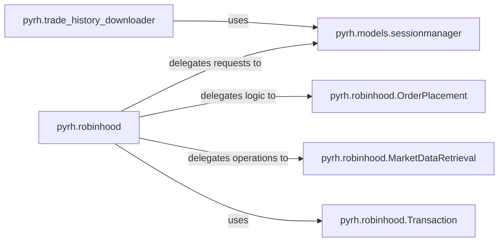

## Details

Analysis of the `pyrh API Client` subsystem, which acts as the primary interface for interacting with the Robinhood API, embodying the Facade/Adapter pattern.

### pyrh.robinhood
The central facade of the `pyrh` library, providing a comprehensive interface for diverse Robinhood API functionalities. This includes market data retrieval (quotes, historical data, popularity, options, fundamentals), order placement (buy/sell, market/limit/stop orders), and account information access. It abstracts the underlying API calls and orchestrates interactions with more specialized internal components.

**Related Classes/Methods**:

- <a href="https://github.com/robinhood-unofficial/pyrh/blob/master/pyrh/robinhood.py" target="_blank" rel="noopener noreferrer">`pyrh.robinhood`</a>

### pyrh.models.sessionmanager
Manages the entire user authentication lifecycle (login, MFA, token refresh, logout) and provides the fundamental HTTP GET and POST methods required for all authenticated API communication. It ensures that requests are properly authorized before being sent to the Robinhood API.

**Related Classes/Methods**:

- <a href="https://github.com/robinhood-unofficial/pyrh/blob/master/pyrh/models/sessionmanager.py" target="_blank" rel="noopener noreferrer">`pyrh.models.sessionmanager`</a>

### pyrh.trade_history_downloader
A specialized component focused on fetching and processing historical trade and order data from the Robinhood API. It handles the retrieval of all historical orders and the extraction of symbol information from instrument URLs.

**Related Classes/Methods**:

- <a href="https://github.com/robinhood-unofficial/pyrh/blob/master/pyrh/trade_history_downloader.py" target="_blank" rel="noopener noreferrer">`pyrh.trade_history_downloader`</a>

### pyrh.robinhood.OrderPlacement
A specialized component for detailed order processing, delegated by the main `pyrh.robinhood` facade. It encapsulates the logic for constructing and sending various types of buy and sell orders.

**Related Classes/Methods**:

- <a href="https://github.com/robinhood-unofficial/pyrh/blob/master/pyrh/robinhood.py" target="_blank" rel="noopener noreferrer">`pyrh.robinhood.OrderPlacement`</a>

### pyrh.robinhood.MarketDataRetrieval
A specialized component for handling various market data operations, delegated by the `pyrh.robinhood` facade. This includes fetching quotes, historical data, and other market-related information.

**Related Classes/Methods**:

- <a href="https://github.com/robinhood-unofficial/pyrh/blob/master/pyrh/robinhood.py" target="_blank" rel="noopener noreferrer">`pyrh.robinhood.MarketDataRetrieval`</a>

### pyrh.robinhood.Transaction
A component responsible for structuring and managing order-related data. It likely defines the data models or structures used when placing and retrieving orders, ensuring consistency and proper formatting for API interactions.

**Related Classes/Methods**:

- <a href="https://github.com/robinhood-unofficial/pyrh/blob/master/pyrh/robinhood.py" target="_blank" rel="noopener noreferrer">`pyrh.robinhood.Transaction`</a>

### [FAQ](https://github.com/CodeBoarding/GeneratedOnBoardings/tree/main?tab=readme-ov-file#faq)