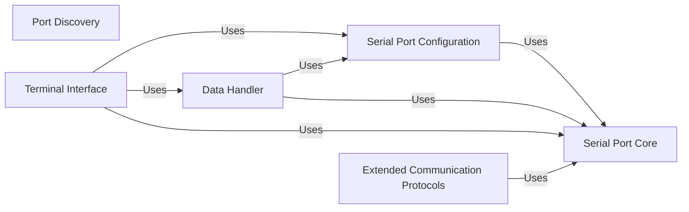

## Component Details

The pyserial library provides a cross-platform interface for serial communication. It abstracts the complexities of interacting with serial ports on different operating systems, offering a consistent API for configuring, reading from, and writing to serial ports. The library also includes tools for discovering available ports, implementing network serial port access, and supporting threaded communication.

### Serial Port Core
This component provides the fundamental abstraction for serial port communication. It includes the base class `SerialBase` and platform-specific implementations (`SerialPosix`, `SerialWin32`, etc.) for accessing serial ports. It handles port opening, closing, basic configuration, and low-level data transfer.
- **Related Classes/Methods**: `serial/serialutil.py`, `serial/serialposix.py`, `serial/serialwin32.py`, `serial/serialjava.py`, `serial/serialcli.py`

### Serial Port Configuration
This component manages the configuration of serial port parameters, such as baud rate, parity, stop bits, and data bits. It provides methods to set and retrieve these parameters, ensuring that the serial port is properly configured for communication. It is tightly integrated with the Serial Port Core.
- **Related Classes/Methods**: `serial/serialutil.py`, `serial/serialposix.py`, `serial/serialwin32.py`, `serial/serialjava.py`, `serial/serialcli.py`

### Data Handler
This component is responsible for reading and writing data to and from the serial port. It provides methods for sending and receiving data, managing buffer sizes, and handling timeouts. It relies on the Serial Port Core for low-level port access.
- **Related Classes/Methods**: `serial/serialutil.py`, `serial/serialposix.py`, `serial/serialwin32.py`, `serial/serialjava.py`, `serial/serialcli.py`

### Port Discovery
This component provides the functionality to list available serial ports on the system. It uses platform-specific methods to identify and enumerate serial ports, making it easier for applications to find and connect to the desired port. It abstracts away the differences in port enumeration across different operating systems.
- **Related Classes/Methods**: `serial/tools/list_ports.py`, `serial/tools/list_ports_windows.py`, `serial/tools/list_ports_linux.py`, `serial/tools/list_ports_osx.py`, `serial/tools/list_ports_common.py`

### Extended Communication Protocols
This component encompasses extended functionalities such as RFC2217 network protocol support, URL handling, threaded communication management, and RS485 communication support. These features enhance the library's capabilities by enabling remote access, flexible port specification, concurrent communication, and support for industrial applications.
- **Related Classes/Methods**: `serial/rfc2217.py`, `serial/urlhandler/__init__.py`, `serial/urlhandler/protocol_socket.py`, `serial/threaded.py`, `serial/rs485.py`

### Terminal Interface
This component provides a simple terminal application for interacting with serial ports. It allows users to send and receive data, configure port settings, and monitor serial communication. It serves as a useful tool for testing and debugging serial communication.
- **Related Classes/Methods**: `serial/tools/miniterm.py`