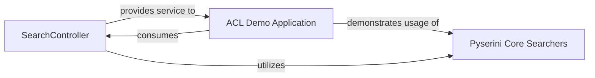

## Details

The Pyserini system, as analyzed, is structured around a `SearchController` acting as a web service facade, providing a unified interface for complex search and retrieval operations. The `ACL Demo Application` serves as a practical example, consuming services from the `SearchController` to showcase Pyserini's capabilities. Both the `SearchController` and the `ACL Demo Application` ultimately rely on the `Pyserini Core Searchers` component, which encapsulates the underlying search engine implementations like Lucene and FAISS, performing the actual data indexing and query execution. This architecture promotes modularity, allowing the core search logic to be reused and demonstrated through various interfaces.

### SearchController
This component serves as the primary web service interface for Pyserini's search and document retrieval functionalities. It encapsulates the logic for handling incoming search requests, managing the initialization of search indexes, and orchestrating sharded search operations across potentially multiple indexes. It embodies the Facade Pattern by simplifying access to complex retrieval mechanisms and forms the server-side of a Client-Server Architecture. Its architectural importance lies in enabling Pyserini to be consumed as a scalable and accessible service.

**Related Classes/Methods**:

- <a href="https://github.com/castorini/pyserini/blob/master/pyserini/server/search_controller.py#L38-L266" target="_blank" rel="noopener noreferrer">`pyserini.server.search_controller.SearchController`:38-266</a>

### ACL Demo Application
This component is a concrete, runnable Flask web application designed to demonstrate how to integrate and utilize Pyserini's `SearchController` and core search functionalities in a practical scenario. It serves as a reference implementation, guiding users on effective library usage and showcasing typical workflows. Its architectural importance stems from promoting ease of use and understanding through a tangible example, aligning with the Modularity and Extensibility patterns by providing a separate, illustrative module.

**Related Classes/Methods**:

- <a href="https://github.com/castorini/pyserini/blob/master/pyserini/demo/acl.py#L48-L83" target="_blank" rel="noopener noreferrer">`pyserini.demo.acl.create_app`:48-83</a>

### Pyserini Core Searchers
This component represents the fundamental search and retrieval mechanisms within Pyserini. It includes concrete implementations such as `LuceneSearcher` and `FaissSearcher`, which are responsible for performing the actual indexing, querying, and document retrieval operations against various data structures and indexes. This component is central to Pyserini's core functionality.

**Related Classes/Methods**:

### [FAQ](https://github.com/CodeBoarding/GeneratedOnBoardings/tree/main?tab=readme-ov-file#faq)