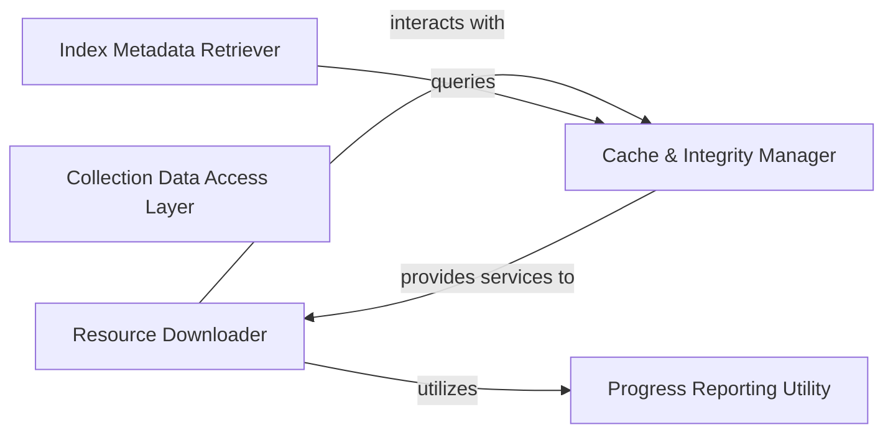

## Details

The `Data & Resource Management` subsystem is critical for handling all data assets within Pyserini, including pre-built indexes, corpora, query sets, and evaluation resources. It ensures efficient acquisition, local storage, and integrity of these diverse data types.

### Resource Downloader
Manages the acquisition of all external data assets (pre-built indexes, corpora, query sets, evaluation scripts) from remote sources. It handles the fetching and initial processing, such as unpacking. This component is fundamental for an ML Toolkit/IR Library to provide readily available resources for experimentation and use.

**Related Classes/Methods**:

- <a href="https://github.com/castorini/pyserini/blob/master/pyserini/util.py#L67-L118" target="_blank" rel="noopener noreferrer">`download_url`:67-118</a>
- <a href="https://github.com/castorini/pyserini/blob/master/pyserini/util.py#L127-L188" target="_blank" rel="noopener noreferrer">`download_and_unpack_index`:127-188</a>
- <a href="https://github.com/castorini/pyserini/blob/master/pyserini/util.py#L242-L269" target="_blank" rel="noopener noreferrer">`download_prebuilt_index`:242-269</a>
- <a href="https://github.com/castorini/pyserini/blob/master/pyserini/util.py#L272-L281" target="_blank" rel="noopener noreferrer">`download_encoded_queries`:272-281</a>
- <a href="https://github.com/castorini/pyserini/blob/master/pyserini/util.py#L284-L294" target="_blank" rel="noopener noreferrer">`download_encoded_corpus`:284-294</a>
- <a href="https://github.com/castorini/pyserini/blob/master/pyserini/util.py#L297-L308" target="_blank" rel="noopener noreferrer">`download_evaluation_script`:297-308</a>

### Cache & Integrity Manager
Oversees the local storage of downloaded resources, ensuring data integrity through checksum verification (e.g., MD5) and providing mechanisms to check for the presence of cached files. It centralizes the management of the local cache directory. This component is vital for performance and reliability.

**Related Classes/Methods**:

- <a href="https://github.com/castorini/pyserini/blob/master/pyserini/util.py#L191-L209" target="_blank" rel="noopener noreferrer">`check_downloaded`:191-209</a>
- <a href="https://github.com/castorini/pyserini/blob/master/pyserini/util.py#L121-L125" target="_blank" rel="noopener noreferrer">`get_cache_home`:121-125</a>
- <a href="https://github.com/castorini/pyserini/blob/master/pyserini/util.py#L56-L64" target="_blank" rel="noopener noreferrer">`compute_md5`:56-64</a>

### Collection Data Access Layer
Offers an abstract interface for initializing and iterating over various data collections, such as document corpora and index segments. It abstracts the underlying data source preparation, providing structured outputs for consumption by other parts of the system. This component ensures modularity in data handling.

**Related Classes/Methods**:

- <a href="https://github.com/castorini/pyserini/blob/master/integrations/lucenesearcher_anserini_checker.py#L26-L37" target="_blank" rel="noopener noreferrer">`__init__`:26-37</a>
- <a href="https://github.com/castorini/pyserini/blob/master/pyserini/collection/_base.py#L113-L129" target="_blank" rel="noopener noreferrer">`__next__`:113-129</a>
- <a href="https://github.com/castorini/pyserini/blob/master/pyserini/collection/_base.py#L66-L70" target="_blank" rel="noopener noreferrer">`_get_collection`:66-70</a>
- <a href="https://github.com/castorini/pyserini/blob/master/pyserini/collection/_base.py" target="_blank" rel="noopener noreferrer">`FileSegment`</a>
- <a href="https://github.com/castorini/pyserini/blob/master/pyserini/collection/_base.py" target="_blank" rel="noopener noreferrer">`SourceDocument`</a>

### Index Metadata Retriever
Specializes in retrieving and providing information about different types of pre-built indexes (sparse, impact, dense). This metadata is crucial for configuring and initializing retrieval tasks, ensuring that the correct index is used for a given query.

**Related Classes/Methods**:

- <a href="https://github.com/castorini/pyserini/blob/master/pyserini/util.py#L212-L219" target="_blank" rel="noopener noreferrer">`get_sparse_indexes_info`:212-219</a>
- <a href="https://github.com/castorini/pyserini/blob/master/pyserini/util.py#L222-L229" target="_blank" rel="noopener noreferrer">`get_impact_indexes_info`:222-229</a>
- <a href="https://github.com/castorini/pyserini/blob/master/pyserini/util.py#L232-L239" target="_blank" rel="noopener noreferrer">`get_dense_indexes_info`:232-239</a>

### Progress Reporting Utility
A common utility responsible for displaying progress during long-running operations, particularly relevant during resource downloads and data processing. It enhances user experience by providing feedback on ongoing tasks.

**Related Classes/Methods**:

- <a href="https://github.com/castorini/pyserini/blob/master/pyserini/util.py#L39-L51" target="_blank" rel="noopener noreferrer">`TqdmUpTo`:39-51</a>

### [FAQ](https://github.com/CodeBoarding/GeneratedOnBoardings/tree/main?tab=readme-ov-file#faq)