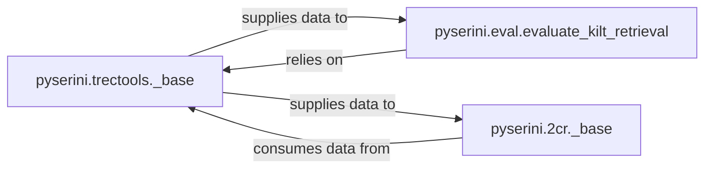

## Details

The `Evaluation & TREC Tools` subsystem in Pyserini is responsible for the standardized evaluation of information retrieval systems, particularly focusing on TREC-style data formats and specific evaluation benchmarks like KILT. Its boundaries encompass utilities for manipulating TREC run files and qrels, base classes for executing evaluation commands, and specific orchestrators for dataset-specific evaluations.

### pyserini.trectools._base
This component serves as the foundational utility for handling all TREC-style data formats. It provides robust functionalities for parsing, manipulating, and generating TREC run files and relevance judgments (qrels). This includes reading, filtering, merging, and converting search results into the standardized TREC format, which is crucial for information retrieval evaluations.

**Related Classes/Methods**:

- <a href="https://github.com/castorini/pyserini/blob/master/pyserini/trectools/_base.py" target="_blank" rel="noopener noreferrer">`pyserini.trectools._base`</a>

### pyserini.eval.evaluate_kilt_retrieval
This component is a specific evaluation orchestrator designed for KILT datasets. It is responsible for computing a range of ranking metrics (e.g., R-precision, precision@k, recall@k, success rate@k), handling data loading, validation, and the core computation of these metrics.

**Related Classes/Methods**:

- <a href="https://github.com/castorini/pyserini/blob/master/pyserini/eval/evaluate_kilt_retrieval.py" target="_blank" rel="noopener noreferrer">`pyserini.eval.evaluate_kilt_retrieval`</a>

### pyserini.2cr._base
This component acts as a base class, providing a standardized interface and common utilities for executing external commands and retrieving evaluation metrics within the 2CR (Cross-lingual Cross-dataset Retrieval) framework. It establishes the core infrastructure for specialized 2CR evaluations across various datasets.

**Related Classes/Methods**:

- <a href="https://github.com/castorini/pyserini/blob/master/pyserini/2cr/_base.py" target="_blank" rel="noopener noreferrer">`pyserini.2cr._base`</a>

### [FAQ](https://github.com/CodeBoarding/GeneratedOnBoardings/tree/main?tab=readme-ov-file#faq)